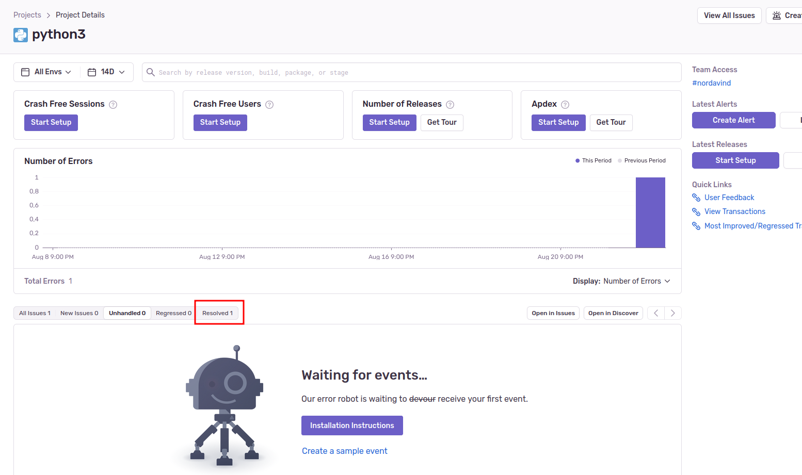

Домашнее задание к занятию "10.5 Платформа мониторинга Sentry"
-----

### Задание 1
В качестве решения задания пришлите скриншот меню Projects на sentry.io. 

## Задание 2

* Создайте python-проект и нажмите Generate sample event для генерации тестового события.

* Перейдите в список событий проекта, выберите созданное вами и нажмите Resolved.

* В качестве решения задание предоставьте скриншот Stack trace из этого события

* список событий проекта после нажатия Resolved.

## Задание 3

* Выберите проект и создайте дефолтное правило алёртинга без настройки полей.

* В качестве решения задания пришлите скриншот тела сообщения из оповещения на почте.

