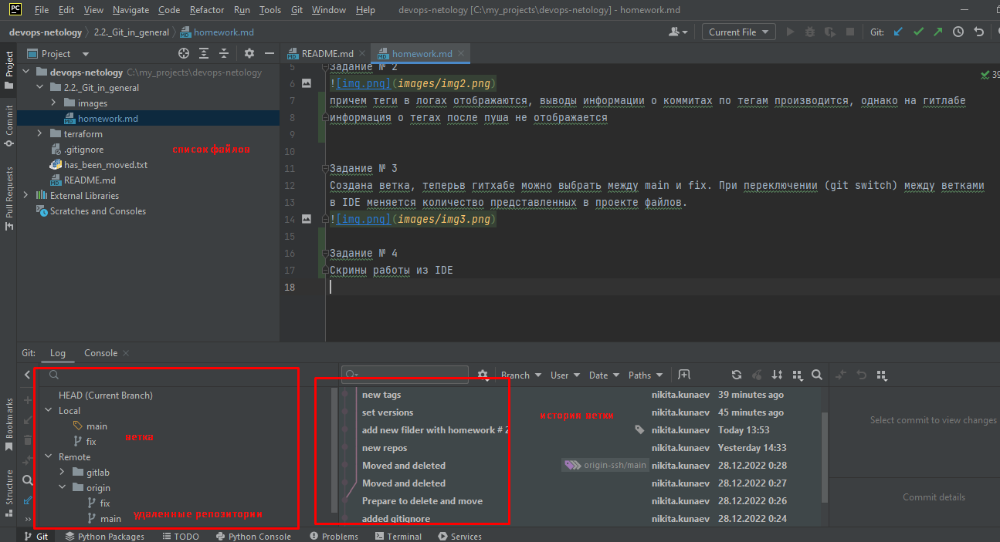

Задание № 1
присоеденить репозиторий из gitlab

Задание № 2

причем теги в логах отображаются, выводы информации о коммитах по тегам производится, однако на гитлабе
информация о тегах после пуша не отображается

Задание № 3
Создана ветка, теперьв гитхабе можно выбрать между main и fix. При переключении (git switch) между ветками
в IDE меняется количество представленных в проекте файлов.

Задание № 4
Скрины работы из IDE
