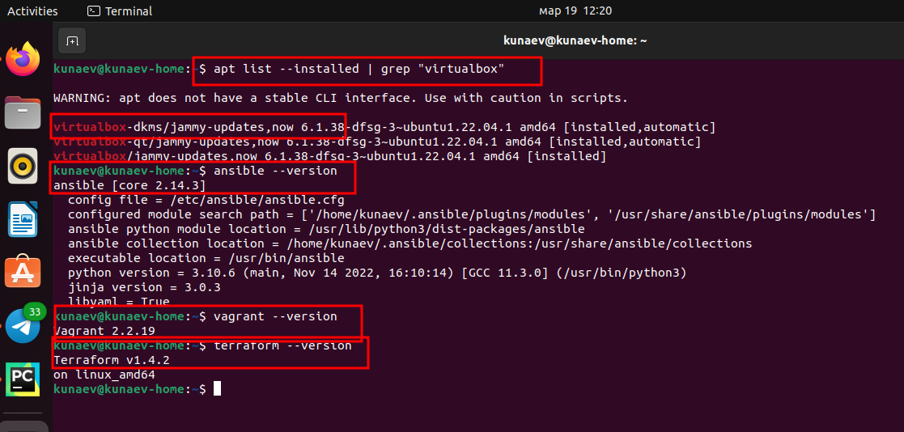
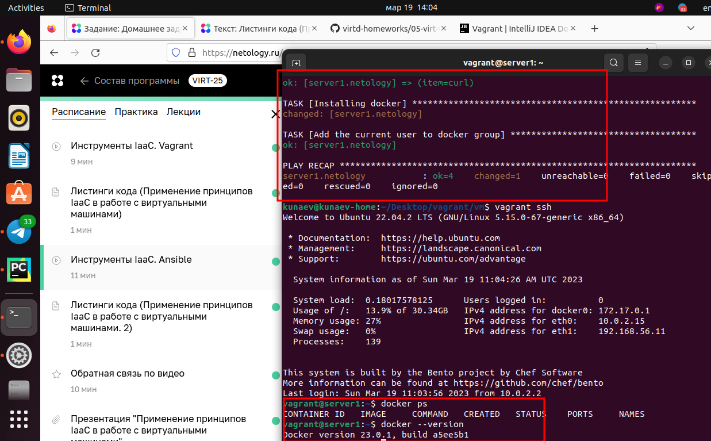

## Применение принципов IaaC 
***
### Задача 1

Конечной целью применения IaaC паттернов является сниженияе показателя TimeToMarket, те
снижение времени доставки продукта(кода) до конечного пользователя, с момента генерации идеи, до
ее воплощения и развертывания на боевом сервере.

Основных принципов IaaC 3:
- ускорение производства и вывода продукта на рынок;
- стабильность среды и устранение различий в конфигурации (идемпотентность) - ключевой
- более быстрая и эффективная разработка

### Задача 2

1. Ansible не требует наличия установленного клиента на целевом хосте
2. На мой взгляд в данном случае не корретно утверждать, что один из способов надежнее. Pull режим доступен при наличии 
установленного агента, который переодически запрашивает инфорацию с управляющего сервера. Конечно в случае изменения 
прослушиваемого порта на управляющем сервере необходимо будет менять настройки на всех агентах. При этом оба способа не 
спасут от проблем с сетью или в случае выхода из строя управляющего сервера.

## Задача 3

## Зачада 4

