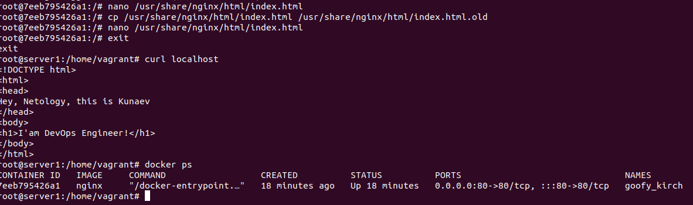
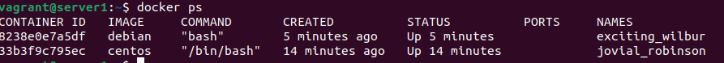

# Введение в Docker

------

## Задача 1

На базе nginx создал новый билд с необходимыми параметрами и отредактированным содержимым /usr/share/nginx/html/index.php.
Запустил контейнер с пробросом портов и вывел содержимое 
через curl.


https://hub.docker.com/repository/docker/kunaev/nginx/general
------

## Задача 2


* высоконагруженное монолитное Java веб-приложение; 

Мнения на этот счет разнятся. Одни утверждают, что высоконагруженные монолитные приложения необходимо разворачивать
на разных виртуальных машинах, при этом информация на форумах и гайдах AWS MS Azue говорит, что даже монолит проще держать 
в контейнере, поскольку его экземпляры в любом случае будут разворачиваться быстрее чем новые ВМ.

* Nodejs веб-приложение и Мобильное прилоение для iOS/Android;

Контейнеры, поскольку на одном хосте можно развернуть необходимое количество экземпляров и сбалансировать нагрузку.

* шина данных на базе Apache Kafka;

Это брокер сообщений между серверными приложениями в режиме реального времени, работающий с большим объемом данных
и высокой нагрузкой. Данная система рассчитана на горизонтальную масштабируемость путем добавления новых нод в кластер, в связи с чем контейнерезация не целесообразна.

* Elasticsearch-кластер для реализации логирования продуктивного веб-приложения — три ноды elasticsearch, два logstash и две ноды kibana;
мониторинг-стек на базе Prometheus и Grafana;

Учитывая, что в описании речь идет за кластер из нод, да еще и сервис логирования. Предполлагаю, что будут сниматься различные метрики,
т.е. будет много мелких файлов,  Таким обазом может возникать проблема с тем, что в контейнерах будут заканчиваться inod'ы, по-этому я бы сделал выбор в пользу ВМ.
Ну и обитатели ХАБРа советуют в контейнере его разворачивать исключитьельно в ознакомительных целях. Ну и нужно не забывать про концепцию: один контейнер - одно приложение.

* MongoDB как основное хранилище данных для Java-приложения;

Это не реляционная БД, насколько я понимаю каждый ее экземпляр используется для своего приложения. Полагаю с контейнерезацией проблем
вознукнуть не должно.

* Gitlab-сервер для реализации CI/CD-процессов и приватный (закрытый) Docker Registry.

В данном случае полагал бы использовать паравиртуализацию, поскольку будет храниться большой объем данных, да и
система более-менее статичная.

-----

## Задача 3

1. Скачал образы centos & debian
- docker pull centos
- docker pull debian

2. Создал каталог дата в домашней директории 
- mkdir ./data

3. Запустил поочередно контейнеры
- docker run -it -v ./data:/data -d centos
- docker run -it -v ./data:/data -d debian



4. Тестим общее пространство
Из вагранта: cat /etc/*release > ./data/vagrant
Далее поочередно подключился к контейнерам и созранил вывыов
os-release в свои файлы:

vagrant@server1:~$ docker exec -it jovial_robinson bash
\[root@33b3f9c795ec /]# cat /etc/*release > /data/centos  
\[root@33b3f9c795ec /]# exit
exit

vagrant@server1:~$ docker exec -it exciting_wilbur bash
root@8238e0e7a5df:/# cat /etc/*release > /data/debian
root@8238e0e7a5df:/# exit
exit

5. Находясь в вагранте объеденил вывод файлов
````
agrant@server1:~$ cat ./data/
centos   debian   newfile  vagrant  
vagrant@server1:~$ cat ./data/*
CentOS Linux release 8.4.2105
NAME="CentOS Linux"
VERSION="8"
ID="centos"
ID_LIKE="rhel fedora"
VERSION_ID="8"
PLATFORM_ID="platform:el8"
PRETTY_NAME="CentOS Linux 8"
ANSI_COLOR="0;31"
CPE_NAME="cpe:/o:centos:centos:8"
HOME_URL="https://centos.org/"
BUG_REPORT_URL="https://bugs.centos.org/"
CENTOS_MANTISBT_PROJECT="CentOS-8"
CENTOS_MANTISBT_PROJECT_VERSION="8"
CentOS Linux release 8.4.2105
CentOS Linux release 8.4.2105
1: lo: <LOOPBACK,UP,LOWER_UP> mtu 65536 qdisc noqueue state UNKNOWN group default qlen 1000
    link/loopback 00:00:00:00:00:00 brd 00:00:00:00:00:00
    inet 127.0.0.1/8 scope host lo
       valid_lft forever preferred_lft forever
5: eth0@if6: <BROADCAST,MULTICAST,UP,LOWER_UP> mtu 1500 qdisc noqueue state UP group default 
    link/ether 02:42:ac:11:00:02 brd ff:ff:ff:ff:ff:ff link-netnsid 0
    inet 172.17.0.2/16 brd 172.17.255.255 scope global eth0
       valid_lft forever preferred_lft forever
PRETTY_NAME="Debian GNU/Linux 11 (bullseye)"
NAME="Debian GNU/Linux"
VERSION_ID="11"
VERSION="11 (bullseye)"
VERSION_CODENAME=bullseye
ID=debian
HOME_URL="https://www.debian.org/"
SUPPORT_URL="https://www.debian.org/support"
BUG_REPORT_URL="https://bugs.debian.org/"
DISTRIB_ID=Ubuntu
DISTRIB_RELEASE=22.04
DISTRIB_CODENAME=jammy
DISTRIB_DESCRIPTION="Ubuntu 22.04.2 LTS"
PRETTY_NAME="Ubuntu 22.04.2 LTS"
NAME="Ubuntu"
VERSION_ID="22.04"
VERSION="22.04.2 LTS (Jammy Jellyfish)"
VERSION_CODENAME=jammy
ID=ubuntu
ID_LIKE=debian
HOME_URL="https://www.ubuntu.com/"
SUPPORT_URL="https://help.ubuntu.com/"
BUG_REPORT_URL="https://bugs.launchpad.net/ubuntu/"
PRIVACY_POLICY_URL="https://www.ubuntu.com/legal/terms-and-policies/privacy-policy"
UBUNTU_CODENAME=jammy
````

