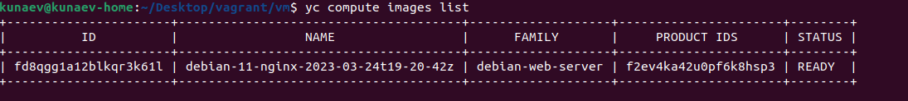
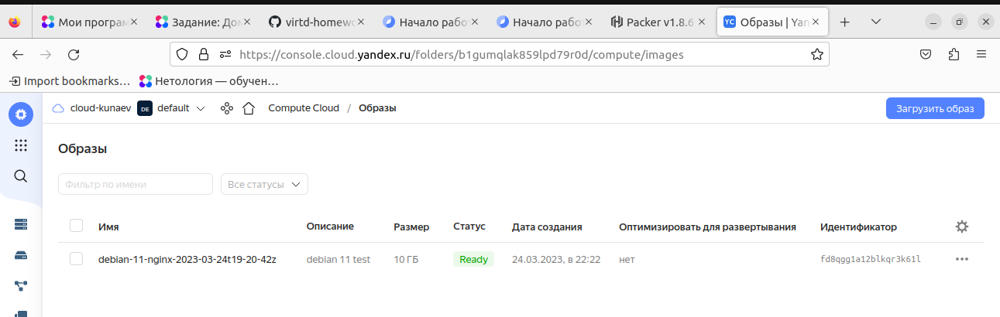
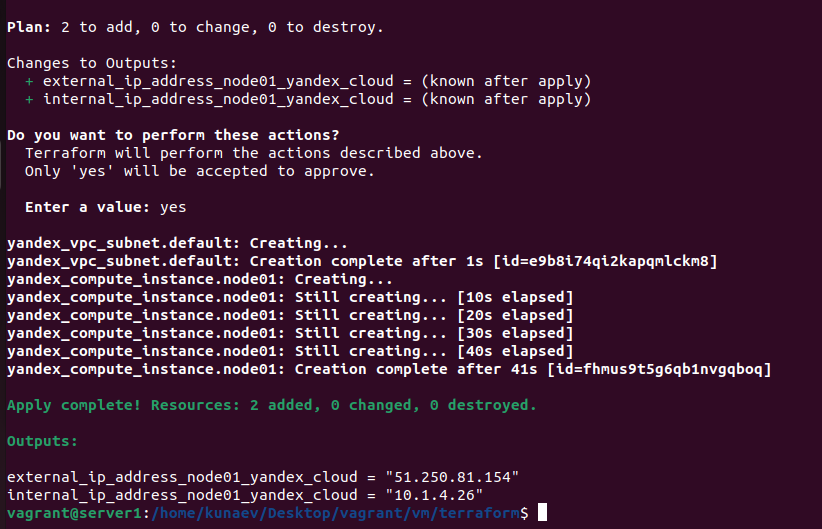
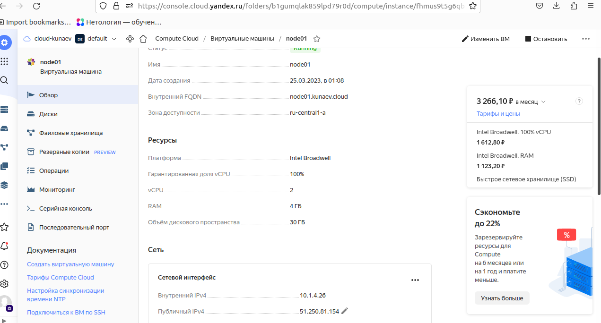

## Оркестрация группой Docker-контейнеров на примере Docker Compose

### Задача 1

С примером конфига из лекции образ отказался собираться в принципе. Помогло добавление в конфигурацию ключа OAuth. 
За основу взял инструкцию по сборке из туториала Яндекса по Packer'y. При абсолютно идентичных
настройках за исключением названий и семейств образов, Дебиан собрался нормально, а Убунта не могла подключиться по SSH 
во время сборки. Хотя фактически реальник навешивался и 22 порт был открыт и доступен...в общем магия.

### Задача 2

Вывод terraform apply

Свойства VM в ЛК Яндекса

