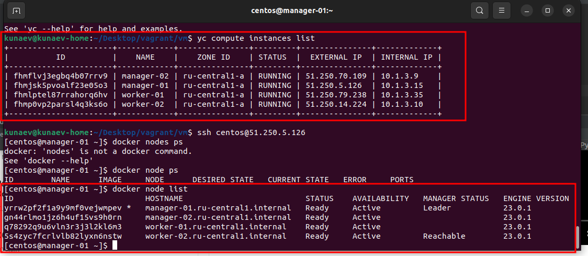
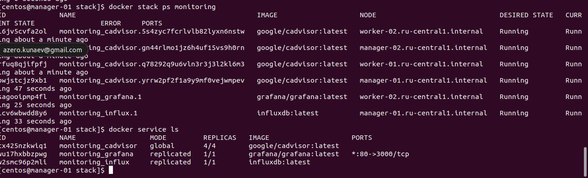

## ДЗ 5.5 Docker Swarm

### Вопрос 1

* Отличия режимов replicated от global
    * reblicated - задает количество экземпляров сервиса, которые необходимо развернуть в кластере. 
    * global - запускает одну задачу на каждой ноде. Предварительно заданного количества экземпляров сервиса
нет. Как правило используется для установки экземпляров агента мониторинга и антивируса.

* Используемый алгоритм выбора лидера.
    * Для выбора лидера используется алгоритм распределенного консенсуса Raft.
Согласно [описанию](https://raft.github.io/) алгоритма, в нем испольуется механизм "конечного автомата", когда состояние 
согласуется и принимается несколькими серверами. Алгоритм достигает успеха, когда согласование происходит с участием большинства серверов.
При этом, если большинство серверов недоступны, то состояние просто перестает фиксироваться, но сервис продолжает работать.

* Overlay Network - это технология vxlan. Фактически это инкапсуляция L2 в L4 для создания собственной подсети для взаимодействия 
между собой контейнеров, запущенных на разных хостах, поверх уже имеющейся сети. 

### Вопрос 2.

Создать кластер в Docker Swarm 

### Вопрос 3. 

Запущен кластер мониторинга из стеков микросервисов

### Вопрос 4. 

Транспотрный уровень общения между нодами шифруется по протоколу TLS. Также этим ключем шифруются Рафт журналы. При перезапуске кластера ключи распространяются между 
управляющими нодами и для того, чтобы обезапасить приватныек ключи от перехвата посе перезапуска кластера, используется параметр
--autolock, который генерирует токе(пароль), который необходимо ввести при перезапуске кластера.
Включается/отключается параметром True/False