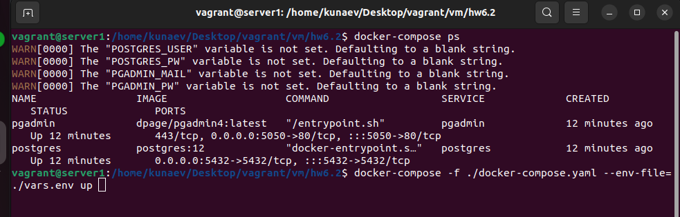
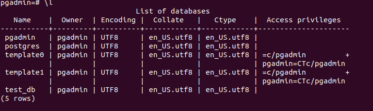
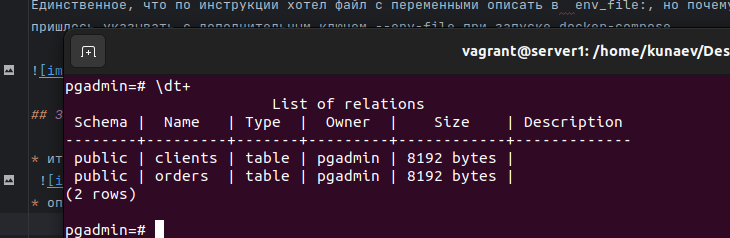
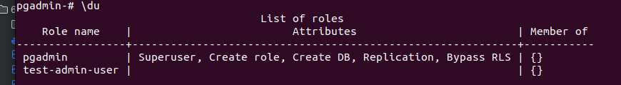
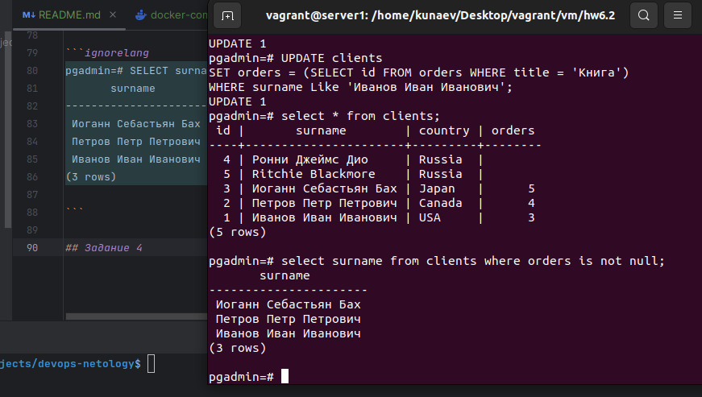
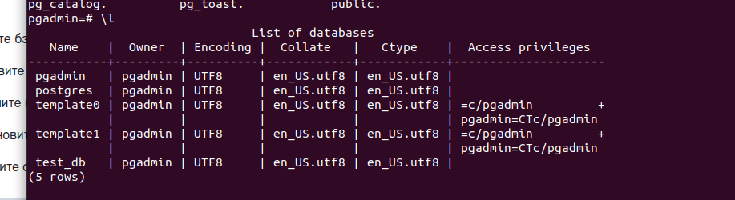

## Задание 1
Создал docker-compose файл для запуска postgres && gpadmin
Единственное, что по инструкции хотел файл с переменными описать в  env_file:, но почему-то не сработало,
пришлось указывать с дополнительным ключем --env-file при запуске docker-compose.



## Задание 2

* итоговый список БД после выполнения пунктов выше;
 
* описание таблиц (describe);
 
* SQL-запрос для выдачи списка пользователей с правами над таблицами test_db; \
SELECT * FROM information_schema.table_privileges, можно уточнить поиск по конкретному пользователю, добавив WHERE grantee = '{username}'
* список пользователей с правами над таблицами test_db.


## Задание 3

- запросы

```ignorelang
pgadmin=# INSERT INTO orders (title, price) VALUES
pgadmin-# ('Шоколад', 10),
pgadmin-# ('Принтер', 3000),
pgadmin-# ('Книга', 500),
pgadmin-# ('Монитор', 7000),
pgadmin-# ('Гитара', 4000);
- результаты их выполнения.
INSERT 0 5
```

```commandline
pgadmin=# INSERT INTO clients (surname, country) VALUES
('Иванов Иван Иванович', 'USA'),
('Петров Петр Петрович', 'Canada'),
('Иоганн Себастьян Бах', 'Japan'),
('Ронни Джеймс Дио', 'Russia'),
('Ritchie Blackmore', 'Russia');
- результаты их выполнения.
INSERT 0 5
```
* вычислите количество записей для каждой таблицы.
```ignorelang
pgadmin=# select count(id) from orders;
 count 
-------
     5
(1 row)
```

```ignorelang
pgadmin=# select count(id) from clients;
 count 
-------
     5
(1 row)
```

## Задание 4

Приведите SQL-запросы для выполнения этих операций.

```commandline
pgadmin UPDATE clients
SET orders = (SELECT id FROM orders WHERE title = 'Гитара')
WHERE surname = 'Иоганн Себастьян Бах';
UPDATE 1

pgadmin=# UPDATE clients
SET orders = (SELECT id FROM orders WHERE title = 'Монитор')
WHERE surname Like 'Петров Петр Петрович';
UPDATE 1
```

Приведите SQL-запрос для выдачи всех пользователей, которые совершили заказ, а также вывод этого запроса.

```ignorelang
pgadmin=# SELECT surname FROM clients WHERE orders IS NOT NULL;
       surname        
----------------------
 Иоганн Себастьян Бах
 Петров Петр Петрович
 Иванов Иван Иванович
(3 rows)

```



## Задание 4

pgadmin=# explain select surname from clients where orders is not null;
                        QUERY PLAN                         
-----------------------------------------------------------
 Seq Scan on clients  (cost=0.00..18.10 rows=806 width=32)
   Filter: (orders IS NOT NULL)
(2 rows)

Seq - последовательное сканирование записей \
Scan on clients - какая таблица сканируется \
cost - затратность начала операции и предлоложительная итоговая затратность операции в случае вывода всех строк \
rows - Ожидаемое число строк, которое должен вывести этот узел плана. При этом так же предполагается, что узел выполняется до конца. \
width - ожидаемый размер строк в битах

## Задача 6

```ignorelang
docker exec -it postgres pg_dump -h localhost -U pgadmin -F t -f /opt/backup_bd/backup.tar test_db
```
указываю локальный хост, юзера, формат выходного файла, директорию и имя файла, а также БД

Дальше уничтожил контейнер

```ignorelang
docker-compose stop
docker rm postgres
```
и запускаю новй экземпляр постгреса
```
docker-compose up
```
Поле чего создаем БД test_db

```ignorelang
docker exec -it postgres psql -U pgadmin -c "CREATE DATABASE test_db;"
и импортируем бэкап
vagrant@server1:/home/kunaev/Desktop/vagrant/vm/hw6.2$ docker exec -it postgres pg_restore -U pgadmin -F t -v -d test_db /opt/backup_bd/backup.tar
pg_restore: connecting to database for restore
pg_restore: implied data-only restore
```


Только странно, БД восстановилась, а таблиц в ней почему-то не найдено
pgadmin=# \dt
Did not find any relations.


