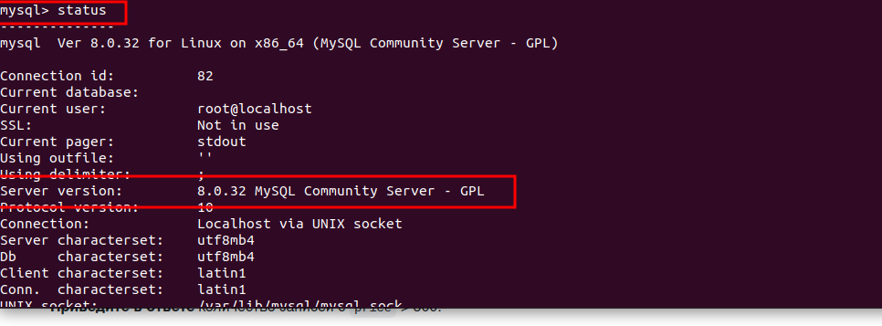
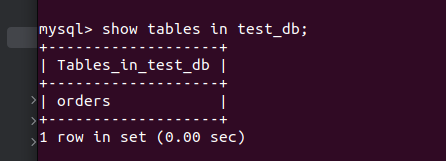
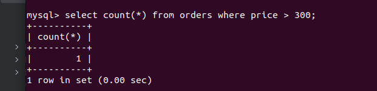
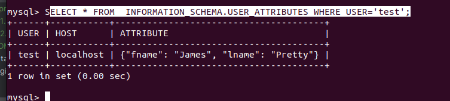
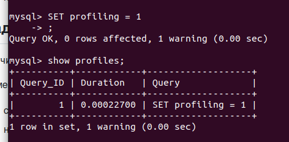
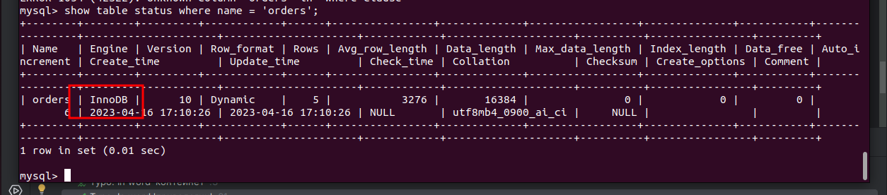

## Задание 1

Запустил контейнет с 8 версией MySQL, своим паролем и примонтированными каталогами
```ignorelang
docker run --name=mysql1 -v $(pwd)/db_dir:/tmp/db_dir -e MYSQL_ROOT_PASSWORD=Qwaszx -d mysql/mysql-server:8.0.32
```
Скачал БД
```ignorelang
wget https://raw.githubusercontent.com/netology-code/virt-homeworks/virt-11/06-db-03-mysql/test_data/test_dump.sql -O ./db_dir/test_db.sql
```
Восстановил
```ignorelang
docker exec -it mysql1 bash -c 'mysql -uroot -p test_db < /tmp/db_dir/test_db.sql'
```
Статус сервера 
```ignorelang
mysql> status;
```


Показать таблицы в БД

```ignorelang
mysql> show tables in test_db;
```


Выборка с ценой больше 300
```ignorelang
select count(*) from orders where price > 300;
```


## Задача 2

Создайте пользователя test в БД c паролем test-pass, используя:

* плагин авторизации mysql_native_password
```ignorelang
CREATE USER 'test'@'localhost' IDENTIFIED WITH mysql_native_password BY "test-pass"
```
* срок истечения пароля — 180 дней
```ignorelang
ALTER USER 'test'@'localhost' PASSWORD EXPIRE INTERVAL 180 DAY;
```
* количество попыток авторизации — 3
```ignorelang
ALTER USER 'test'@'localhost' FAILED_LOGIN_ATTEMPTS 3 PASSWORD_LOCK_TIME 3;
```
* максимальное количество запросов в час — 100
```ignorelang
ALTER USER 'test'@'localhost' WITH MAX_QUERIES_PER_HOUR 100;
```
* аттрибуты пользователя:
  * Фамилия "Pretty"
  * Имя "James".
```ignorelang
ALTER USER 'test'@'localhost' ATTRIBUTE '{"fname": "James", "lname": "Pretty"}';

```
* Предоставьте привелегии пользователю test на операции SELECT базы test_db.
```ignorelang
GRANT SELECT ON test_db TO 'test'@'localhost';
```
Используя таблицу INFORMATION_SCHEMA.USER_ATTRIBUTES, получите данные по пользователю test и приведите в ответе к задаче.
```ignorelang
SELECT * FROM  INFORMATION_SCHEMA.USER_ATTRIBUTES WHERE USER='test';
```


## Задача 3

Установите профилирование SET profiling = 1. Изучите вывод профилирования команд SHOW PROFILES;.


Исследуйте, какой engine используется в таблице БД test_db и приведите в ответе.


Измените engine и приведите время выполнения и запрос на изменения из профайлера в ответе
на MyISAM
```ignorelang
ALTER TABLE orders ENGINE = MyISAM;
```
MyISAM \
|       10 | 0.00022550 | SET profiling = 1 \
InnoDB \
|        1 | 0.00022700 | SET profiling = 1

## Задача 4

скорость IO важнее сохранности данных;
```ignorelang
innodb_flush_log_at_trx_commit = 0
```
Значение “0” даст наибольшую производительность. В этом случае буфер будет сбрасываться в лог файл независимо от транзакций. В этом случае риск потери данных возрастает.

нужна компрессия таблиц для экономии места на диске;
```ignorelang
innodb_file_format=Barracuda
```
Нужно включить формат Barracuda, который поддерживает сжатие таблиц, после чего будет необходимо
изменить саму таблицу, применив к ней комманду:
```ignorelang
ALTER TABLE orders ROW_FORMAT=COMPRESSED;
```
Также для удобства работы с таблицами, можно применить праметр
```ignorelang
innodb_file_per_table = 1
```
Который будет записывать таблицы каждую в отдельный файл.
размер буффера с незакомиченными транзакциями 1 Мб;
```ignorelang
innodb_log_buffer_size	= 1M
```

буффер кеширования 30% от ОЗУ;
```ignorelang
innodb_buffer_pool_size = 2048M
```

размер файла логов операций 100 Мб.
```ignorelang
max_binlog_size	= 100M
```

Итоговый файл после удаления закомментированных строк:

```ignorelang
[mysqld]
skip-host-cache
skip-name-resolve
datadir=/var/lib/mysql
socket=/var/lib/mysql/mysql.sock
secure-file-priv=/var/lib/mysql-files
user=mysql
pid-file=/var/run/mysqld/mysqld.pid

innodb_flush_log_at_trx_commit = 0
innodb_file_format=Barracuda
innodb_file_per_table = 1
innodb_log_buffer_size	= 1M
innodb_buffer_pool_size = 2048M
max_binlog_size	= 100M
```