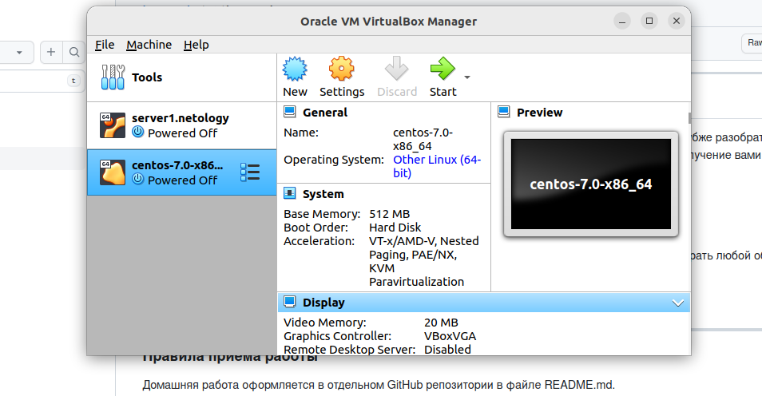

## Задача 0 /* Подготовка */

Скачайте и установите актуальную версию terraform (не менее 1.3.7). Приложите скриншот вывода команды terraform --version.


Скачайте на свой ПК данный git репозиторий. Исходный код для выполнения задания расположен в директории 01/src.


Убедитесь, что в вашей ОС установлен docker.


## Задача 1

Перейдите в каталог src. Скачайте все необходимые зависимости, использованные в проекте.
```ignorelang
wget https://raw.githubusercontent.com/netology-code/ter-homeworks/main/01/src/.terraformrc
wget https://raw.githubusercontent.com/netology-code/ter-homeworks/main/01/src/.gitignore
wget https://raw.githubusercontent.com/netology-code/ter-homeworks/main/01/src/main.tf
```
Использвал wget, тк не хотел все содержимое репозитория с ДЗ тянуть, а только нужные файлы.

**Изучите файл .gitignore. В каком terraform файле согласно этому .gitignore допустимо сохранить личную, секретную информацию?**

~~*В main и других файлах .tf, в которых не раскрывается содержимое состояния инфраструктуры (tfstate), \
значения чувствительных - приватных переменных (tfvars) и служебных (скрытых) файлов, название котрых начитается с "."*~~

В файле personal.auto.tfvars

**Выполните код проекта. Найдите в State-файле секретное содержимое созданного ресурса random_password. Пришлите его в качестве ответа.**


*GtiwMyudZIbDF4VK*

Раскомментируйте блок кода, примерно расположенный на строчках 29-42 файла main.tf. Выполните команду terraform validate. Объясните в чем заключаются намеренно допущенные ошибки? Исправьте их.


У типа resource должно быть 2 лейбла. В первом случае он отсутствовал, а во второй начинался с недопустимого символа (цифры)

Выполните код. В качестве ответа приложите вывод команды docker ps


nginx радостно завелся.

Замените имя docker-контейнера в блоке кода на hello_world, выполните команду terraform apply -auto-approve. Объясните своими словами, в чем может быть опасность применения ключа -auto-approve ?


Недостатком режима авто-подтверждения является отсутствие интерактивного взаимодейсвтя с пользователем с демострацией ресурсов, которые будут изменены. \
Тк, если в ходе проверки обнаружены опечатки или missconfig, то операцию можно прервать без последствий.

Уничтожьте созданные ресурсы с помощью terraform. Убедитесь, что все ресурсы удалены. Приложите содержимое файла terraform.tfstate.


Удалил контейнер.

~~Согласно документации Хашикорпа и еще пары внешних источников, команда destroy
удаляет только объекты, управление которыми осуществляется терраформом. Сам образ
не является управляемой единицей или процессом и храниться в репозитории (хранилище) докера,
участвуя только в запуске контейнера, но не его работе, в связи с чем и не удаляется при выполнении
указанной комманды.~~

~~Для удаления неиспользуемых образов используется команда docker system prune~~

В конфигурационом файле, например main.tf, в блоке, описывающим ресурс, нужно выставить
параметр rm = true (по умолчанию false), тогда контейнер удалится после выполнения terraform destroy.

## Задача 2

~~При попытке установки провайдера для виртуалбокса 
согласно инструкии на [гитхабе](https://github.com/pyToshka/terraform-provider-virtualbox), выяснилось, что 
в ОС Ubuntu 22.04 оказывается нет предустановленного go. Не беда - поставил из стандартной репы 1.18.1,
так выяснилось, что метод get - устаревший (deprecated). Не беда - поставил через go install, 
но terraform провайдера в упор не видит, как и не видит его в репозитории зеркала яндекса. В общем мрак)~~

Проблема была в том, что терраформ продолжал пытаться использовать хашикорповский репозиторий, который по 403 отказывал
в обслуживании. Причем помещение файла .terraformrc с конфигом на зеркало яндекса в ~/.terraform.d/ эффекта не возымело 
(ни юзеру, ни руту). Скорее всего из-за того, что ранее с яндекс клаудом работал и что-то у него там перемкнуло.
Переустанавливать было лень, по этому решил вопрос через vpn. 

Вывод terraform plan

```ignorelang
kunaev@kunaev-home:~/Desktop/vagrant/vm/hw71/task2$ terraform plan
virtualbox_vm.vm1_centos7_kunaev: Refreshing state... [id=72e38696-711f-4c13-9b79-433ea5beaff2]

Note: Objects have changed outside of Terraform

Terraform detected the following changes made outside of Terraform since the
last "terraform apply" which may have affected this plan:

  # virtualbox_vm.vm1_centos7_kunaev has changed
  ~ resource "virtualbox_vm" "vm1_centos7_kunaev" {
      + boot_order = []
        id         = "72e38696-711f-4c13-9b79-433ea5beaff2"
        name       = "centos-7.0-x86_64"
      ~ status     = "running" -> "poweroff"
        # (3 unchanged attributes hidden)

      ~ network_adapter {
          - ipv4_address           = "192.168.56.101" -> null
          ~ ipv4_address_available = "yes" -> "no"
          ~ status                 = "up" -> "down"
            # (4 unchanged attributes hidden)
        }
    }


Unless you have made equivalent changes to your configuration, or ignored the
relevant attributes using ignore_changes, the following plan may include
actions to undo or respond to these changes.

───────────────────────────────────────────────────────────────────────────────

Terraform used the selected providers to generate the following execution plan.
Resource actions are indicated with the following symbols:
  ~ update in-place

Terraform will perform the following actions:

  # virtualbox_vm.vm1_centos7_kunaev will be updated in-place
  ~ resource "virtualbox_vm" "vm1_centos7_kunaev" {
        id         = "72e38696-711f-4c13-9b79-433ea5beaff2"
        name       = "centos-7.0-x86_64"
      ~ status     = "poweroff" -> "running"
        # (4 unchanged attributes hidden)

        # (1 unchanged block hidden)
    }

Plan: 0 to add, 1 to change, 0 to destroy.

Changes to Outputs:
  ~ IPAddress = "192.168.56.101" -> ""

───────────────────────────────────────────────────────────────────────────────

Note: You didn't use the -out option to save this plan, so Terraform can't
guarantee to take exactly these actions if you run "terraform apply" now.
```

Скрин из виртуалбокса.

