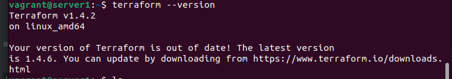
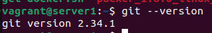
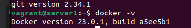
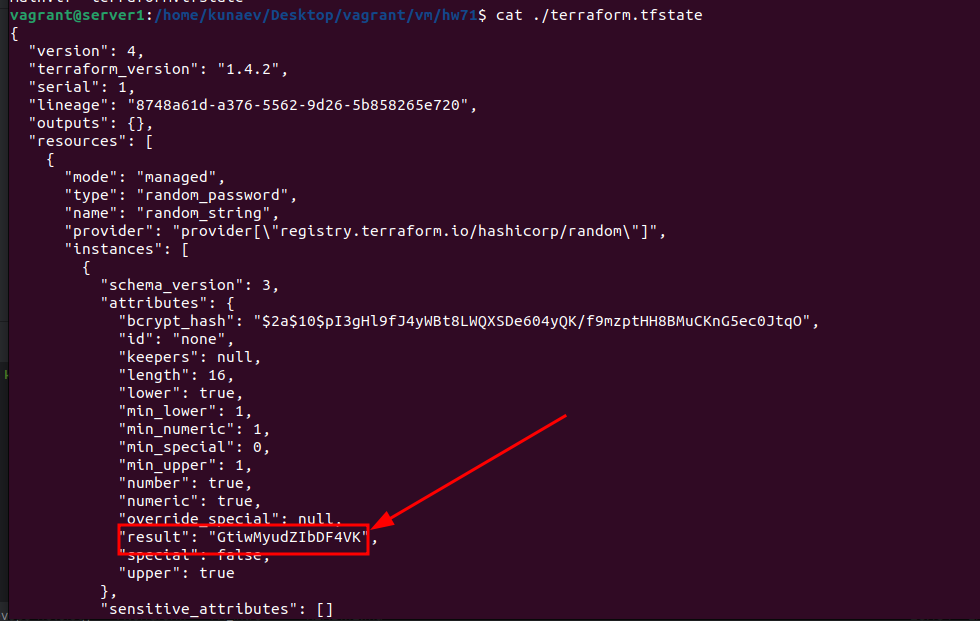
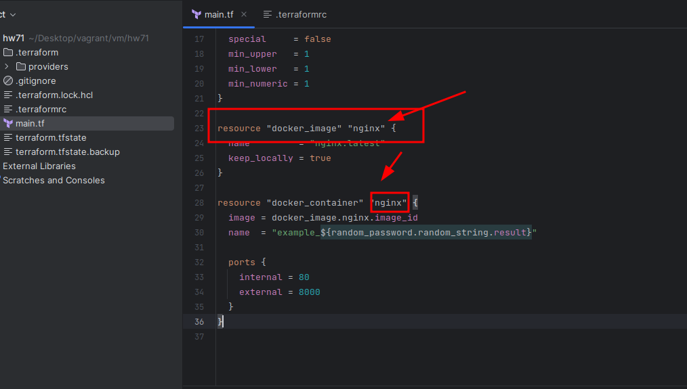
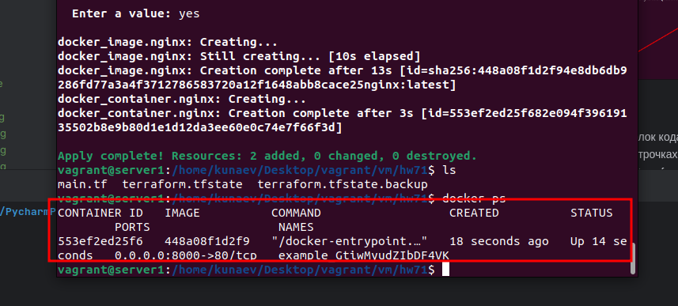
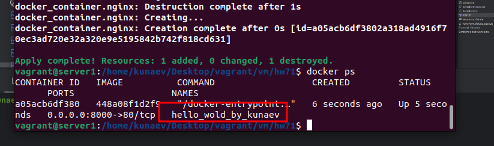
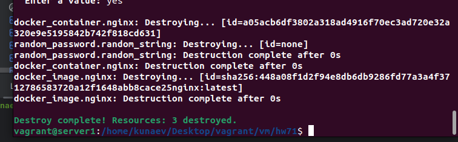

## Задача 0 /* Подготовка */

Скачайте и установите актуальную версию terraform (не менее 1.3.7). Приложите скриншот вывода команды terraform --version.

Скачайте на свой ПК данный git репозиторий. Исходный код для выполнения задания расположен в директории 01/src.

Убедитесь, что в вашей ОС установлен docker.


## Задача 1

Перейдите в каталог src. Скачайте все необходимые зависимости, использованные в проекте.
```ignorelang
wget https://raw.githubusercontent.com/netology-code/ter-homeworks/main/01/src/.terraformrc
wget https://raw.githubusercontent.com/netology-code/ter-homeworks/main/01/src/.gitignore
wget https://raw.githubusercontent.com/netology-code/ter-homeworks/main/01/src/main.tf
```
Изучите файл .gitignore. В каком terraform файле допустимо сохранить личную, секретную информацию?

*В main и других файлах .tf, в которых не раскрывается содержимое состояния инфраструктуры (tfstate), \
значения чувствительных - приватных переменных (tfvars) и служебных (скрытых) файлов, название котрых начитается с "."*

Выполните код проекта. Найдите в State-файле секретное содержимое созданного ресурса random_password. Пришлите его в качестве ответа.



*GtiwMyudZIbDF4VK*

Раскомментируйте блок кода, примерно расположенный на строчках 29-42 файла main.tf. Выполните команду terraform validate. Объясните в чем заключаются намеренно допущенные ошибки? Исправьте их.


У типа resource должно быть 2 лейбла. В первом случае он отсутствовал, а во второй начинался с недопустимого символа (цифры)

Выполните код. В качестве ответа приложите вывод команды docker ps

nginx радостно завелся.

Замените имя docker-контейнера в блоке кода на hello_world, выполните команду terraform apply -auto-approve. Объясните своими словами, в чем может быть опасность применения ключа -auto-approve ?

Недостатком режима авто-подтверждения является отсутствие интерактивного взаимодейсвтя с пользователем с демострацией ресурсов, которые будут изменены. \
Тк, если в ходе проверки обнаружены опечатки или missconfig, то операцию можно прервать без последствий.

Уничтожьте созданные ресурсы с помощью terraform. Убедитесь, что все ресурсы удалены. Приложите содержимое файла terraform.tfstate.

Удалил контейнер.

Согласоно документации Хашикорпа и еще пары внешних источников, команда destroy
удаляет только объекты, управление которыми осуществляется терраформом. Сам образ
не является управляемой единицей или процессом и храниться в репозитории (хранилище) докера,
участвуя только в запуске контейнера, но не его работе, в связи с чем и не удаляется при выполнении
указанной комманды.

Для удаления неиспользуемых образов используется команда docker system prune

## Задача 2

При попытке установки провайдера для виртуалбокса 
согласно инструкии на [гитхабе](https://github.com/pyToshka/terraform-provider-virtualbox), выяснилось, что 
в ОС Ubuntu 22.04 оказывается нет предустановленного go. Не беда - поставил из стандартной репы 1.18.1,
так выяснилось, что метод get - устаревший (deprecated). Не беда - поставил через go install, 
но terraform провайдера в упор не видит, как и не видит его в репозитории. В общем мрак)