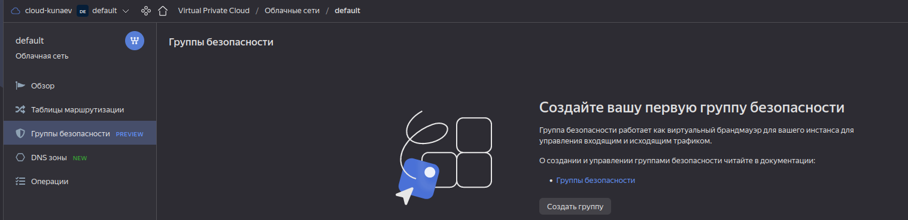
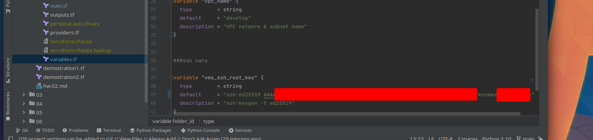
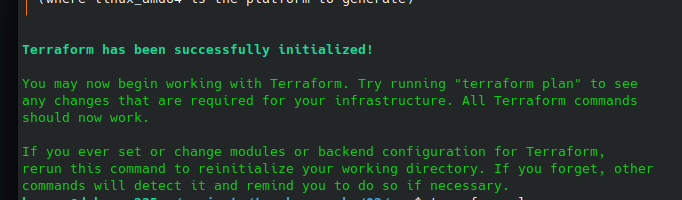
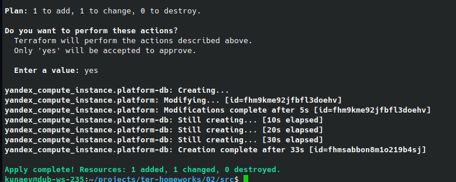

## Задание 0

Доступ к security-groups предоставлен.

!

## Задание 1

* Добавил в variables.tf, переменной  vms_ssh_root_key дефолтным значением сгенерированный ключ



* переименовал personal.auto.tfvars
* произвел terraform init, однако при инициализации ошибок не было, запустилось в 1 раза. 

* Единственная ошибка была при запуске terraform apply, а именно ругнулся на количество процессоров у ВМ. Было указано значение 1,
в то время, как стандарт обслуживания поддерживал минимум 2.
* preemptible - прерываемость. Предусматривает остановку созданной ВМ в 2 случаях: \
когда с момента запуска прошло 24 часа \
когда не хватает ресурсов для запуска обычной ВМ
* core_fraction - базовая производительность ЦПУ. Параметр определяет гарантированное время, которое выделяется виртуальному ядру для
взаимодействия в физическим в еденицу времени. Минимальное значение 5, макс. 100%.

## Задание 2

В файле variables.tf определены следующие переменные:
```terraform
variable "vm_web_image" {
  type        = string
  default     = "ubuntu-2004-lts"
  description = "https://cloud.yandex.ru/marketplace?categories=os"
}

#platform vars
variable "vm_web_platform_name" {
  type        = string
  default     = "netology-develop-platform-web"
}

variable "vm_web_maintenance_class" {
  type        = string
  default     = "standard-v1"
  description = "https://cloud.yandex.ru/docs/compute/concepts/vm-platforms"
}
```
Хардкод в main.tf был заменен следующими переменными:
```terraform
data "yandex_compute_image" "ubuntu" {
  family = var.vm_web_image
}

resource "yandex_compute_instance" "platform" {
  name        = var.vm_web_platform_name
  platform_id = var.vm_web_maintenance_class

```

Вывод terraform plan

```ignorelang
kunaev@dub-ws-235:~/projects/ter-homeworks/02/src$ terraform plan
data.yandex_compute_image.ubuntu: Reading...
yandex_vpc_network.develop: Refreshing state... [id=enpppuqqnn7ti67cls32]
data.yandex_compute_image.ubuntu: Read complete after 0s [id=fd83gfh90hpp3sojs1r3]
yandex_vpc_subnet.develop: Refreshing state... [id=e9b88ts67bol0g54efdc]
yandex_compute_instance.platform: Refreshing state... [id=fhm9kme92jfbfl3doehv]

No changes. Your infrastructure matches the configuration.

Terraform has compared your real infrastructure against your configuration and found no differences, so no changes are needed.
```

## Задание 3

Описана инфраструктура инстанса БД

```terraform
#vm db image vars

variable "vm_db_image" {
  type        = string
  default     = "ubuntu-2004-lts"
  description = "https://cloud.yandex.ru/marketplace?categories=os"
}

#platform vars
variable "vm_db_platform_name" {
  type        = string
  default     = "netology-develop-platform-db"
}

variable "vm_db_maintenance_class" {
  type        = string
  default     = "standard-v1"
  description = "https://cloud.yandex.ru/docs/compute/concepts/vm-platforms"
}

# resourse description

resource "yandex_compute_instance" "platform-db" {
  name        = var.vm_db_platform_name
  platform_id = var.vm_db_maintenance_class

  resources {
    cores         = 2
    memory        = 2
    core_fraction = 20
  }
  boot_disk {
    initialize_params {
      image_id = data.yandex_compute_image.ubuntu.image_id
    }
  }
  scheduling_policy {
    preemptible = true
  }
  network_interface {
    subnet_id = yandex_vpc_subnet.develop.id
    nat       = true
  }

  metadata = {
    serial-port-enable = 1
    ssh-keys           = "ubuntu:${var.vms_ssh_root_key}"
  }

}
```

Изменения успешно применены. Изменения в 1й машине - это поменял хостнейм.




## Задание 4

Определены параметры outputs

```terraform
output "platform" {
  value = yandex_compute_instance.platform.network_interface[0].nat_ip_address
}
output "platform_db" {
  value = yandex_compute_instance.platform-db.network_interface[0].nat_ip_address
}

output "platform_map" {
  value = {
    instance_name = yandex_compute_instance.platform.name
    external_ip = yandex_compute_instance.platform-db.network_interface[0].nat_ip_address
  }
}

output "platform_db_map" {
  value = {
    instance_name = yandex_compute_instance.platform.name
    external_ip = yandex_compute_instance.platform-db.network_interface[0].nat_ip_address
  }
}
```

Вывод комманды apply && output

```ignorelang
Outputs:

platform = "158.160.56.63"
platform_db = "158.160.53.184"
platform_db_map = {
  "external_ip" = "158.160.53.184"
  "instance_name" = "netology-develop-platform-web"
}
platform_map = {
  "external_ip" = "158.160.53.184"
  "instance_name" = "netology-develop-platform-web"
}

```

## Задание 5
* В файле locals.tf опишите в одном local-блоке имя каждой ВМ, используйте интерполяцию ${..} с несколькими переменными по примеру из лекции
```terraform
locals {
  web_name    = "netology-${var.vm_web_platform_name}"
  db_name     = "netology-${var.vm_db_platform_name}"
}
```

* Замените переменные с именами ВМ из файла variables.tf на созданные вами local переменные.
```terraform
resource "yandex_compute_instance" "platform-db" {
  name        = local.db_name
  platform_id = var.vm_db_maintenance_class
```

```terraform
resource "yandex_compute_instance" "platform" {
  name        = local.web_name
  platform_id = var.vm_web_maintenance_class
```

* Примените изменения.
```ignorelang
kunaev@dub-ws-235:~/projects/ter-homeworks/02/src$ terraform plan
data.yandex_compute_image.ubuntu: Reading...
yandex_vpc_network.develop: Refreshing state... [id=enpppuqqnn7ti67cls32]
data.yandex_compute_image.ubuntu: Read complete after 0s [id=fd83gfh90hpp3sojs1r3]
yandex_vpc_subnet.develop: Refreshing state... [id=e9b88ts67bol0g54efdc]
yandex_compute_instance.platform: Refreshing state... [id=fhm9kme92jfbfl3doehv]
yandex_compute_instance.platform-db: Refreshing state... [id=fhmsabbon8m1o219b4sj]

No changes. Your infrastructure matches the configuration.

Terraform has compared your real infrastructure against your configuration and found no differences, so no changes are needed.

```

## Задание 6

* Вместо использования 3-х переменных ".._cores",".._memory",".._core_fraction" в блоке resources {...}, объедените их в переменные типа map с именами "vm_web_resources" и "vm_db_resources".

```terraform
variable "web_platform_resources" {
  default = {
    cores         = 2
    memory        = 1
    core_fraction = 5
  }
  type = object({
    cores=number
    memory=number
    core_fraction=number
  })
}

variable "bd_platform_resources" {
  default = {
    cores         = 2
    memory        = 2
    core_fraction = 20
  }
  type = object({
    cores=number
    memory=number
    core_fraction=number
  })
}
```

* Так же поступите с блоком metadata {serial-port-enable, ssh-keys}, эта переменная должна быть общая для всех ваших ВМ.

Определил значение переменных
```terraform
variable "metadata_info" {
  default = {
    serial-port-enable = 1
    ssh-keys           = "ssh-ed25519 AAAAC3NzaC1lZDI1NTE5AAAAIGMnEWb24K3HZ4E0L7GvrcRUECIhelmu0eBKQuGtK4CR kunaev@dub-ws-235"
  }
  type = object({
    serial-port-enable=number
    ssh-keys=string
  })
}
```

Заменил значения metadata в описаниях ресурсов
```terraform
  metadata = {
    serial-port-enable = var.metadata_info.serial-port-enable
    ssh-keys           = var.metadata_info.ssh-keys
  }
```

* Найдите и удалите все более не используемые переменные проекта. \
vms_ssh_root_key закомментирован

terraform plan сказал, что изменений не будет.
```ignorelang
kunaev@dub-ws-235:~/projects/ter-homeworks/02/src$ terraform plan
data.yandex_compute_image.ubuntu: Reading...
yandex_vpc_network.develop: Refreshing state... [id=enpppuqqnn7ti67cls32]
data.yandex_compute_image.ubuntu: Read complete after 0s [id=fd83gfh90hpp3sojs1r3]
yandex_vpc_subnet.develop: Refreshing state... [id=e9b88ts67bol0g54efdc]
yandex_compute_instance.platform-db: Refreshing state... [id=fhmsabbon8m1o219b4sj]
yandex_compute_instance.platform: Refreshing state... [id=fhm9kme92jfbfl3doehv]

No changes. Your infrastructure matches the configuration.

Terraform has compared your real infrastructure against your configuration and found no differences, so no changes are needed.
```

## Задание 7

Напишите, какой командой можно отобразить второй элемент списка test_list?
    
    > local.test_list[1]
    "staging"

Найдите длину списка test_list с помощью функции length(<имя переменной>).

    > length(local.test_list)
    3

Напишите, какой командой можно отобразить значение ключа admin из map test_map ?
    
    > local.test_map["admin"]
    "John"

Напишите interpolation выражение, результатом которого будет: "John is admin for production server based on OS ubuntu-20-04 with X vcpu, Y ram and Z virtual disks", используйте данные из переменных test_list, test_map, servers и функцию length() для подстановки значений.
```terraform
  result = "${local.test_map.admin} is admin for production server based on ${local.servers.production.image} with ${local.servers.production.cpu} vcpu, ${local.servers.production.ram} ram and ${length(local.servers.production.disks)} virtual disks"
```

Результат выполнения

```ignorelang
> local.result
"John is admin for production server based on ubuntu-20-04 with 10 vcpu, 40 ram and 4 virtual disks"
```