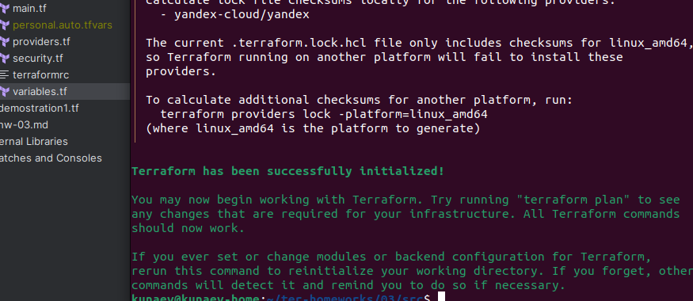
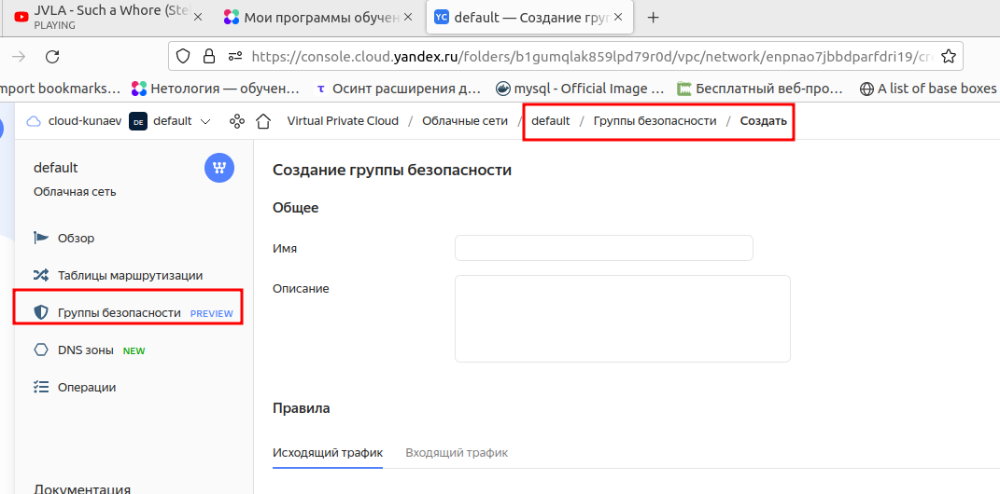
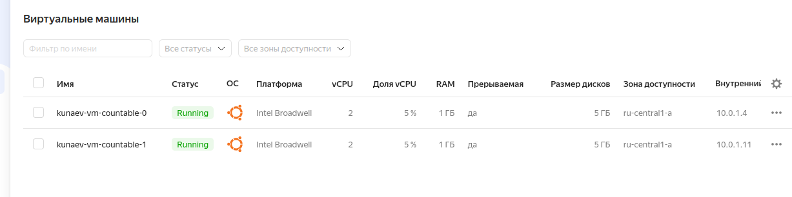
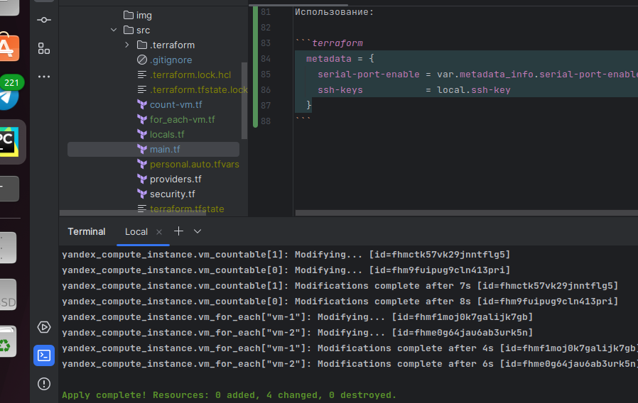

## Задание 1

* Инициализация проекта прошла успешно


* Приложите скриншот входящих правил "Группы безопасности" в ЛК Yandex Cloud 


## Задание 2

1. Создайте файл count-vm.tf. Опишите в нем создание двух **одинаковых** виртуальных машин с минимальными параметрами, используя мета-аргумент **count loop**. \
Созданы 2 VM в "минимальной" комплектации.


2.Создайте файл for_each-vm.tf. 
Опишите в нем создание 2 разных по cpu/ram/disk виртуальных машин, используя мета-аргумент for_each loop.
Используйте переменную типа list(object({ vm_name=string, cpu=number, ram=number, disk=number })).
При желании внесите в переменную все возможные параметры.

Создана переменная со списком словарей
```terraform
variable "vm_resources_list" {
  type = list(object({
    vm_name       = string
    cpu           = number
    ram           = number
    disk          = number
    core_fraction = number
  }))
  default = [
    {
      vm_name       = "vm-1"
      cpu           = 2
      ram           = 1
      disk          = 1
      core_fraction = 5

    },
        {
      vm_name       = "vm-2"
      cpu           = 2
      ram           = 2
      disk          = 3
      core_fraction = 5
    },
  ]
  description = "There's list if dict's with VM resources"
}

```

В блоке resources, в разделе for_each идет итерация по списку

```terraform
  for_each   = {
    for index, vm in var.vm_resources_list:
    vm.vm_name => vm
  }
  name        = each.value.vm_name

  resources {
    cores         = each.value.cpu
    memory        = each.value.ram
    core_fraction = each.value.core_fraction

  }
```

3. ВМ из пункта 2.2 должны создаваться после создания ВМ из пункта 2.1.

  depends_on = [yandex_compute_instance.vm_countable]
  
4. Используйте функцию file в local переменной для считывания ключа ~/.ssh/id_rsa.pub и его последующего использования в блоке metadata, взятому из ДЗ №2.

```terraform
locals {
  ssh-key = "ubuntu:${file("~/.ssh/ya_key.pub")}"
}
```

Использование:

```terraform
  metadata = {
    serial-port-enable = var.metadata_info.serial-port-enable
    ssh-keys           = local.ssh-key
  }
```
5. Инициализируйте проект, выполните код


## Задание 3