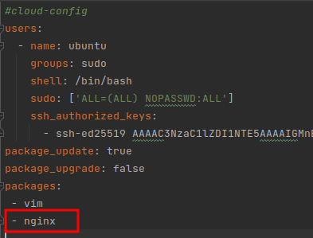
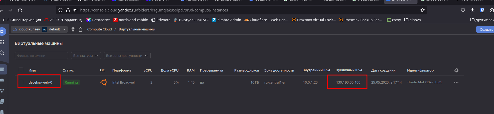
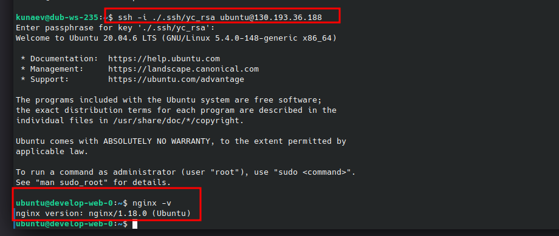

## Задание 1

* Добавьте в файл cloud-init.yml установку nginx.

* Предоставьте скриншот подключения к консоли и вывод команды sudo nginx -t.

Вот сам хост

Вот подключился к нему по ключу и вызвал nginx -v

