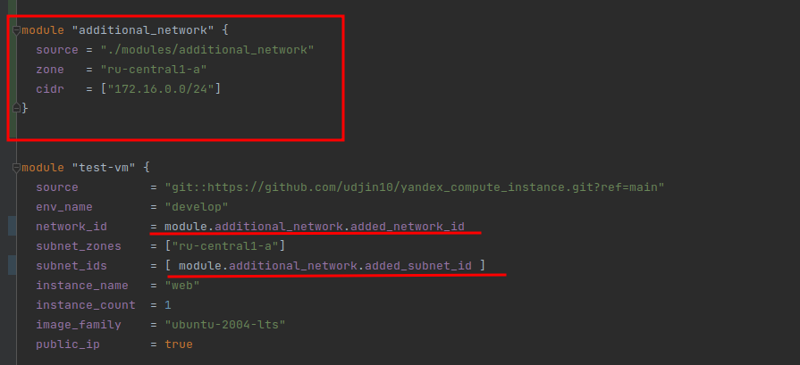
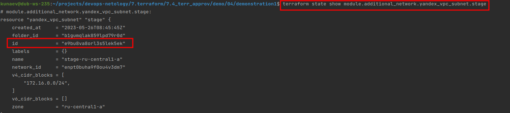
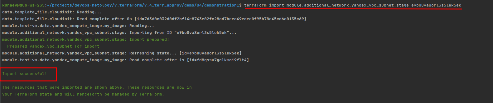
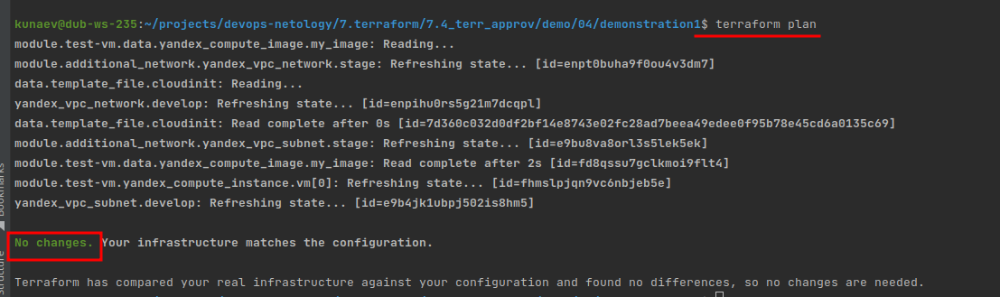

## Задание 1

* Добавьте в файл cloud-init.yml установку nginx.


* Предоставьте скриншот подключения к консоли и вывод команды sudo nginx -t.

Вот сам хост


Вот подключился к нему по ключу и вызвал nginx -v


## Задание 2

* Напишите локальный модуль vpc, который будет создавать 2 ресурса: одну сеть и одну подсеть в зоне, объявленной при вызове модуля. например: ru-central1-a.

main

```terraform
terraform {
  required_providers {
    yandex = {
      source = "yandex-cloud/yandex"
    }
  }
  required_version = ">=0.13"
}

resource "yandex_vpc_network" "stage" {
  name = "stage"
}

resource "yandex_vpc_subnet" "stage" {
  name           = "stage-${var.zone}"
  zone           = var.zone
  network_id     = yandex_vpc_network.stage.id
  v4_cidr_blocks = var.cidr
}

```
        
variables

```terraform
variable "zone" {
  type        = string
  default     = "ru-central1-a"
  description = "https://cloud.yandex.ru/docs/overview/concepts/geo-scope"
  validation {
    condition = contains(["ru-central1-a", "ru-central1-b", "ru-central1-c"], var.zone)
    error_message = "Invalid zone, choose one of ru-central1-{a, b or c}."
  }
}

variable "cidr" {
  type        = list(string)
  default     = ["172.16.0.0/24"]
  description = "https://networkencyclopedia.com/local-address/"
}
```

* Модуль должен возвращать значения vpc.id и subnet.id

outputs

```terraform
output "added_network_id" {
  value = yandex_vpc_network.stage.id
}

output "added_subnet_id" {
  value = yandex_vpc_subnet.stage.id
}

output "added_subnet_netmask" {
  value = yandex_vpc_subnet.stage.v4_cidr_blocks
}
```

* Замените ресурсы yandex_vpc_network и yandex_vpc_subnet, созданным модулем.



* Сгенерируйте документацию к модулю с помощью terraform-docs.

docker pull quay.io/terraform-docs/terraform-docs

docker run --rm --volume "$(pwd):/terraform-docs" -u $(id -u) quay.io/terraform-docs/terraform-docs markdown ./terraform-docs | tee ./docs.md

Вот сама [дока](https://github.com).

З.Ы. обнаружена следующая бага:

    чтобы можно было обратиться к модулю, нужно его сначала создать. \
    при этом, во время воследующих применений терраформ apply или destroy 
    нарушается порядок применения/удаления модулей.

    например терраформ пересоздает есть, соответственно меняется вшений адрес у маины, но
    терраформ потом еще пытается проверить ее доступность по старому адресу и соответственно возникает ошибка.
      *-  error: code = NotFound desc = Address 51.250.12.76 not found -*

    Или при удалении ресурсов он пытается удалить модуль, тк он описан раньше, но возникает ошибка,
    что невозможно удалить подсеть, тк она еще используется, ведь модуль с посетью описан раньше чем вм, 
    которая ее использует.
      *- FailedPrecondition desc = Subnet has allocated instances -*
    я так полагаю эту проблему и должен решать terragrunt ?

## Задание 3

* Выведите список ресурсов в стейте.

```ignorelang
kunaev@dub-ws-235:~/projects/devops-netology/7.terraform/7.4_terr_approv/demo/04/demonstration1$ terraform state list
data.template_file.cloudinit
yandex_vpc_network.develop
yandex_vpc_subnet.develop
module.additional_network.yandex_vpc_network.stage
module.additional_network.yandex_vpc_subnet.stage
module.test-vm.data.yandex_compute_image.my_image
module.test-vm.yandex_compute_instance.vm[0]

```

Смотрим ижентификатор



* Удалите из стейта модуль vpc.

```ignorelang
kunaev@dub-ws-235:~/projects/devops-netology/7.terraform/7.4_terr_approv/demo/04/demonstration1$ terraform state rm module.additional_network.yandex_vpc_subnet.stage

Removed module.additional_network.yandex_vpc_subnet.stage
Successfully removed 1 resource instance(s).
```

* Импортируйте его обратно. Проверьте terraform plan - изменений быть не должно. Приложите список выполненных команд и вывод.

```ignorelang
terraform import module.additional_network.yandex_vpc_subnet.stage e9bu8va8orl3s5lek5ek
```



```ignorelang
terraform plan
```

