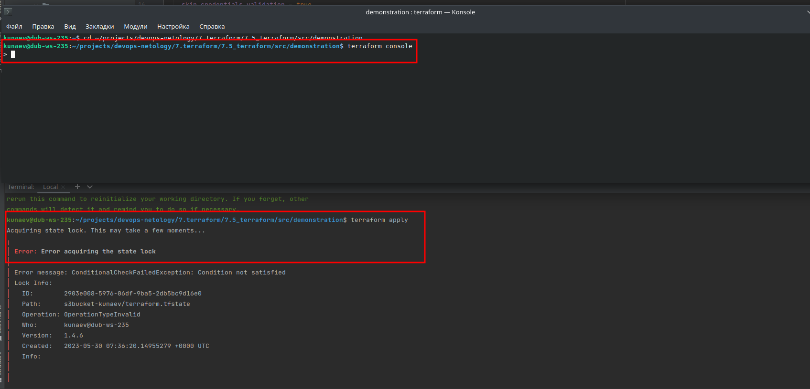
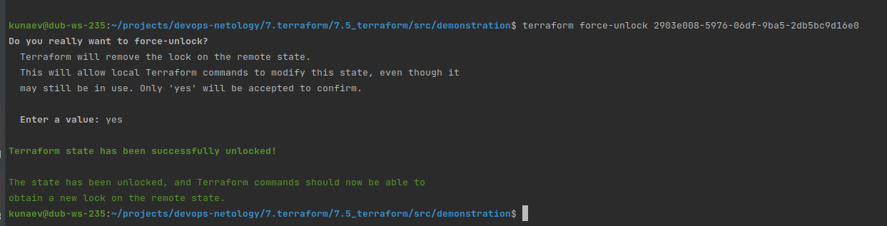

# Задание 1

* Возьмите код
```ignorelang
 git clone git@github.com:netology-code/ter-homeworks.git
```

* Проверьте код с помощью tflint и checkov. Вам не нужно инициализировать этот проект.

```ignorelang
docker pull ghcr.io/terraform-linters/tflint:v0.46.1
docker pull bridgecrew/checkov

docker run --rm -v "$(pwd):/tflint" ghcr.io/terraform-linters/tflint /tflint > ./tflint_output
docker run --rm --tty --volume $(pwd):/tf --workdir /tf bridgecrew/checkov --download-external-modules true --directory /tf | tee ./checkou_output
```

* Перечислите какие типы ошибок обнаружены в проекте (без дублей).

* Checkov 
  * не назначен внешний адрес
  * не назначена группа безопасности 

* Tflint
  * нет указания на версию у провайдера yandex и template
  * Мodule source "git::..." использует вертку по умолчанию как ссылку 
  * переменные vpc_name и public_key описаны но не используются

# Задание 2

* Возьмите ваш GitHub репозиторий с выполненным ДЗ №4 в ветке 'terraform-04' и сделайте из него ветку 'terraform-05'
```ignorelang
git checkout -b terraform-05
```

* Повторите демонстрацию лекции: настройте YDB, S3 bucket, yandex service account, права доступа и мигрируйте State проекта в S3 с блокировками.
```ignorelang

  backend "s3" {
    endpoint = "storage.yandexcloud.net"
    bucket = "s3bucket-kunaev"
    region = "ru-central1"
    key = "terraform.tfstate"

    skip_region_validation      = true
    skip_credentials_validation = true

    dynamodb_endpoint = "https://docapi.serverless.yandexcloud.net/ru-central1/****"
    dynamodb_table = "tfstate"
  }
  
  ----------
terraform init -backend-config="access_key=YC****y" -backend-config="secret_key=YCO****Uy"

```

* Закомитьте в ветку 'terraform-05' все изменения.

```ignorelang
git commit -a -m "hw7.5_rc2"
git push origin terraform-05
```
* Откройте в проекте terraform console, а в другом окне из этой же директории попробуйте запустить terraform apply.
* Пришлите ответ об ошибке доступа к State.


* Принудительно разблокируйте State. Пришлите команду и вывод.


# Задание 3

* Сделайте в GitHub из ветки 'terraform-05' новую ветку 'terraform-hotfix'.
* 
```ignorelang
git checkout -b terraform-hotfix
```

