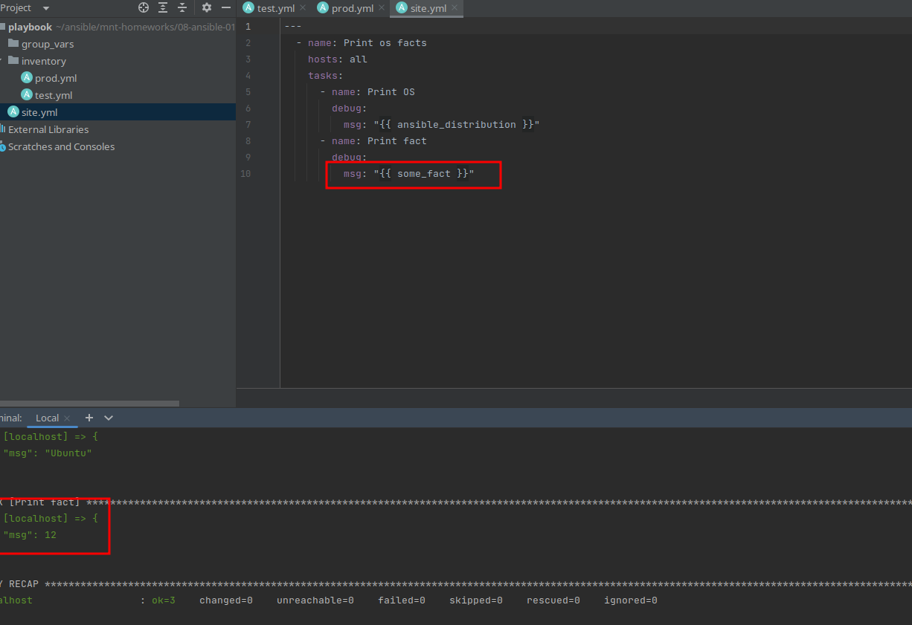

# Main
* Попробуйте запустить playbook на окружении из test.yml, зафиксируйте значение, которое имеет факт some_fact для 
указанного хоста при выполнении playbook.

```ignorelang
 ansible-playbook -i inventory/test.yml site.yml 

TASK [Print fact] *****************************************************************************************************************************************************
ok: [localhost] => {
    "msg": 12
}
```



* Найдите файл с переменными (group_vars), в котором задаётся найденное в первом пункте значение, и поменяйте его на all default fact.

