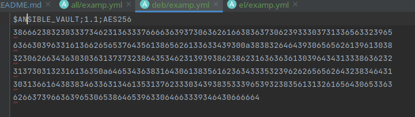

# Main
* Попробуйте запустить playbook на окружении из test.yml, зафиксируйте значение, которое имеет факт some_fact для 
указанного хоста при выполнении playbook.

```ignorelang
 ansible-playbook -i inventory/test.yml site.yml 

TASK [Print fact] *****************************************************************************************************************************************************
ok: [localhost] => {
    "msg": 12
}
```


* Найдите файл с переменными (group_vars), в котором задаётся найденное в первом пункте значение, и поменяйте его на all default fact.


* Воспользуйтесь подготовленным (используется docker) или создайте собственное окружение для проведения дальнейших испытаний.

```ignorelang
docker pull centos/python-38-centos7
docker pull matthewfeickert/docker-python3-ubuntu

docker run -it --rm -d --name ubuntu matthewfeickert/docker-python3-ubuntu /bin/bash
docker run -it --rm -d --name centos7 centos/python-38-centos7 /bin/bash
```

* Проведите запуск playbook на окружении из prod.yml. Зафиксируйте полученные значения some_fact для каждого из managed host.
```ignorelang
ansible-playbook -i inventory/prod.yml site.yml 

TASK [Print fact] **********************************************************************************************************************************************************************************************************************
ok: [centos7] => {
    "msg": "el"
}
ok: [ubuntu] => {
    "msg": "deb"
}

```

* Добавьте факты в group_vars каждой из групп хостов так, чтобы для some_fact получились значения: для deb — deb default fact, для el — el default fact.
* Повторите запуск playbook на окружении prod.yml. Убедитесь, что выдаются корректные значения для всех хостов.
```ignorelang
TASK [Print fact] *****************************************************************
    "msg": "el default fact"
}
ok: [ubuntu] => {
    "msg": "deb default fact"
}

PLAY RECAP ***********************************************************************
centos7                    : ok=3    changed=0    unreachable=0    failed=0    skipped=0    rescued=0    ignored=0   
ubuntu                     : ok=3    changed=0    unreachable=0    failed=0    skipped=0    rescued=0    ignored=0  
```

* При помощи ansible-vault зашифруйте факты в group_vars/deb и group_vars/el с паролем netology.

```ignorelang
ansible-vault encrypt group_vars/deb/examp.yml 
ansible-vault encrypt group_vars/el/examp.yml
```



* Запустите playbook на окружении prod.yml. При запуске ansible должен запросить у вас пароль. Убедитесь в работоспособности.

```ignorelang
kunaev@dub-ws-235:~/projects/devops-netology/8.ansible/8.1_intro/playbook$ ansible-playbook -i inventory/prod.yml site.yml --ask-vault-pass
Vault password:

TASK [Print fact] **********************************************************************************************************************************************************************************************************************
ok: [centos7] => {
    "msg": "el default fact"
}
ok: [ubuntu] => {
    "msg": "deb default fact"
}

PLAY RECAP *****************************************************************************************************************************************************************************************************************************
centos7                    : ok=3    changed=0    unreachable=0    failed=0    skipped=0    rescued=0    ignored=0   
ubuntu                     : ok=3    changed=0    unreachable=0    failed=0    skipped=0    rescued=0    ignored=0   

```

* Посмотрите при помощи ansible-doc список плагинов для подключения. Выберите подходящий для работы на control node.
```ignorelang
kunaev@dub-ws-235:~/projects/devops-netology/8.ansible/8.1_intro/playbook$ ansible-doc -t connection -l | grep local
community.general.chroot       Interact with local chroot                  
local                          execute on controller 
```

* В prod.yml добавьте новую группу хостов с именем local, в ней разместите localhost с необходимым типом подключения.

```yaml
---
  el:
    hosts:
      centos7:
        ansible_connection: docker
  deb:
    hosts:
      ubuntu:
        ansible_connection: docker
  local:
    hosts:
      localhost:
        ansible_connection: local
```

* Запустите playbook на окружении prod.yml. При запуске ansible должен запросить у вас пароль. Убедитесь, что факты some_fact для каждого из хостов определены из верных group_vars.


```ignorelang
TASK [Print fact] **********************************************************************************************************************************************************************************************************************
ok: [localhost] => {
    "msg": "hello, i'm localhost"
}
ok: [centos7] => {
    "msg": "el default fact"
}
ok: [ubuntu] => {
    "msg": "deb default fact"
}

PLAY RECAP *****************************************************************************************************************************************************************************************************************************
centos7                    : ok=3    changed=0    unreachable=0    failed=0    skipped=0    rescued=0    ignored=0   
localhost                  : ok=3    changed=0    unreachable=0    failed=0    skipped=0    rescued=0    ignored=0   
ubuntu                     : ok=3    changed=0    unreachable=0    failed=0    skipped=0    rescued=0    ignored=0   

```

# Additional

* При помощи ansible-vault расшифруйте все зашифрованные файлы с переменными.
```ignorelang
ansible-vault decrypt ./group_vars/deb/examp.yml 
ansible-vault decrypt ./group_vars/el/examp.yml 
```

* Зашифруйте отдельное значение PaSSw0rd для переменной some_fact паролем netology. Добавьте полученное значение в group_vars/all/exmp.yml.

```ignorelang
ansible-vault encrypt_string PaSSw0rd
```

* Запустите playbook, убедитесь, что для нужных хостов применился новый fact.

```ignorelang
TASK [Print secret] ********************************************************************************************************************************************************************************************************************
ok: [localhost] => {
    "msg": "PaSSw0rd"
}
ok: [centos7] => {
    "msg": "PaSSw0rd"
}
ok: [ubuntu] => {
    "msg": "PaSSw0rd"
}

PLAY RECAP *****************************************************************************************************************************************************************************************************************************
centos7                    : ok=4    changed=0    unreachable=0    failed=0    skipped=0    rescued=0    ignored=0   
localhost                  : ok=4    changed=0    unreachable=0    failed=0    skipped=0    rescued=0    ignored=0   
ubuntu                     : ok=4    changed=0    unreachable=0    failed=0    skipped=0    rescued=0    ignored=0 
```

* Добавьте новую группу хостов fedora, самостоятельно придумайте для неё переменную. В качестве образа можно использовать этот вариант.

```ignorelang

# Не стал делать новую группу, а добавил в el, думаю не критично

  el:
    hosts:
      centos7:
        ansible_connection: docker
      fedora:
        ansible_connection: docker
```

* Напишите скрипт на bash: автоматизируйте поднятие необходимых контейнеров, запуск ansible-playbook и остановку контейнеров.

```shell
#!/bin/bash

#check ansible
dpkg -s ansible &> /dev/null
if [ $? -ne 0 ]; then
    echo "Install ansible first"
    exit 1
fi

#set docker images
machines=("pycontribs/fedora" \
          "matthewfeickert/docker-python3-ubuntu" \
          "centos/python-38-centos7")

#set name of the machines to shoot them down in the end
names=("ubuntu" "centos7" "fedora")

docker_run () {
   bash -c "docker run -it --rm -d --name $1 $2 /bin/bash"
   echo "$2 containter has been started"
}

docker_stop () {
  bash -c "docker stop $1"
  echo "$1 containter has been stopped"
}

# Идем циклом по массиву из имен образов, проверяем в условии имя, и исходя из этого обхываем контейнер.
# Можно конечно было бы и задавать имена, но лень уже было фантазировать :)

for os in "${machines[@]}"; do
  case $os in
  pycontribs/fedora)
    docker_run fedora "$os"
    ;;
  matthewfeickert/docker-python3-ubuntu)
    docker_run ubuntu "$os"
    ;;
  centos/python-38-centos7)
    docker_run centos7 "$os"
    ;;
  esac
done

echo "Пароль 'netology'"

# запускаем ансамбль
ansible-playbook -i inventory/prod.yml site.yml --ask-vault-pass

# выключаем машины
for name in "${names[@]}"; do
  docker_stop "$name"
  done

```