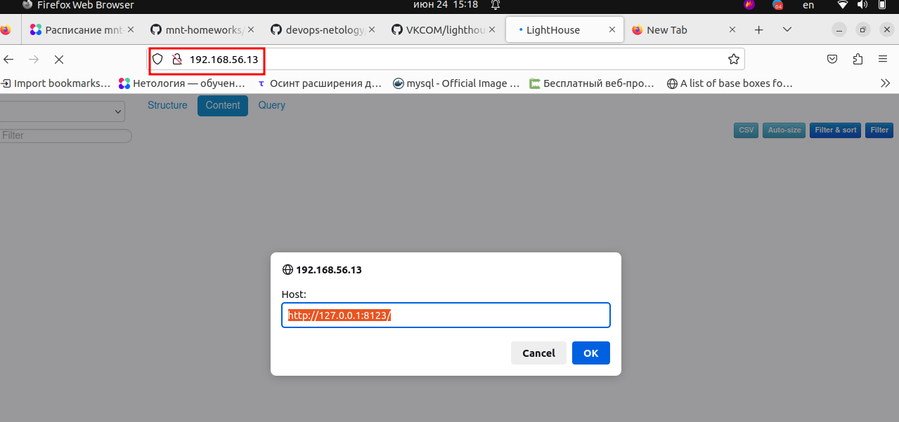
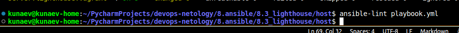

# Подготовка к выполнению

Подготовьте в Yandex Cloud три хоста: для clickhouse, для vector и для lighthouse.

Если не критично, то через [вагрант](https://github.com/nkunaev/devops-netology/blob/main/8.ansible/8.3_lighthouse/host/Vagrantfile) подготовил 3 VM под указанные цели.

# Основная часть

* Допишите playbook: нужно сделать ещё один play, который устанавливает и настраивает LightHouse. При создании tasks рекомендую использовать модули: get_url, template, yum, apt.
Tasks должны: скачать статику LightHouse, установить Nginx или любой другой веб-сервер, настроить его конфиг для открытия LightHouse, запустить веб-сервер.

```yaml

- name: Install lighthouse
  hosts: lighthouse
  become: true

  handlers:
    - name: nginx-reload
      ansible.builtin.service:
        name: nginx
        state: restarted

  tasks:
    - name: Install nginx
      ansible.builtin.apt:
        name: nginx
        state: present

    - name: Get lighthouse from git
      ansible.builtin.git:
        repo: "{{ lighthouse_repo }}"
        version: master
        dest: "{{ lighthouse_dst_folder }}"

    - name: Make website avaliable
      ansible.builtin.template:
        src: lighthouse.conf.j2
        dest: "/etc/nginx/sites-enabled/default"
        mode: 0644
      notify: nginx-reload

    - name: Flush handllush_handleers
      meta: flush_handlers

```




* Подготовьте свой inventory-файл prod.yml.
```yaml
---
all:
  children:
    clickhouse:
      hosts:
        server.clickhouse.vagrant:
          ansible_host: 192.168.56.12
          ansible_connection: ssh
          ansible_user: vagrant
    lighthouse:
      hosts:
        server.lighthouse.vagrant:
          ansible_host: 192.168.56.13
          ansible_connection: ssh
          ansible_user: vagrant
    web:
      hosts:
        server.web.vagrant:
          ansible_host: 192.168.56.11
          ansible_connection: ssh
          ansible_user: vagrant
```
* Запустите ansible-lint site.yml и исправьте ошибки, если они есть.


* Попробуйте запустить playbook на этом окружении с флагом --check. Запустите playbook на prod.yml окружении с флагом --diff. Убедитесь, что изменения на системе произведены. Повторно запустите playbook с флагом --diff и убедитесь, что playbook идемпотентен.
```ignorelang
kunaev@kunaev-home:~/PycharmProjects/devops-netology/8.ansible/8.3_lighthouse/host$ ansible-playbook -i inventory/prod.yaml playbook.yml --diff

PLAY [base packages] *************************************************************************************************

TASK [Gathering Facts] ***********************************************************************************************
ok: [server.lighthouse.vagrant]
ok: [server.clickhouse.vagrant]
ok: [server.web.vagrant]

TASK [Installing tools] **********************************************************************************************
ok: [server.lighthouse.vagrant] => (item=git)
ok: [server.web.vagrant] => (item=git)
ok: [server.clickhouse.vagrant] => (item=git)
ok: [server.lighthouse.vagrant] => (item=curl)
ok: [server.web.vagrant] => (item=curl)
ok: [server.clickhouse.vagrant] => (item=curl)
ok: [server.lighthouse.vagrant] => (item=wget)
ok: [server.web.vagrant] => (item=wget)
ok: [server.clickhouse.vagrant] => (item=wget)
ok: [server.lighthouse.vagrant] => (item=unzip)
ok: [server.web.vagrant] => (item=unzip)
ok: [server.clickhouse.vagrant] => (item=unzip)

TASK [add ssh key] ***************************************************************************************************
ok: [server.lighthouse.vagrant]
ok: [server.web.vagrant]
ok: [server.clickhouse.vagrant]

PLAY [Install Clickhouse] ********************************************************************************************

TASK [Gathering Facts] ***********************************************************************************************
ok: [server.clickhouse.vagrant]

TASK [Get clickhouse distrib] ****************************************************************************************
ok: [server.clickhouse.vagrant] => (item=clickhouse-client)
ok: [server.clickhouse.vagrant] => (item=clickhouse-server)
ok: [server.clickhouse.vagrant] => (item=clickhouse-common-static)

TASK [Install clickhouse packages] ***********************************************************************************
ok: [server.clickhouse.vagrant] => (item=clickhouse-common-static-22.4.6.53.deb)
ok: [server.clickhouse.vagrant] => (item=clickhouse-client-22.4.6.53.deb)
ok: [server.clickhouse.vagrant] => (item=clickhouse-server-22.4.6.53.deb)

TASK [Flush handllush_handleers] *************************************************************************************

TASK [wait till clickhouse will be restarted] ************************************************************************
Pausing for 5 seconds
(ctrl+C then 'C' = continue early, ctrl+C then 'A' = abort)
ok: [server.clickhouse.vagrant]

TASK [Create database] ***********************************************************************************************
ok: [server.clickhouse.vagrant]

PLAY [Install Vector] ************************************************************************************************

TASK [Gathering Facts] ***********************************************************************************************
ok: [server.web.vagrant]

TASK [Get Vector Package] ********************************************************************************************
ok: [server.web.vagrant]

PLAY [Install lighthouse] ********************************************************************************************

TASK [Gathering Facts] ***********************************************************************************************
ok: [server.lighthouse.vagrant]

TASK [Install nginx] *************************************************************************************************
ok: [server.lighthouse.vagrant]

TASK [Get lighthouse from git] ***************************************************************************************
ok: [server.lighthouse.vagrant]

TASK [Make website avaliable] ****************************************************************************************
ok: [server.lighthouse.vagrant]

TASK [Flush handllush_handleers] *************************************************************************************

PLAY RECAP ***********************************************************************************************************
server.clickhouse.vagrant  : ok=8    changed=0    unreachable=0    failed=0    skipped=0    rescued=0    ignored=0   
server.lighthouse.vagrant  : ok=7    changed=0    unreachable=0    failed=0    skipped=0    rescued=0    ignored=0   
server.web.vagrant         : ok=5    changed=0    unreachable=0    failed=0    skipped=0    rescued=0    ignored=0   

```

* Подготовьте README.md-файл по своему playbook. В нём должно быть описано: что делает playbook, какие у него есть параметры и теги.

Playbook состоит из четырех  плеев: \

Первый плей состоит из двух заданий, которые устанавливают базовый набор пакетов и прокидывает ключ на созданную VM. Также у плея имеется тег "Install".

Второй плей состоит из пяти тасок и 1 хендера, которые устанавливают Clickhouse и создают БД.

Третий плей состоит из 1 хенделра и 1 таски, которые устанавливают вектор.

Третий плей состоит из 1 хендера и 4 тасок, котоые устанавливают веб сервер, скачивают с гита лайтхайс и заменяют дефольный конфиг файл nginx'a.


* Готовый playbook выложите в свой репозиторий, поставьте тег 08-ansible-03-yandex на фиксирующий коммит, в ответ предоставьте ссылку на него.

```ignorelang
a133766 (HEAD -> main, tag: 08-ansible-03-yandex) hw8.3_rc2
```