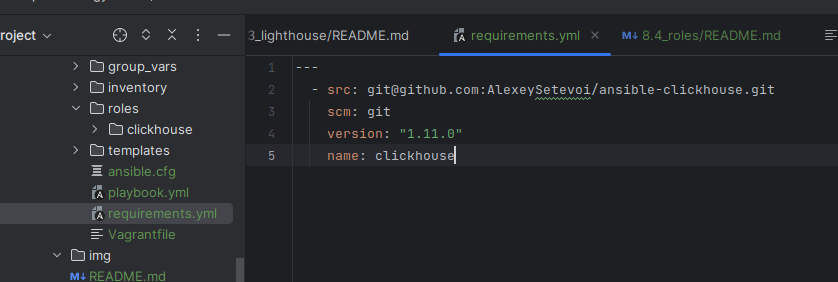
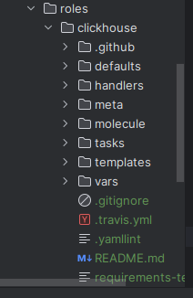

# 8.4 Roles


* Создайте в старой версии playbook файл requirements.yml и заполните его содержимым:

```yaml

---
  - src: git@github.com:AlexeySetevoi/ansible-clickhouse.git
    scm: git
    version: "1.11.0"
    name: clickhouse 
```


* При помощи ansible-galaxy скачайте себе эту роль.  

```ignorelang
 ansible-galaxy -r requirements.yml -p roles
```


* Создайте новый каталог с ролью при помощи ansible-galaxy role init vector-role.

На основе tasks из старого playbook заполните новую role. Разнесите переменные между vars и default.

Перенести нужные шаблоны конфигов в templates.

Опишите в README.md обе роли и их параметры.

Повторите шаги 3–6 для LightHouse. Помните, что одна роль должна настраивать один продукт.

Выложите все roles в репозитории. Проставьте теги, используя семантическую нумерацию. Добавьте roles в requirements.yml в playbook.

Переработайте playbook на использование roles. Не забудьте про зависимости LightHouse и возможности совмещения roles с tasks.

Выложите playbook в репозиторий.

В ответе дайте ссылки на оба репозитория с roles и одну ссылку на репозиторий с playbook.
