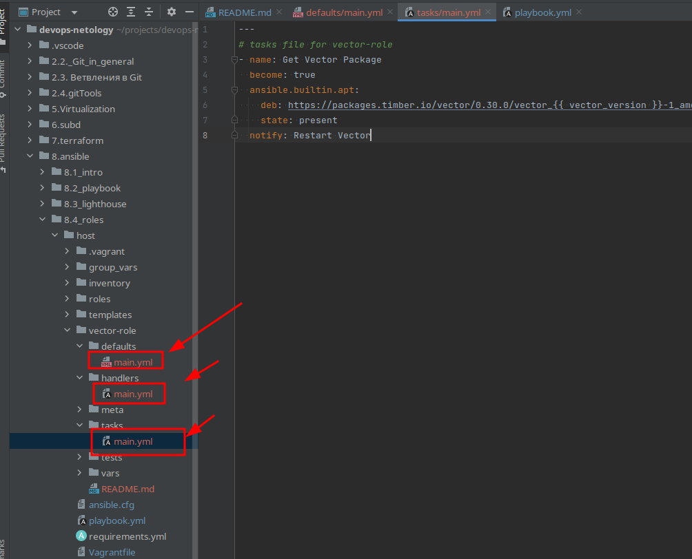
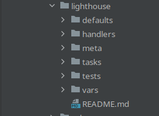
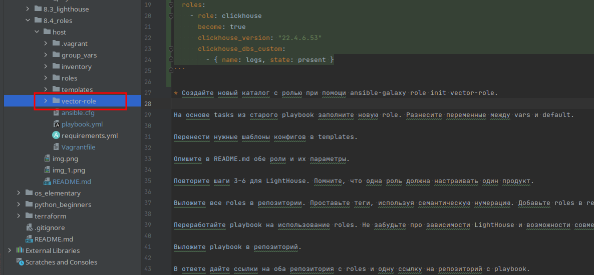

# 8.4 Roles


* Создайте в старой версии playbook файл requirements.yml и заполните его содержимым:



* При помощи ansible-galaxy скачайте себе эту роль.  

```ignorelang
 ansible-galaxy -r requirements.yml -p roles
```


playbook changes:
```yaml
- name: Install Clickhouse
  hosts: clickhouse
  roles:
    - role: clickhouse
      become: true
      clickhouse_version: "22.4.6.53"
      clickhouse_dbs_custom:
        - { name: logs, state: present }
```

* Создайте новый каталог с ролью при помощи ansible-galaxy role init vector-role.


На основе tasks из старого playbook заполните новую role. Разнесите переменные между vars и default. Перенести нужные шаблоны конфигов в templates.


* Опишите в README.md обе роли и их параметры.  

Role clickhouse.  
Скачана с гит репозитория git@github.com:AlexeySetevoi/ansible-clickhouse.git. Имеет внушительное количество параметров настройки, начиная с имени хоста, пользователей БД и заканчивая временем ротации БД и портов для подключения.

Role vector-role  
Самописное художество, где можно выбрать версию устанавливаемого пакета Vector.

* Повторите шаги 3–6 для LightHouse. Помните, что одна роль должна настраивать один продукт.


* Выложите все roles в репозитории. Проставьте теги, используя семантическую нумерацию. Добавьте roles в requirements.yml в playbook.  

git@github.com:nkunaev/lighthouse_homework.git v. 1.0.0  

git@github.com:nkunaev/vector_homework.git v. 1.0.0

```ignorelang
 kunaev@dub-ws-235:~/projects/devops-netology/8.ansible/8.4_roles/host$ ansible-galaxy install -r requirements.yml -p roles
Starting galaxy role install process
- clickhouse (1.11.0) is already installed, skipping.
Enter passphrase for key '/home/kunaev/.ssh/id_rsa': 
- extracting lighthouse to /home/kunaev/projects/devops-netology/8.ansible/8.4_roles/host/roles/lighthouse
- lighthouse (1.0.0) was installed successfully
Enter passphrase for key '/home/kunaev/.ssh/id_rsa': 
- extracting vector to /home/kunaev/projects/devops-netology/8.ansible/8.4_roles/host/roles/vector
- vector (1.0.0) was installed successfully

```

* Переработайте playbook на использование roles. Не забудьте про зависимости LightHouse и возможности совмещения roles с tasks.

```yaml
---
- name: 'base packages'
  hosts: all
  become: true
  tags:
    - install

  tasks:
    - name: Installing tools
      apt:
        package: "{{ item }}"
        state: present
        update_cache: true
      with_items:
        - git
        - curl
        - wget
        - unzip
        - gnupg
    - name: add ssh key
      ansible.builtin.authorized_key:
        user: vagrant
        state: present
        manage_dir: true
        key: "{{ lookup('file', '~/.ssh/id_rsa.pub') }}"

- name: Install Clickhouse
  hosts: clickhouse
  roles:
    - role: clickhouse
      become: true
      clickhouse_version: "22.4.6.53"
      clickhouse_dbs_custom:
        - { name: logs, state: present }

- name: Install Vector
  hosts: web
  roles:
    - role: vector-role
      vector_version: "0.30.0"


- name: Install lighthouse
  hosts: lighthouse
  roles:
    - role: lighthouse

```

* Выложите playbook в репозиторий.

[Playbook](https://github.com/nkunaev/devops-netology/blob/main/8.ansible/8.4_roles/host/playbook.yml)

* В ответе дайте ссылки на оба репозитория с roles и одну ссылку на репозиторий с playbook.

[Playbook](https://github.com/nkunaev/devops-netology/blob/main/8.ansible/8.4_roles/host/playbook.yml)  
[Lighthouse role](https://github.com/nkunaev/lighthouse_homework)  
[Vector role](https://github.com/nkunaev/vector_homework)  

