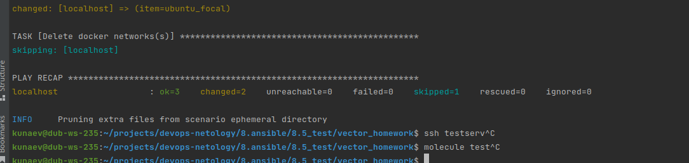
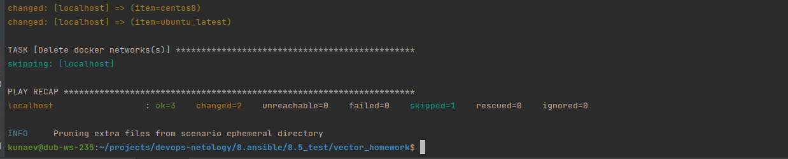

# 8.5 Тестирование roles

#  Molecule

* Запустите molecule test -s centos_7 внутри корневой директории clickhouse-role, посмотрите на вывод команды. Данная команда может отработать с ошибками, это нормально. Наша цель - посмотреть как другие в реальном мире используют молекулу.  

На стадии "Converge" выпал с ошибкой из-за того, что не смог корректно импортирвоать роль



* Перейдите в каталог с ролью vector-role и создайте сценарий тестирования по умолчанию при помощи molecule init scenario --driver-name docker.

* Добавьте несколько разных дистрибутивов (centos:8, ubuntu:latest) для инстансов и протестируйте роль, исправьте найденные ошибки, если они есть.
Добавил centos:8, ubuntu:latest
```yaml
  platforms:
  - name: centos-8
    hostname: centos
    image: geerlingguy/docker-centos8-ansible:latest
    cgroupns_mode: host
    volumes:
      - /sys/fs/cgroup:/sys/fs/cgroup:rw
    privileged: true
    command: /lib/systemd/systemd
    pre_build_image: true

  - name: ubuntu22-latest
    hostname: ubuntu
    image: geerlingguy/docker-ubuntu2204-ansible:latest
    cgroupns_mode: host
    volumes:
      - /sys/fs/cgroup:/sys/fs/cgroup:rw
    privileged: true
    command: /lib/systemd/systemd
    pre_build_image: true
```

Создал 2 контейнера ( molecule create ) и програл molecule converge

```ignorelang
kunaev@dub-ws-235:~/projects/devops-netology/8.ansible/8.5_test/vector_homework$ molecule converge
WARNING  Driver docker does not provide a schema.
INFO     default scenario test matrix: dependency, create, prepare, converge
INFO     Performing prerun with role_name_check=0...
INFO     Set ANSIBLE_LIBRARY=/home/kunaev/.cache/ansible-compat/5af297/modules:/home/kunaev/.ansible/plugins/modules:/usr/share/ansible/plugins/modules
INFO     Set ANSIBLE_COLLECTIONS_PATH=/home/kunaev/.cache/ansible-compat/5af297/collections:/home/kunaev/.ansible/collections:/usr/share/ansible/collections
INFO     Set ANSIBLE_ROLES_PATH=/home/kunaev/.cache/ansible-compat/5af297/roles:/home/kunaev/.ansible/roles:/usr/share/ansible/roles:/etc/ansible/roles
INFO     Using /home/kunaev/.cache/ansible-compat/5af297/roles/vector.vector symlink to current repository in order to enable Ansible to find the role using its expected full name.
INFO     Running default > dependency
WARNING  Skipping, missing the requirements file.
WARNING  Skipping, missing the requirements file.
INFO     Running default > create
WARNING  Skipping, instances already created.
INFO     Running default > prepare
WARNING  Skipping, prepare playbook not configured.
INFO     Running default > converge
INFO     Sanity checks: 'docker'

PLAY [Converge] ****************************************************************

TASK [Gathering Facts] *********************************************************
ok: [ubuntu22-latest]
ok: [centos-8]

TASK [Include vector_homework] *************************************************

TASK [vector_homework : include_tasks] *****************************************
skipping: [centos-8]
included: /home/kunaev/projects/devops-netology/8.ansible/8.5_test/vector_homework/tasks/debian.yml for ubuntu22-latest

TASK [vector_homework : Get Vector Package deb] ********************************
changed: [ubuntu22-latest]

TASK [vector_homework : include_tasks] *****************************************
skipping: [ubuntu22-latest]
included: /home/kunaev/projects/devops-netology/8.ansible/8.5_test/vector_homework/tasks/redhat.yml for centos-8

TASK [vector_homework : Get Vector Package rpm] ********************************
changed: [centos-8]

RUNNING HANDLER [vector_homework : Restart Vector] *****************************
changed: [centos-8]
changed: [ubuntu22-latest]

PLAY RECAP *********************************************************************
centos-8                   : ok=4    changed=2    unreachable=0    failed=0    skipped=1    rescued=0    ignored=0
ubuntu22-latest            : ok=4    changed=2    unreachable=0    failed=0    skipped=1    rescued=0    ignored=0

```

Пришлось немного подправить таски, установив зависимость от типа исполняемой среды. В итоге, сначала првоерял среду, потом 
импортировал нужные для нее таски.

```yaml
- include_tasks: debian.yml
  when: ansible_os_family == "Debian"

- include_tasks: redhat.yml
  when: ansible_os_family == "RedHat"
```

* Добавьте несколько assert в verify.yml-файл для проверки работоспособности vector-role (проверка, что конфиг валидный, проверка успешности запуска и др.).

Убрал дефлотный ассерт и добавил проверку за статус запущенной службы, валидность конфига и вывод в stdout параметров валидатора.

```yaml

---
# This is an example playbook to execute Ansible tests.

- name: Verify
  hosts: all
  gather_facts: false
  tasks:

    - name: Get service status
      ansible.builtin.systemd:
        name: "vector"
      register: vector
    - name: Check service status
      ansible.builtin.assert:
        that:
          - "vector.status.ActiveState == 'active'"

    - name: Get config validation status
      ansible.builtin.command: "vector validate"
      register: validation_result
    - name: Print validation info
      debug:
        var: validation_result.stdout_lines
    - name: Check service status
      ansible.builtin.assert:
        that:
          - "validation_result.stdout_lines[4] == '                           Validated'"


```
* Запустите тестирование роли повторно и проверьте, что оно прошло успешно.

```ignorelang
kunaev@dub-ws-235:~/projects/devops-netology/8.ansible/8.5_test/vector_homework$ molecule test
WARNING  Driver docker does not provide a schema.
INFO     default scenario test matrix: dependency, cleanup, destroy, syntax, create, prepare, converge, idempotence, side_effect, verify, cleanup, destroy
INFO     Performing prerun with role_name_check=0...
INFO     Set ANSIBLE_LIBRARY=/home/kunaev/.cache/ansible-compat/5af297/modules:/home/kunaev/.ansible/plugins/modules:/usr/share/ansible/plugins/modules
INFO     Set ANSIBLE_COLLECTIONS_PATH=/home/kunaev/.cache/ansible-compat/5af297/collections:/home/kunaev/.ansible/collections:/usr/share/ansible/collections
INFO     Set ANSIBLE_ROLES_PATH=/home/kunaev/.cache/ansible-compat/5af297/roles:/home/kunaev/.ansible/roles:/usr/share/ansible/roles:/etc/ansible/roles
INFO     Using /home/kunaev/.cache/ansible-compat/5af297/roles/vector.vector symlink to current repository in order to enable Ansible to find the role using its expected full name.
INFO     Running default > dependency
WARNING  Skipping, missing the requirements file.
WARNING  Skipping, missing the requirements file.
INFO     Running default > cleanup
WARNING  Skipping, cleanup playbook not configured.
INFO     Running default > destroy
INFO     Sanity checks: 'docker'

PLAY [Destroy] *****************************************************************

TASK [Set async_dir for HOME env] **********************************************
ok: [localhost]

TASK [Destroy molecule instance(s)] ********************************************
changed: [localhost] => (item=centos-8)
changed: [localhost] => (item=ubuntu22-latest)

TASK [Wait for instance(s) deletion to complete] *******************************
FAILED - RETRYING: [localhost]: Wait for instance(s) deletion to complete (300 retries left).
changed: [localhost] => (item=centos-8)
changed: [localhost] => (item=ubuntu22-latest)

TASK [Delete docker networks(s)] ***********************************************
skipping: [localhost]

PLAY RECAP *********************************************************************
localhost                  : ok=3    changed=2    unreachable=0    failed=0    skipped=1    rescued=0    ignored=0

INFO     Running default > syntax

playbook: /home/kunaev/projects/devops-netology/8.ansible/8.5_test/vector_homework/molecule/default/converge.yml
INFO     Running default > create

PLAY [Create] ******************************************************************

TASK [Set async_dir for HOME env] **********************************************
ok: [localhost]

TASK [Log into a Docker registry] **********************************************
skipping: [localhost] => (item=None) 
skipping: [localhost] => (item=None) 
skipping: [localhost]

TASK [Check presence of custom Dockerfiles] ************************************
ok: [localhost] => (item={'cgroupns_mode': 'host', 'command': '/lib/systemd/systemd', 'hostname': 'centos', 'image': 'geerlingguy/docker-centos8-ansible:latest', 'name': 'centos-8', 'pre_build_image': True, 'privileged': True, 'volumes': ['/sys/fs/cgroup:/sys/fs/cgroup:rw']})
ok: [localhost] => (item={'cgroupns_mode': 'host', 'command': '/lib/systemd/systemd', 'hostname': 'ubuntu', 'image': 'geerlingguy/docker-ubuntu2204-ansible:latest', 'name': 'ubuntu22-latest', 'pre_build_image': True, 'privileged': True, 'volumes': ['/sys/fs/cgroup:/sys/fs/cgroup:rw']})

TASK [Create Dockerfiles from image names] *************************************
skipping: [localhost] => (item={'cgroupns_mode': 'host', 'command': '/lib/systemd/systemd', 'hostname': 'centos', 'image': 'geerlingguy/docker-centos8-ansible:latest', 'name': 'centos-8', 'pre_build_image': True, 'privileged': True, 'volumes': ['/sys/fs/cgroup:/sys/fs/cgroup:rw']})
skipping: [localhost] => (item={'cgroupns_mode': 'host', 'command': '/lib/systemd/systemd', 'hostname': 'ubuntu', 'image': 'geerlingguy/docker-ubuntu2204-ansible:latest', 'name': 'ubuntu22-latest', 'pre_build_image': True, 'privileged': True, 'volumes': ['/sys/fs/cgroup:/sys/fs/cgroup:rw']})
skipping: [localhost]

TASK [Synchronization the context] *********************************************
skipping: [localhost] => (item={'cgroupns_mode': 'host', 'command': '/lib/systemd/systemd', 'hostname': 'centos', 'image': 'geerlingguy/docker-centos8-ansible:latest', 'name': 'centos-8', 'pre_build_image': True, 'privileged': True, 'volumes': ['/sys/fs/cgroup:/sys/fs/cgroup:rw']})
skipping: [localhost] => (item={'cgroupns_mode': 'host', 'command': '/lib/systemd/systemd', 'hostname': 'ubuntu', 'image': 'geerlingguy/docker-ubuntu2204-ansible:latest', 'name': 'ubuntu22-latest', 'pre_build_image': True, 'privileged': True, 'volumes': ['/sys/fs/cgroup:/sys/fs/cgroup:rw']})
skipping: [localhost]

TASK [Discover local Docker images] ********************************************
ok: [localhost] => (item={'changed': False, 'skipped': True, 'skip_reason': 'Conditional result was False', 'false_condition': 'not item.pre_build_image | default(false)', 'item': {'cgroupns_mode': 'host', 'command': '/lib/systemd/systemd', 'hostname': 'centos', 'image': 'geerlingguy/docker-centos8-ansible:latest', 'name': 'centos-8', 'pre_build_image': True, 'privileged': True, 'volumes': ['/sys/fs/cgroup:/sys/fs/cgroup:rw']}, 'ansible_loop_var': 'item', 'i': 0, 'ansible_index_var': 'i'})
ok: [localhost] => (item={'changed': False, 'skipped': True, 'skip_reason': 'Conditional result was False', 'false_condition': 'not item.pre_build_image | default(false)', 'item': {'cgroupns_mode': 'host', 'command': '/lib/systemd/systemd', 'hostname': 'ubuntu', 'image': 'geerlingguy/docker-ubuntu2204-ansible:latest', 'name': 'ubuntu22-latest', 'pre_build_image': True, 'privileged': True, 'volumes': ['/sys/fs/cgroup:/sys/fs/cgroup:rw']}, 'ansible_loop_var': 'item', 'i': 1, 'ansible_index_var': 'i'})

TASK [Build an Ansible compatible image (new)] *********************************
skipping: [localhost] => (item=molecule_local/geerlingguy/docker-centos8-ansible:latest) 
skipping: [localhost] => (item=molecule_local/geerlingguy/docker-ubuntu2204-ansible:latest) 
skipping: [localhost]

TASK [Create docker network(s)] ************************************************
skipping: [localhost]

TASK [Determine the CMD directives] ********************************************
ok: [localhost] => (item={'cgroupns_mode': 'host', 'command': '/lib/systemd/systemd', 'hostname': 'centos', 'image': 'geerlingguy/docker-centos8-ansible:latest', 'name': 'centos-8', 'pre_build_image': True, 'privileged': True, 'volumes': ['/sys/fs/cgroup:/sys/fs/cgroup:rw']})
ok: [localhost] => (item={'cgroupns_mode': 'host', 'command': '/lib/systemd/systemd', 'hostname': 'ubuntu', 'image': 'geerlingguy/docker-ubuntu2204-ansible:latest', 'name': 'ubuntu22-latest', 'pre_build_image': True, 'privileged': True, 'volumes': ['/sys/fs/cgroup:/sys/fs/cgroup:rw']})

TASK [Create molecule instance(s)] *********************************************
changed: [localhost] => (item=centos-8)
changed: [localhost] => (item=ubuntu22-latest)

TASK [Wait for instance(s) creation to complete] *******************************
changed: [localhost] => (item={'failed': 0, 'started': 1, 'finished': 0, 'ansible_job_id': 'j81603141382.107059', 'results_file': '/home/kunaev/.ansible_async/j81603141382.107059', 'changed': True, 'item': {'cgroupns_mode': 'host', 'command': '/lib/systemd/systemd', 'hostname': 'centos', 'image': 'geerlingguy/docker-centos8-ansible:latest', 'name': 'centos-8', 'pre_build_image': True, 'privileged': True, 'volumes': ['/sys/fs/cgroup:/sys/fs/cgroup:rw']}, 'ansible_loop_var': 'item'})
FAILED - RETRYING: [localhost]: Wait for instance(s) creation to complete (300 retries left).
changed: [localhost] => (item={'failed': 0, 'started': 1, 'finished': 0, 'ansible_job_id': 'j972443044696.107085', 'results_file': '/home/kunaev/.ansible_async/j972443044696.107085', 'changed': True, 'item': {'cgroupns_mode': 'host', 'command': '/lib/systemd/systemd', 'hostname': 'ubuntu', 'image': 'geerlingguy/docker-ubuntu2204-ansible:latest', 'name': 'ubuntu22-latest', 'pre_build_image': True, 'privileged': True, 'volumes': ['/sys/fs/cgroup:/sys/fs/cgroup:rw']}, 'ansible_loop_var': 'item'})

PLAY RECAP *********************************************************************
localhost                  : ok=6    changed=2    unreachable=0    failed=0    skipped=5    rescued=0    ignored=0

INFO     Running default > prepare
WARNING  Skipping, prepare playbook not configured.
INFO     Running default > converge

PLAY [Converge] ****************************************************************

TASK [Gathering Facts] *********************************************************
ok: [ubuntu22-latest]
ok: [centos-8]

TASK [Include vector_homework] *************************************************

TASK [vector_homework : include_tasks] *****************************************
skipping: [centos-8]
included: /home/kunaev/projects/devops-netology/8.ansible/8.5_test/vector_homework/tasks/debian.yml for ubuntu22-latest

TASK [vector_homework : Get Vector Package deb] ********************************
changed: [ubuntu22-latest]

TASK [vector_homework : include_tasks] *****************************************
skipping: [ubuntu22-latest]
included: /home/kunaev/projects/devops-netology/8.ansible/8.5_test/vector_homework/tasks/redhat.yml for centos-8

TASK [vector_homework : Get Vector Package rpm] ********************************
changed: [centos-8]

RUNNING HANDLER [vector_homework : Restart Vector] *****************************
changed: [centos-8]
changed: [ubuntu22-latest]

PLAY RECAP *********************************************************************
centos-8                   : ok=4    changed=2    unreachable=0    failed=0    skipped=1    rescued=0    ignored=0
ubuntu22-latest            : ok=4    changed=2    unreachable=0    failed=0    skipped=1    rescued=0    ignored=0

INFO     Running default > idempotence

PLAY [Converge] ****************************************************************

TASK [Gathering Facts] *********************************************************
ok: [centos-8]
ok: [ubuntu22-latest]

TASK [Include vector_homework] *************************************************

TASK [vector_homework : include_tasks] *****************************************
skipping: [centos-8]
included: /home/kunaev/projects/devops-netology/8.ansible/8.5_test/vector_homework/tasks/debian.yml for ubuntu22-latest

TASK [vector_homework : Get Vector Package deb] ********************************
ok: [ubuntu22-latest]

TASK [vector_homework : include_tasks] *****************************************
skipping: [ubuntu22-latest]
included: /home/kunaev/projects/devops-netology/8.ansible/8.5_test/vector_homework/tasks/redhat.yml for centos-8

TASK [vector_homework : Get Vector Package rpm] ********************************
ok: [centos-8]

PLAY RECAP *********************************************************************
centos-8                   : ok=3    changed=0    unreachable=0    failed=0    skipped=1    rescued=0    ignored=0
ubuntu22-latest            : ok=3    changed=0    unreachable=0    failed=0    skipped=1    rescued=0    ignored=0

INFO     Idempotence completed successfully.
INFO     Running default > side_effect
WARNING  Skipping, side effect playbook not configured.
INFO     Running default > verify
INFO     Running Ansible Verifier

PLAY [Verify] ******************************************************************

TASK [Get service status] ******************************************************
ok: [ubuntu22-latest]
ok: [centos-8]

TASK [Check service status] ****************************************************
ok: [centos-8] => {
    "changed": false,
    "msg": "All assertions passed"
}
ok: [ubuntu22-latest] => {
    "changed": false,
    "msg": "All assertions passed"
}

TASK [Get config validation status] ********************************************
changed: [ubuntu22-latest]
changed: [centos-8]

TASK [Print validation info] ***************************************************
ok: [centos-8] => {
    "validation_result.stdout_lines": [
        "√ Loaded [\"/etc/vector/vector.toml\"]",
        "√ Component configuration",
        "√ Health check \"print\"",
        "------------------------------------",
        "                           Validated"
    ]
}
ok: [ubuntu22-latest] => {
    "validation_result.stdout_lines": [
        "√ Loaded [\"/etc/vector/vector.toml\"]",
        "√ Component configuration",
        "√ Health check \"print\"",
        "------------------------------------",
        "                           Validated"
    ]
}

TASK [Check service status] ****************************************************
ok: [centos-8] => {
    "changed": false,
    "msg": "All assertions passed"
}
ok: [ubuntu22-latest] => {
    "changed": false,
    "msg": "All assertions passed"
}

PLAY RECAP *********************************************************************
centos-8                   : ok=5    changed=1    unreachable=0    failed=0    skipped=0    rescued=0    ignored=0
ubuntu22-latest            : ok=5    changed=1    unreachable=0    failed=0    skipped=0    rescued=0    ignored=0

INFO     Verifier completed successfully.
INFO     Running default > cleanup
WARNING  Skipping, cleanup playbook not configured.
INFO     Running default > destroy

PLAY [Destroy] *****************************************************************

TASK [Set async_dir for HOME env] **********************************************
ok: [localhost]

TASK [Destroy molecule instance(s)] ********************************************
changed: [localhost] => (item=centos-8)
changed: [localhost] => (item=ubuntu22-latest)

TASK [Wait for instance(s) deletion to complete] *******************************
FAILED - RETRYING: [localhost]: Wait for instance(s) deletion to complete (300 retries left).
changed: [localhost] => (item=centos-8)
changed: [localhost] => (item=ubuntu22-latest)

TASK [Delete docker networks(s)] ***********************************************
skipping: [localhost]

PLAY RECAP *********************************************************************
localhost                  : ok=3    changed=2    unreachable=0    failed=0    skipped=1    rescued=0    ignored=0

INFO     Pruning extra files from scenario ephemeral directory

```

* Добавьте новый тег на коммит с рабочим сценарием в соответствии с семантическим версионированием.

[b122060](https://github.com/nkunaev/vector_homework/releases/tag/1.0.4) (HEAD -> main, tag: 1.0.4, origin/main, origin/HEAD) hw8_5

# Tox

* Добавьте в директорию с vector-role файлы из директории.

* Запустите docker run --privileged=True -v <path_to_repo>:/opt/vector-role -w /opt/vector-role -it aragast/netology:latest /bin/bash, где path_to_repo — путь до корня репозитория с vector-role на вашей файловой системе.
```ignorelang
docker run --privileged=True -v /home/kunaev/projects/devops-netology/8.ansible/8.5_test/vector_homework:/opt/vector-role -w /opt/vector-role -it aragast/netology:latest /bin/bash```
```

* Внутри контейнера выполните команду tox, посмотрите на вывод.

```ignorelang
CRITICAL 'molecule/compatibility/molecule.yml' glob failed.  Exiting.
ERROR: InvocationError for command /opt/vector-role/.tox/py39-ansible30/bin/molecule test -s compatibility --destroy always (exited with code 1)
```

Причины:  
у меня нет сценария "compatibility"

* Создайте облегчённый сценарий для molecule с драйвером molecule_podman. Проверьте его на исполнимость.
```ignorelang
---
---
dependency:
  name: galaxy
driver:
  name: podman
platforms:
  - name: centos-8
    hostname: centos
    image: geerlingguy/docker-centos8-ansible:latest
    cgroupns_mode: host
    volumes:
      - /sys/fs/cgroup:/sys/fs/cgroup:rw
    privileged: true
    command: /lib/systemd/systemd
    pre_build_image: true
provisioner:
  name: ansible
verifier:
  name: ansible
scenario:
  test_sequence:
    - destroy
    - create
    - converge
    - destroy
```
* Пропишите правильную команду в tox.ini, чтобы запускался облегчённый сценарий.
```ignorelang
[tox]
minversion = 1.8
basepython = python3.6
envlist = py{37}-ansible{210,30}
skipsdist = true

[testenv]
passenv = *
deps =
    -r tox-requirements.txt
    ansible210: ansible<3.0
    ansible30: ansible<3.1
commands =
    {posargs:molecule test -s tox --destroy always}
```

* Запустите команду tox. Убедитесь, что всё отработало успешно.

* Добавьте новый тег на коммит с рабочим сценарием в соответствии с семантическим версионированием.

[f29d306](https://github.com/nkunaev/vector_homework/releases/tag/1.0.5) (HEAD -> main, tag: 1.0.5, origin/main, origin/HEAD) hw 8.5
