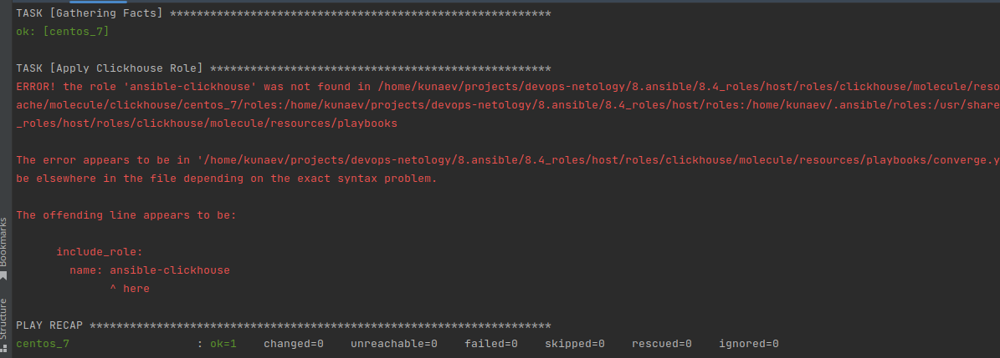
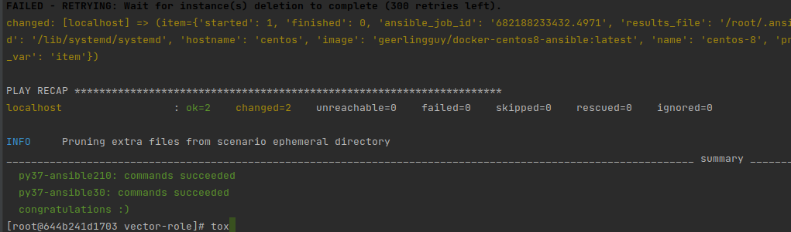

# 8.5 Тестирование roles

#  Molecule

* Запустите molecule test -s centos_7 внутри корневой директории clickhouse-role, посмотрите на вывод команды. Данная команда может отработать с ошибками, это нормально. Наша цель - посмотреть как другие в реальном мире используют молекулу.  

Даже дополнительно поставив molecule-plugins[docker], все равно ругается на конфиг, при этом нормальной доки с описанием модуля provision к молекуле на нашел.

```ignorelang
kunaev@dub-ws-235:~/projects/devops-netology/8.ansible/8.5_test/host/roles/clickhouse$ molecule test -s centos_7
WARNING  Driver docker does not provide a schema.
CRITICAL Failed to validate /home/kunaev/projects/devops-netology/8.ansible/8.5_test/host/roles/clickhouse/molecule/centos_7/molecule.yml

```

* Перейдите в каталог с ролью vector-role и создайте сценарий тестирования по умолчанию при помощи molecule init scenario --driver-name docker.



* Добавьте несколько разных дистрибутивов (centos:8, ubuntu:latest) для инстансов и протестируйте роль, исправьте найденные ошибки, если они есть.
```ignorelang
  - name: centos-8
    hostname: centos
    image: mpaivabarbosa/molecule-systemd-centos:8
    volumes:
      - /sys/fs/cgroup:/sys/fs/cgroup:ro
    privileged: true
    pre_build_image: true
    override_command: false
  - name: ubuntu-latest
    hostname: ubuntu
    image: mpaivabarbosa/molecule-systemd-ubuntu:latest
    volumes:
      - /sys/fs/cgroup:/sys/fs/cgroup:ro
    privileged: true
    pre_build_image: true
    override_command: false
```


* Добавьте несколько assert в verify.yml-файл для проверки работоспособности vector-role (проверка, что конфиг валидный, проверка успешности запуска и др.).
```ignorelang
  tasks:
    - name: Example assertion
      ansible.builtin.assert:
        that: true
    - name: is vector runnin'
      service_facts:
      register: service_state
    - name: debug
      debug:
        var: service_state

```
* Запустите тестирование роли повторно и проверьте, что оно прошло успешно.

* Добавьте новый тег на коммит с рабочим сценарием в соответствии с семантическим версионированием.


# Tox

* Добавьте в директорию с vector-role файлы из директории.

* Запустите docker run --privileged=True -v <path_to_repo>:/opt/vector-role -w /opt/vector-role -it aragast/netology:latest /bin/bash, где path_to_repo — путь до корня репозитория с vector-role на вашей файловой системе.
```ignorelang
docker run --privileged=True -v /home/kunaev/projects/devops-netology/8.ansible/8.5_test/vector_homework:/opt/vector-role -w /opt/vector-role -it aragast/netology:latest /bin/bash
```
* Внутри контейнера выполните команду tox, посмотрите на вывод.

```ignorelang

```

Тесты проваливаются, тк в контейнере собирается окружение для теста под centos. Также я так понимаю есть проблемы с "перевариванием" 
плагина для запуска докера. 

* Создайте облегчённый сценарий для molecule с драйвером molecule_podman. Проверьте его на исполнимость.
```ignorelang
---
dependency:
  name: galaxy

driver:
  name: podman

platforms:
  - name: ubuntu22
    image: ubuntu:22.04
    command: ["/sbin/init"]
    pre_build_images:
      - docker://docker.io/library/ubuntu:22.04

provisioner:
  name: ansible
  lint:
    name: ansible-lint
  inventory:
    host_vars:
      ubuntu22:
        ansible_connection: podman
    group_vars:
      all:
        ansible_python_interpreter: /usr/bin/python3

scenario:
  name: podman
  test_sequence:
    - lint
    - create
    - prepare
    - converge
    - check
    - destroy

verifier:
  name: testinfra

lint: flake8
```
* Пропишите правильную команду в tox.ini, чтобы запускался облегчённый сценарий.
```ignorelang
    {posargs:molecule test -s podman --destroy always}
```
* Запустите команду tox. Убедитесь, что всё отработало успешно.

* Добавьте новый тег на коммит с рабочим сценарием в соответствии с семантическим версионированием.
