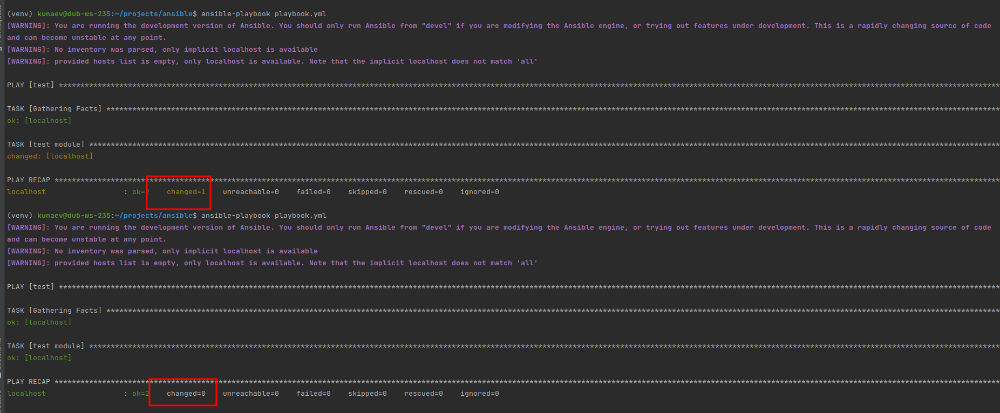
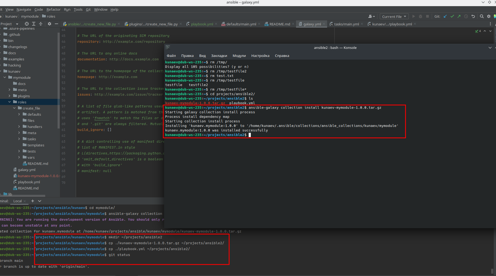
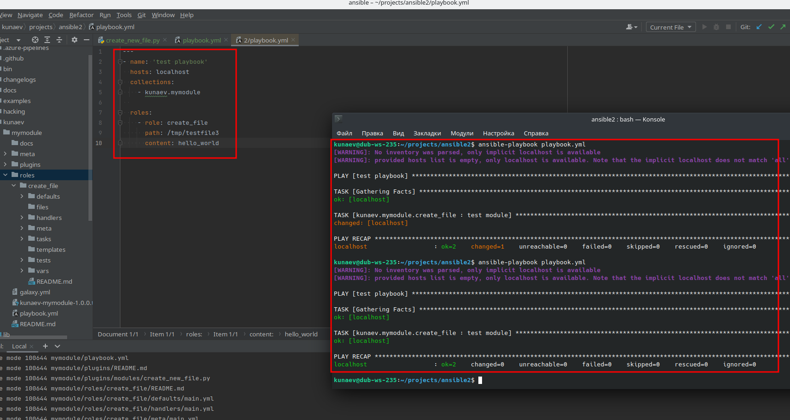

# 8.6 Own modules


* Шаг 4. Проверьте module на исполняемость локально

Входные данные
```json
{
  "ANSIBLE_MODULE_ARGS": {
    "path": "/tmp/testfile.txt",
    "content": "hello1, hello2, hello3"
  }
}
```
Функциональный блок
```python
if os.path.exists(module.params['path']):
    module.exit_json(**result)

try:
    f = open(module.params['path'], 'w+')
    for text in module.params['content']:
        f.write(text)
    f.close()
    module.exit_json(changed=True)
except SystemExit:
    raise
```
stdout
```ignorelang
(venv) kunaev@dub-ws-235:~/projects/ansible$ python -m ansible.modules.send_my_file ../testvord.json 

{"changed": false, "original_message": "hello1, hello2, hello3", "message": "file was created on path /tmp/testfile.txt", "invocation": {"module_args": {"path": "/tmp/testfile.txt", "content": "hello1, hello2, hello3"}}}

kunaev@dub-ws-235:~/projects/ansible$ cat /tmp/testfile.txt 

hello1, hello2, hello3
```

```ignorelang
(venv) kunaev@dub-ws-235:~/projects/ansible$ ansible-test sanity

WARNING: Reviewing previous 22 warning(s):
WARNING: The validate-modules sanity test cannot compare against the base commit because it was not detected.
WARNING: Skipping tests disabled by default without --allow-disabled: docs-build, package-data
WARNING: Skipping sanity test "compile" on Python 2.7 because it could not be found.
WARNING: Skipping sanity test "compile" on Python 3.6 because it could not be found.
WARNING: Skipping sanity test "compile" on Python 3.7 because it could not be found.
WARNING: Skipping sanity test "compile" on Python 3.8 because it could not be found.
WARNING: Skipping sanity test "compile" on Python 3.9 because it could not be found.
WARNING: Skipping sanity test "compile" on Python 3.11 because it could not be found.
WARNING: Skipping sanity test "import" on Python 2.7 because it could not be found.
WARNING: Skipping sanity test "import" on Python 3.6 because it could not be found.
WARNING: Skipping sanity test "import" on Python 3.7 because it could not be found.
WARNING: Skipping sanity test "import" on Python 3.8 because it could not be found.
WARNING: Skipping sanity test "import" on Python 3.9 because it could not be found.
WARNING: Skipping sanity test "import" on Python 3.11 because it could not be found.
WARNING: Skipping sanity test "mypy" on Python 2.7 because it is unsupported. Supported Python versions: 3.6, 3.7, 3.8, 3.9, 3.10, 3.11
WARNING: Skipping sanity test "mypy" on Python 3.6 because it could not be found.
WARNING: Skipping sanity test "mypy" on Python 3.7 because it could not be found.
WARNING: Skipping sanity test "mypy" on Python 3.8 because it could not be found.
WARNING: Skipping sanity test "mypy" on Python 3.9 because it could not be found.
WARNING: Skipping sanity test "mypy" on Python 3.11 because it could not be found.
WARNING: Required program "pwsh" not found.
WARNING: Required program "shellcheck" not found.
```

* Шаг 6. Проверьте через playbook на идемпотентность.  
```ignorelang
(venv) kunaev@dub-ws-235:~/projects/ansible$ ansible-playbook playbook.yml 
[WARNING]: You are running the development version of Ansible. You should only run Ansible from "devel" if you are modifying the Ansible engine, or trying out features under development. This is a rapidly changing source of code
and can become unstable at any point.
[WARNING]: No inventory was parsed, only implicit localhost is available
[WARNING]: provided hosts list is empty, only localhost is available. Note that the implicit localhost does not match 'all'

PLAY [test] ****************************************************************************************************************************************************************************************************************************

TASK [Gathering Facts] *****************************************************************************************************************************************************************************************************************
ok: [localhost]

TASK [test module] *********************************************************************************************************************************************************************************************************************
changed: [localhost]

PLAY RECAP *****************************************************************************************************************************************************************************************************************************
localhost                  : ok=2    changed=1    unreachable=0    failed=0    skipped=0    rescued=0    ignored=0   

(venv) kunaev@dub-ws-235:~/projects/ansible$ ansible-playbook playbook.yml 
[WARNING]: You are running the development version of Ansible. You should only run Ansible from "devel" if you are modifying the Ansible engine, or trying out features under development. This is a rapidly changing source of code
and can become unstable at any point.
[WARNING]: No inventory was parsed, only implicit localhost is available
[WARNING]: provided hosts list is empty, only localhost is available. Note that the implicit localhost does not match 'all'

PLAY [test] ****************************************************************************************************************************************************************************************************************************

TASK [Gathering Facts] *****************************************************************************************************************************************************************************************************************
ok: [localhost]

TASK [test module] *********************************************************************************************************************************************************************************************************************
ok: [localhost]

PLAY RECAP *****************************************************************************************************************************************************************************************************************************
localhost                  : ok=2    changed=0    unreachable=0    failed=0    skipped=0    rescued=0    ignored=0   

(venv) kunaev@dub-ws-235:~/projects/ansible$ 

```


* Шаг 15. Установите collection из локального архива: ansible-galaxy collection install <archivename>.tar.gz  



* Шаг 16. Запустите playbook, убедитесь, что он работает

