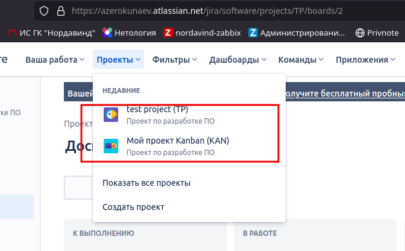
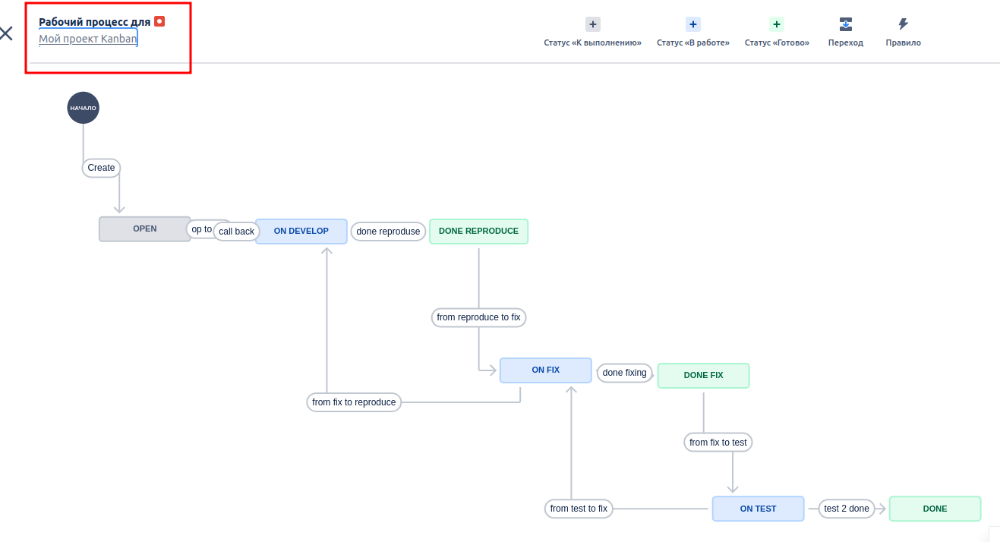
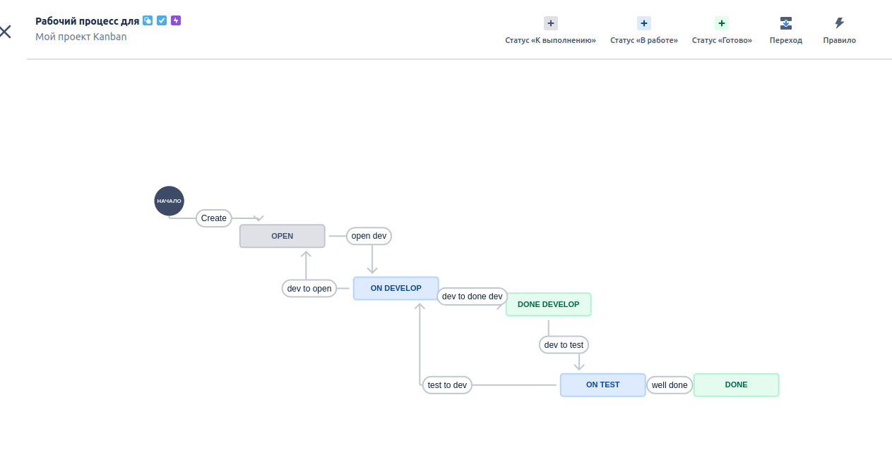
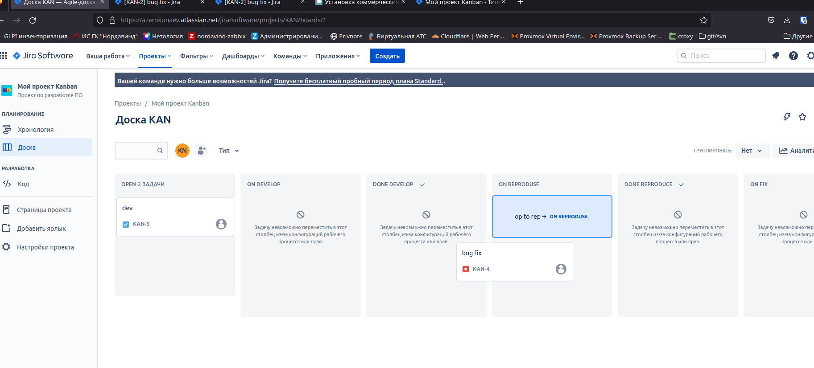
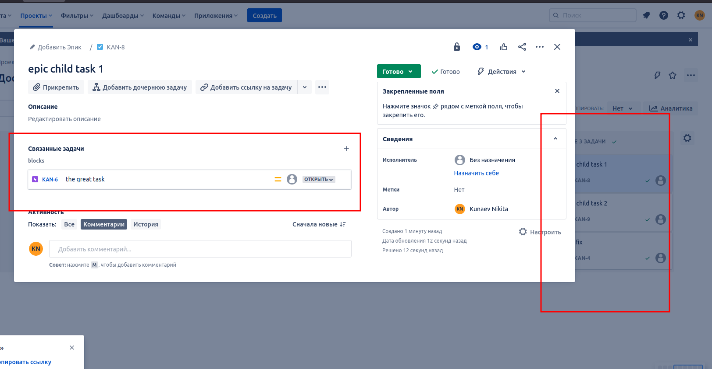
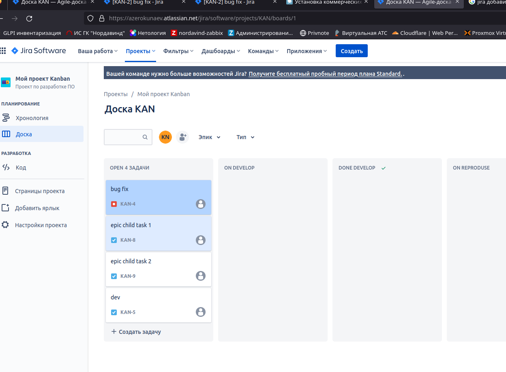
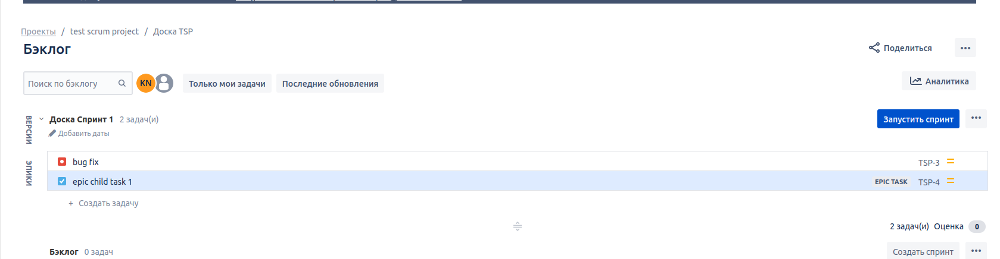
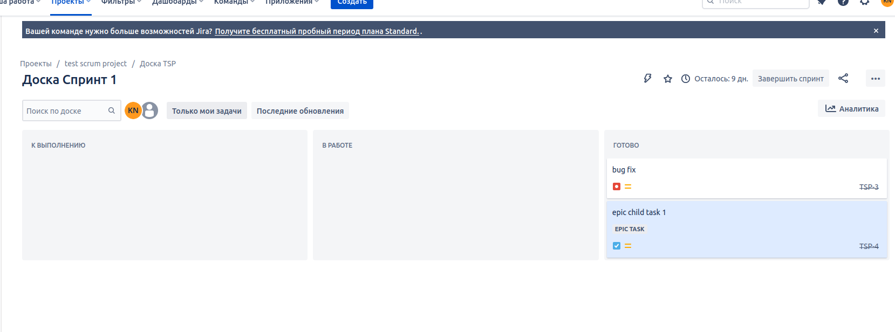

# CI/CD Intro

## Подготовка к выполнению

* Создать доски Kanban и Scrum.

## Основная часть

* Необходимо создать собственные workflow для bug 

    Open -> On reproduce.  
    On reproduce -> Open, Done reproduce.  
    Done reproduce -> On fix.  
    On fix -> On reproduce, Done fix.  
    Done fix -> On test.  
    On test -> On fix, Done.  
    Done -> Closed, Open.  

* Необходимо создать собственные workflow для остальных.

    Open -> On develop.  
    On develop -> Open, Done develop.  
    Done develop -> On test.  
    On test -> On develop, Done.  
    Done -> Closed, Open.  

## TO DO

* Создайте задачу с типом bug, попытайтесь провести его по всему workflow до Done.

* Создайте задачу с типом epic, к ней привяжите несколько задач с типом task, проведите их по всему workflow до Done. При проведении обеих задач по статусам используйте kanban.

* Верните задачи в статус Open.

* Перейдите в Scrum, запланируйте новый спринт, состоящий из задач эпика и одного бага, стартуйте спринт, проведите задачи до состояния Closed. Закройте спринт.

* Если всё отработалось в рамках ожидания — выгрузите схемы workflow для импорта в XML. Файлы с workflow и скриншоты workflow приложите к решению задания.
