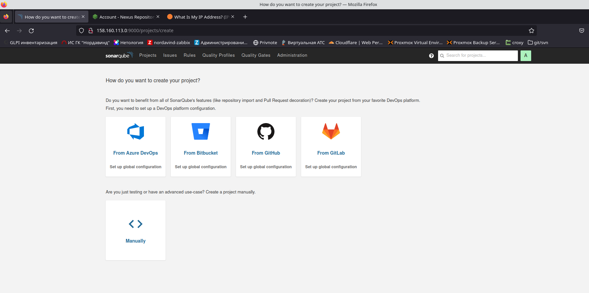
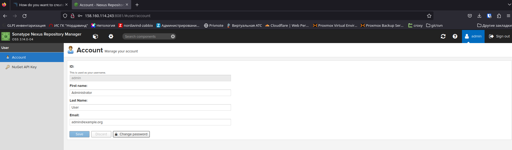
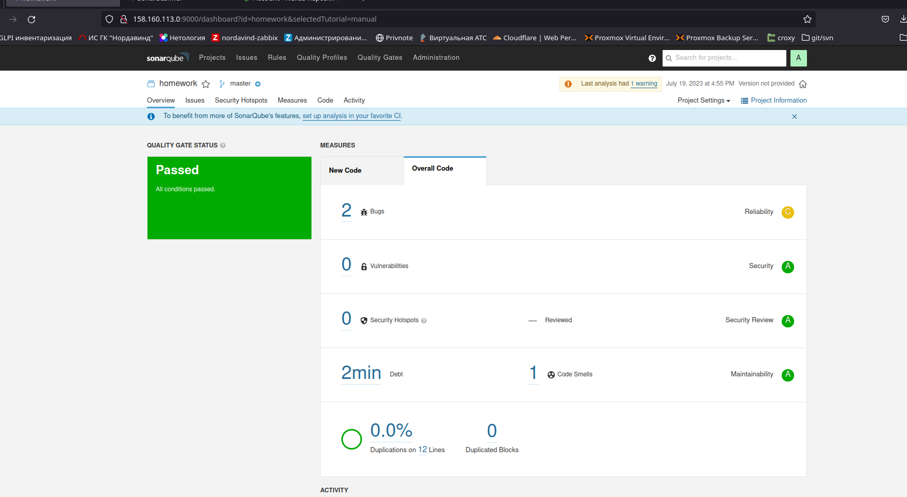
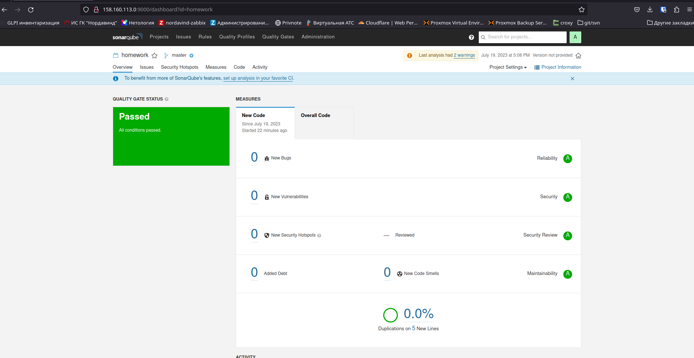
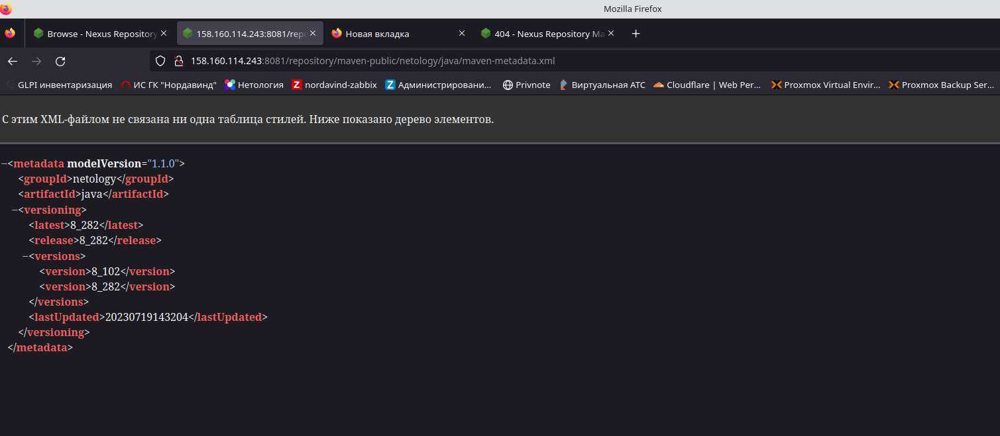

9.3 Процессы CI/CD
===

## Подготовка к выполнению
* Создайте два VM в Yandex Cloud с параметрами: 2CPU 4RAM Centos7.
```hcl
Outputs:

platform_hw_cicd = {
  "external_ip" = [
    "158.160.113.0",
    "158.160.114.243",
  ]
  "instance_name" = [
    "centos7-server-0",
    "centos7-server-1",
  ]
}

```

* Проверьте готовность SonarQube через браузер.

* Проверьте готовность Nexus через бразуер.


## Знакомоство с SonarQube

* Посмотрите результат в интерфейсе.

* Исправьте ошибки, которые он выявил, включая warnings. Сделайте скриншот успешного прохождения анализа, приложите к решению ДЗ.


## Знакомство с Nexus
* В ответе пришлите файл maven-metadata.xml для этого артефекта.


## Знакомство с Maven
* Запустите команду mvn package в директории с pom.xml, ожидайте успешного окончания.
```ignorelang
[WARNING] JAR will be empty - no content was marked for inclusion!
[INFO] Building jar: /home/kunaev/ansible/mnt-homeworks/09-ci-03-cicd/mvn/target/simple-app-1.0-SNAPSHOT.jar
[INFO] ------------------------------------------------------------------------
[INFO] BUILD SUCCESS
[INFO] ------------------------------------------------------------------------
[INFO] Total time:  12.419 s
[INFO] Finished at: 2023-07-19T18:08:43+03:00
[INFO] ------------------------------------------------------------------------
```

* Проверьте директорию ~/.m2/repository/, найдите ваш артефакт.
```ignorelang
kunaev@dub-ws-235:~/ansible/mnt-homeworks/09-ci-03-cicd/mvn$ tree ~/.m2/repository/netology/
/home/kunaev/.m2/repository/netology/
└── java
    └── 8_282
        ├── java-8_282-distrib.tar.gz
        ├── java-8_282-distrib.tar.gz.sha1
        ├── java-8_282.pom.lastUpdated
        └── _remote.repositories

2 directories, 4 files
```