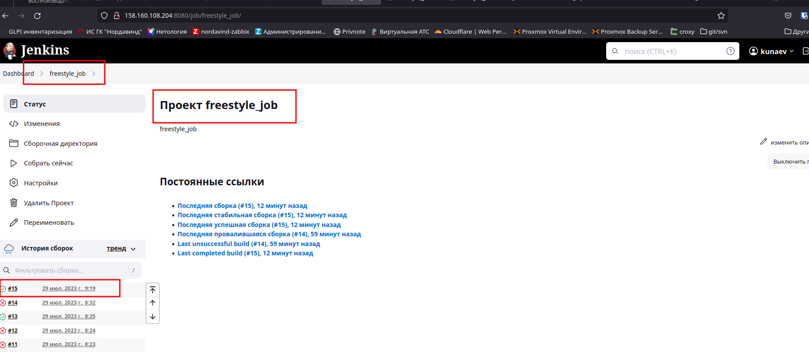
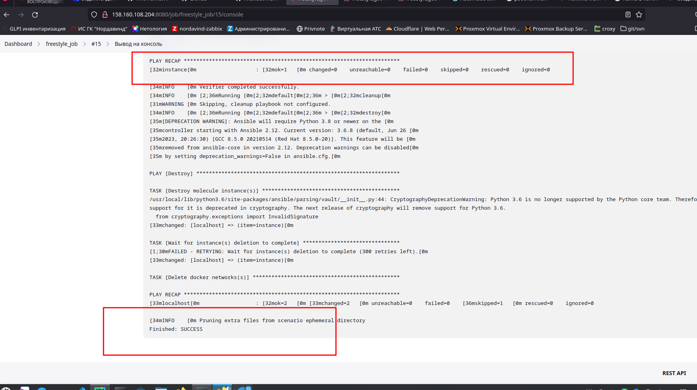
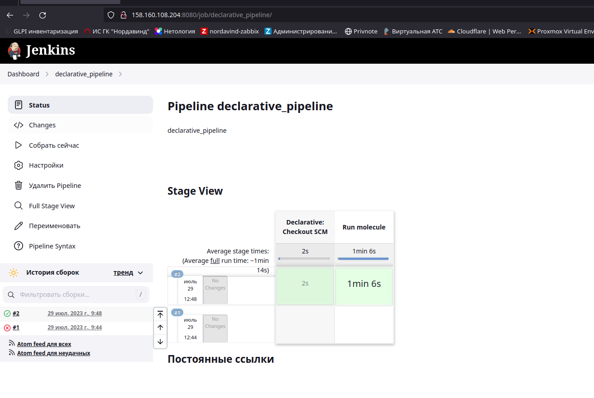
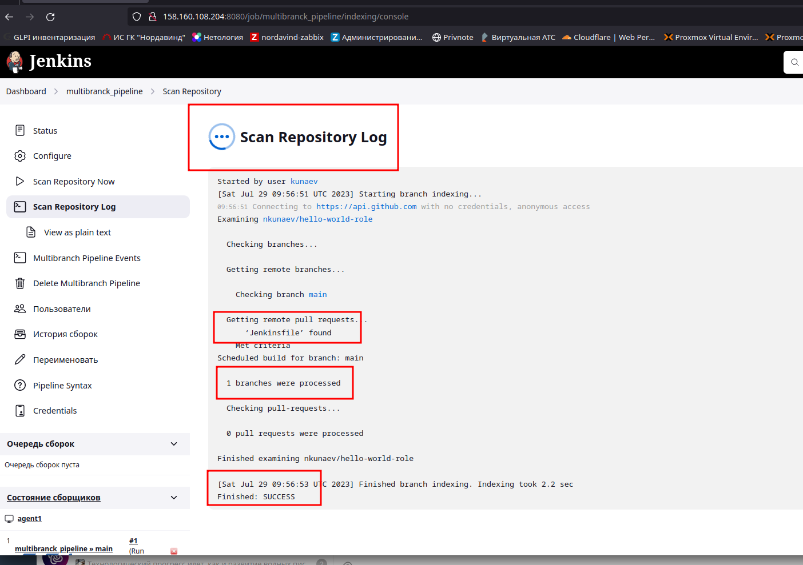
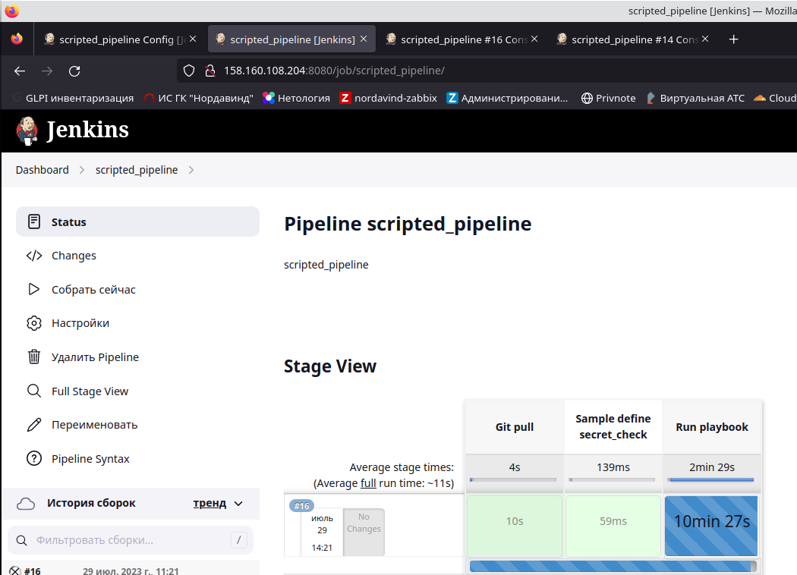

# Jenkins

## Подготовка к выполнению
```ignorelang
kunaev@dub-ws-235:~/projects/devops-netology/9.ci-cd/9.4_Jenkins/infra/terraform$ terraform output
platform_hw_cicd = {
  "external_ip" = [
    "158.160.108.204",
    "158.160.98.57",
  ]
  "instance_name" = [
    "centos-stream-8-jenkins-server-0",
    "centos-stream-8-jenkins-server-1",
  ]
}
```
## Основная часть

* Сделать Freestyle Job, который будет запускать molecule test из любого вашего репозитория с ролью.




* Сделать Declarative Pipeline Job, который будет запускать molecule test из любого вашего репозитория с ролью.


```ignorelang
pipeline {
    agent any
    stages {
        stage('Run molecule') {
            steps {
                sh 'molecule test'
            }
        }
    }
}
```
* Перенести Declarative Pipeline в репозиторий в файл Jenkinsfile.

[Jenkinsfile](https://github.com/nkunaev/hello-world-role/blob/main/Jenkinsfile)

*  Создать Multibranch Pipeline на запуск Jenkinsfile из репозитория.



* Создать Scripted Pipeline, наполнить его скриптом из pipeline.
```ignorelang
node("linux"){
    stage("Git checkout"){
        git credentialsId: '5ac0095d-0185-431b-94da-09a0ad9b0e2c', url: 'git@github.com:aragastmatb/example-playbook.git'
    }
    stage("Sample define secret_check"){
        secret_check=true
    }
    stage("Run playbook"){
        if (secret_check){
            sh 'ansible-playbook site.yml -i inventory/prod.yml'
        }
        else{
            echo 'need more action'
        }
        
    }
}
```

* Внести необходимые изменения, чтобы Pipeline запускал ansible-playbook без флагов --check --diff, если не установлен параметр при запуске джобы (prod_run = True). По умолчанию параметр имеет значение False и запускает прогон с флагами --check --diff.
```ignorelang
node("linux"){
    stage("Git pull"){
        git credentialsId: '9e82f86e-c930-40f6-a290-232f2b29deb9', url: 'git@github.com:nkunaev/vector-playbook.git', branch: 'main'
    }
    stage("Check environment"){
        prod_run=true
    }
    stage("Run playbook"){
        if (prod_run){
            sh 'ansible-galaxy install -r requirements.yml --ignore-errors'
            sh 'ansible-playbook -i inventory/prod.yml playbook.yml'
        }
        else{
            sh 'ansible-galaxy install -r requirements.yml --ignore-errors'
            sh 'ansible-playbook -i inventory/prod.yml playbook.yml --check --diff'
        }
        
    }
}
```
* Проверить работоспособность, исправить ошибки, исправленный Pipeline вложить в репозиторий в файл ScriptedJenkinsfile.


* [ScriptedJenkinsfile](ScriptedJenkinsfile)
[Declarative Pipeline](Declarative Pipeline)
[Scripted Pipeline](Scripted Pipeline)
