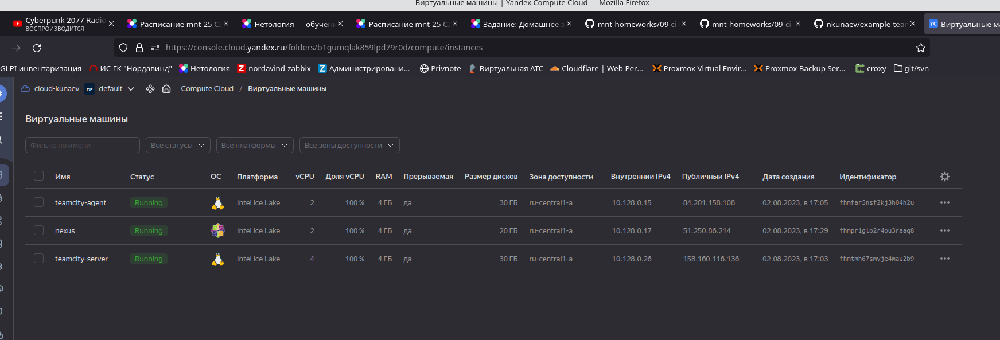
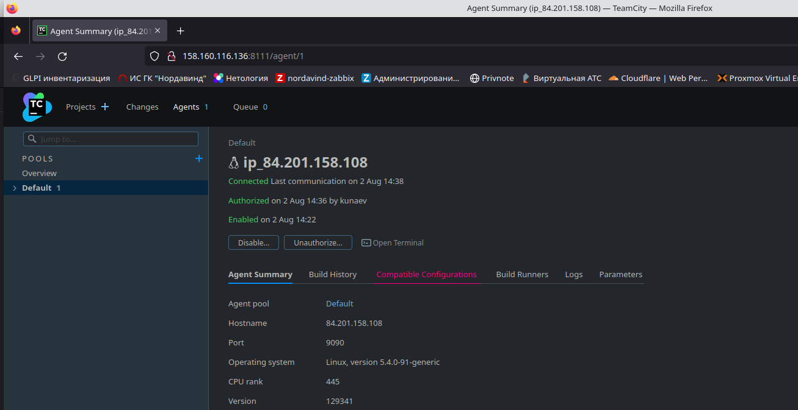
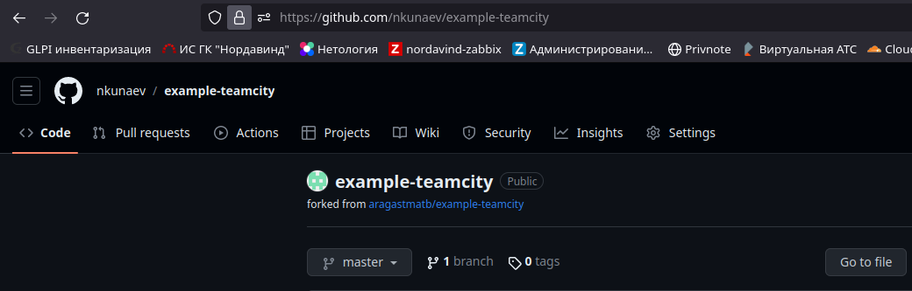
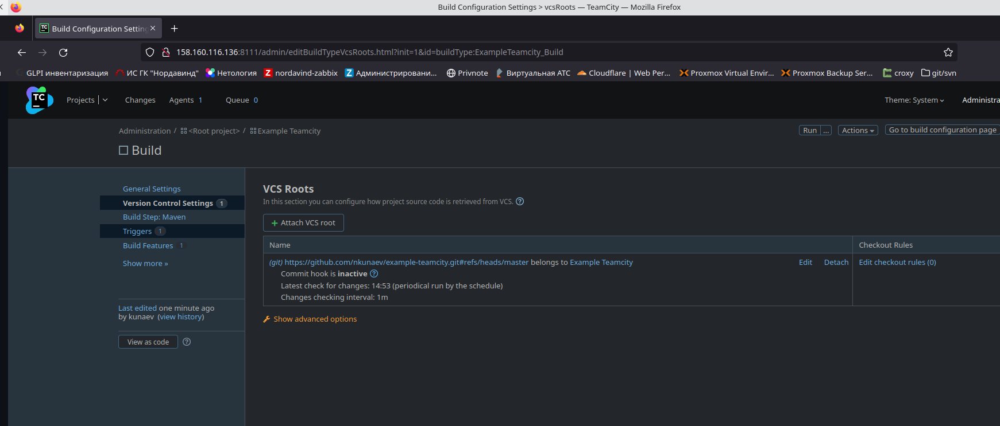
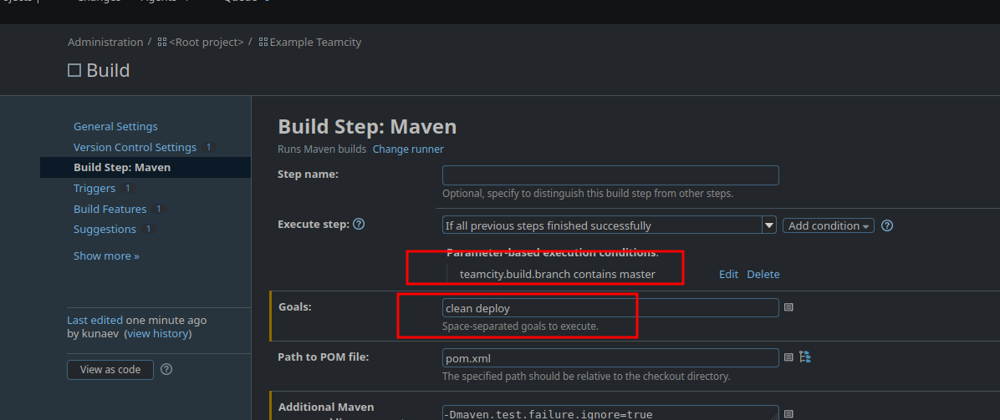
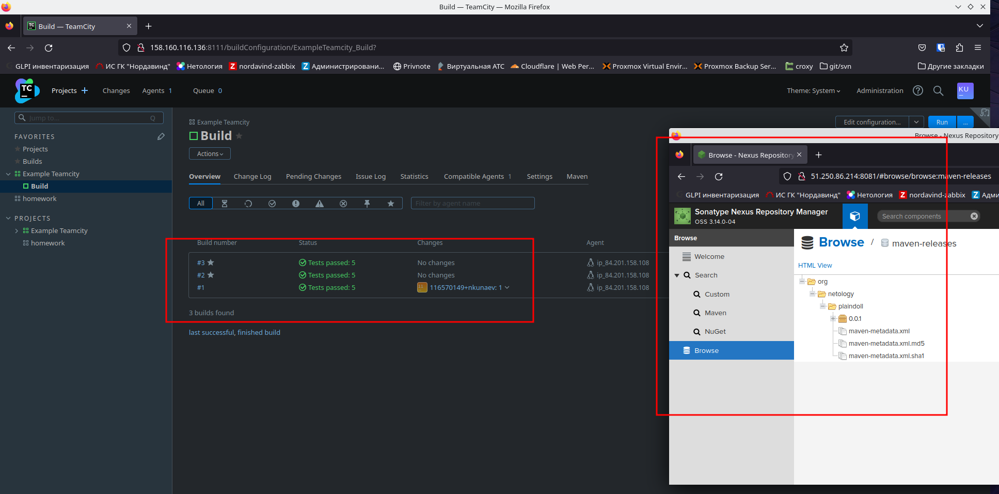
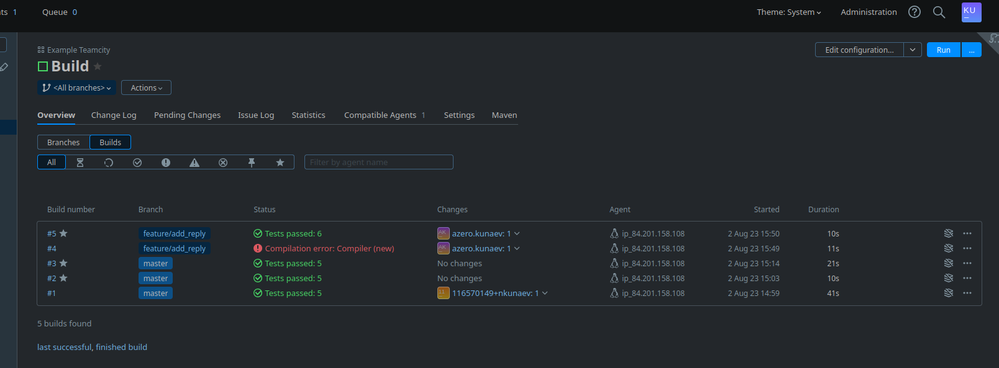
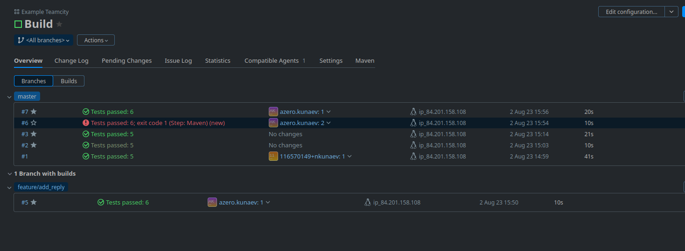

# Домашнее задание «Teamcity»

## Подготовка к выполнению

* Создайте инстансы: `jetbrains/teamcity-server`, `jetbrains/teamcity-agent`, vm `centos7`. 

* Авторизуйте агент. 

* Сделайте fork [репозитория](https://github.com/aragastmatb/example-teamcity).


## Основная часть

1. Создайте новый проект в teamcity на основе fork.

2. Сделайте autodetect конфигурации.
3. Сохраните необходимые шаги, запустите первую сборку master.

4. Поменяйте условия сборки: если сборка по ветке `master`, то должен происходит `mvn clean deploy`, иначе `mvn clean test`.
5. Для deploy будет необходимо загрузить [settings.xml](teamcityettings.xml) в набор конфигураций maven у teamcity, предварительно записав туда креды для подключения к nexus.
6. В pom.xml необходимо поменять ссылки на репозиторий и nexus.
7. Запустите сборку по master, убедитесь, что всё прошло успешно и артефакт появился в nexus.

8. Мигрируйте `build configuration` в репозиторий.

[Вот](https://github.com/nkunaev/devops-netology/blob/main/9.ci-cd/9.5_teamcity/build_config), если это конечто об этом речь
9. Создайте отдельную ветку `feature/add_reply` в репозитории.
10. Напишите новый метод для класса Welcomer: метод должен возвращать произвольную реплику, содержащую слово `hunter`.
```ignorelang
	public String sayNerzhul(){
	  return "Life for ner'zhul, hunter";
	}
```
11. Дополните тест для нового метода на поиск слова `hunter` в новой реплике.
```ignorelang
		@Test
	public void welcomerServeToNerzhul(){
		assertThat(welcomer.sayNerzhul(), containsString("hunter"));
	}
```

12. Сделайте push всех изменений в новую ветку репозитория.
13. Убедитесь, что сборка самостоятельно запустилась, тесты прошли успешно.

14. Внесите изменения из произвольной ветки `feature/add_reply` в `master` через `Merge`.
15. Убедитесь, что нет собранного артефакта в сборке по ветке `master`.  


Сборка упала из-за того, что нет прав на перезапись артефакта той-же версии
16. Настройте конфигурацию так, чтобы она собирала `.jar` в артефакты сборки.  

Поправил версию артефакта в pom.xml, сборка завершилась успешно, артефакт ушел на нексус.
17. Проведите повторную сборку мастера, убедитесь, что сбора прошла успешно и артефакты собраны.
18. Проверьте, что конфигурация в репозитории содержит все настройки конфигурации из teamcity.
19. В ответе пришлите ссылку на репозиторий.

[Вот] (https://github.com/nkunaev/example-teamcity)
---

### Как оформить решение задания

Выполненное домашнее задание пришлите в виде ссылки на .md-файл в вашем репозитории.

---
