Домашнее задание 9.6 Gitlab
---

# Подготовка к выполнению

* Создайте новый репозиторий в GitLab, наполните его файлами.
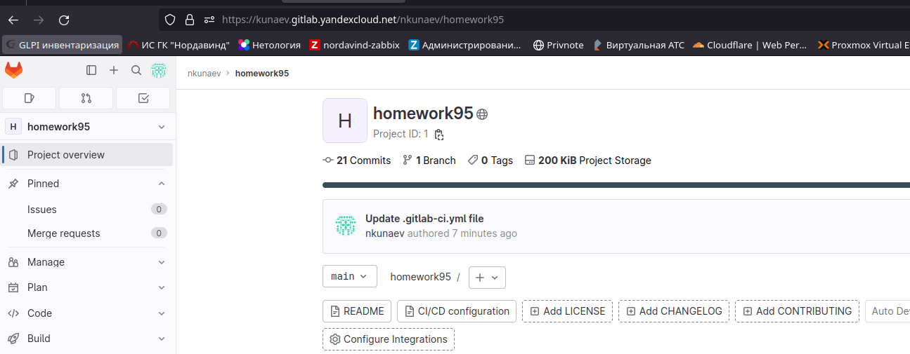

# Основная часть

## DevOps
1. Образ собирается на основе centos:7.
2. Python версии не ниже 3.7.
3. Установлены зависимости: flask flask-jsonpify flask-restful.
4. Создана директория /python_api.
5. Скрипт из репозитория размещён в /python_api.
6. Точка вызова: запуск скрипта.
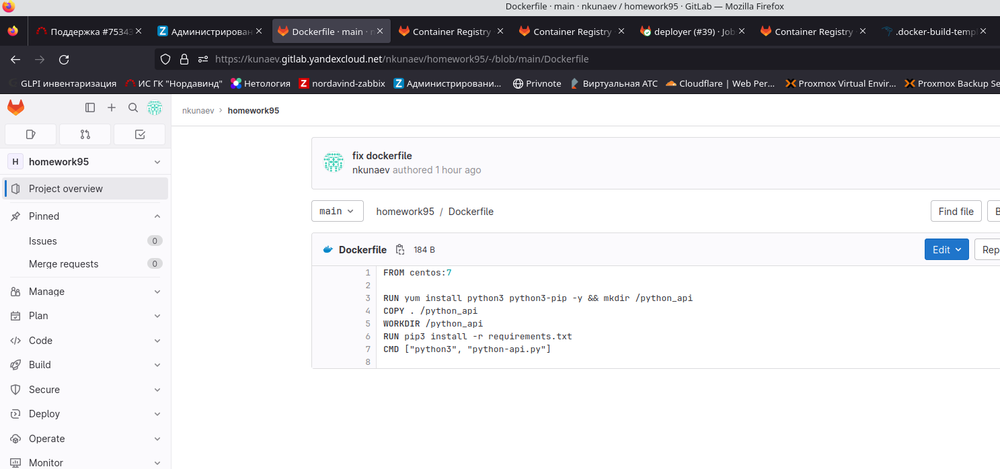
7. При комите в любую ветку должен собираться docker image с форматом имени hello:gitlab-$CI_COMMIT_SHORT_SHA . Образ должен быть выложен в Gitlab registry или yandex registry.
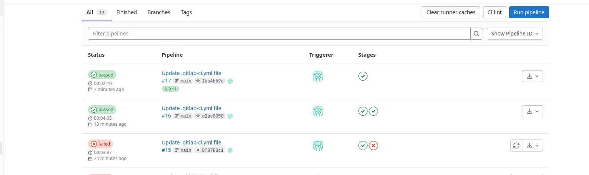
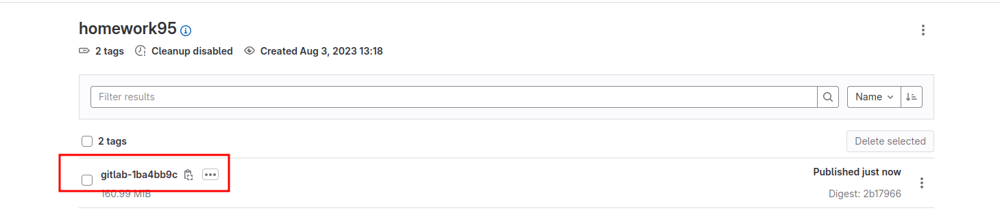
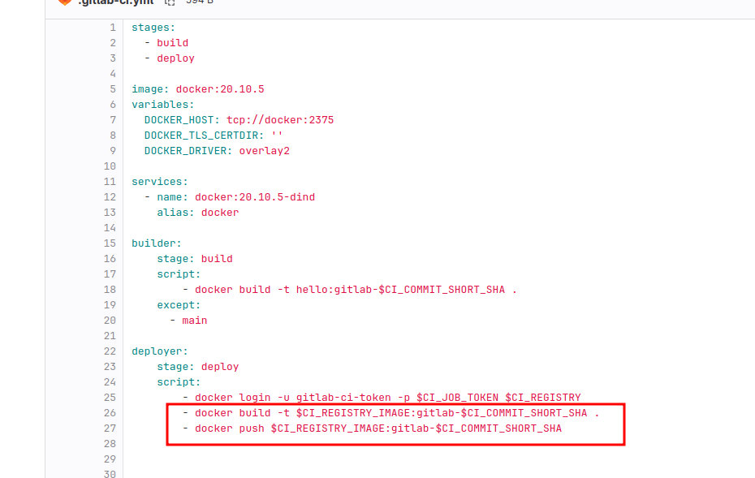

## Product Owner
Вашему проекту нужна бизнесовая доработка: нужно поменять JSON ответа на вызов метода GET `/rest/api/get_info`, необходимо создать Issue в котором указать:

1. Какой метод необходимо исправить.
2. Текст с `{ "message": "Already started" }` на `{ "message": "Running"}`.
3. Issue поставить label: feature.

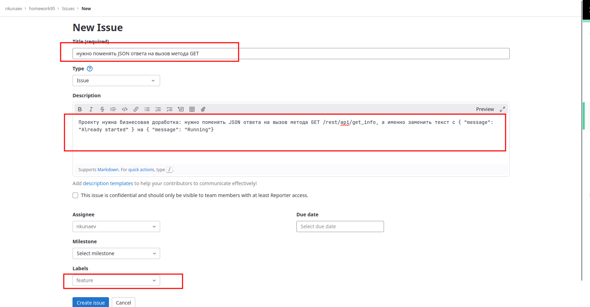

## Developer

1. Создать отдельную ветку, связанную с этим Issue. 
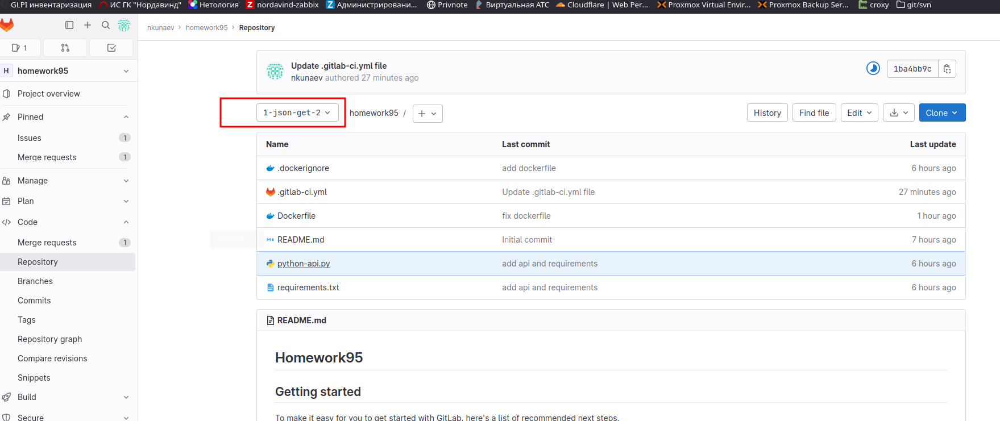
2. Внести изменения по тексту из задания. 
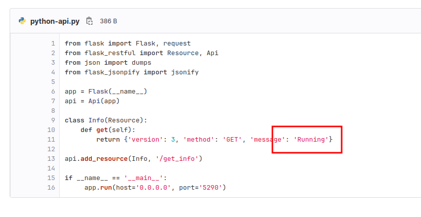
3. Подготовить Merge Request, влить необходимые изменения в master, проверить, что сборка прошла успешно.
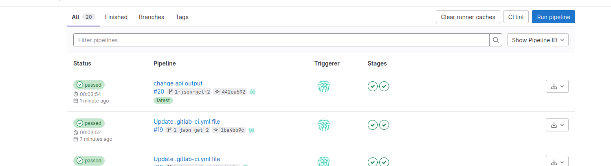

### Tester

Разработчики выполнили новый Issue, необходимо проверить валидность изменений:

1. Поднять докер-контейнер с образом `python-api:latest` и проверить возврат метода на корректность.
2. Закрыть Issue с комментарием об успешности прохождения, указав желаемый результат и фактически достигнутый.
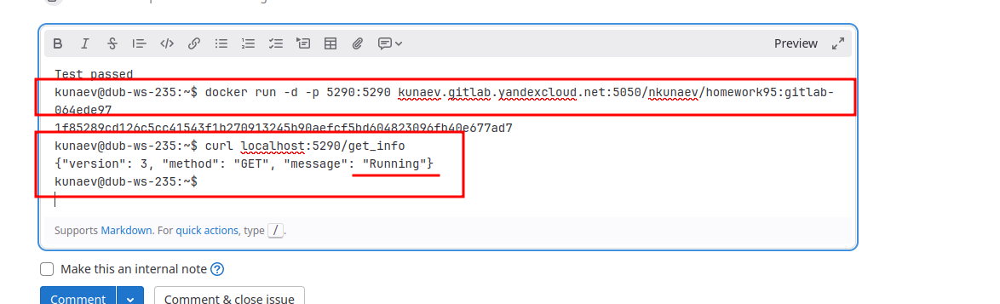

## Итог

В качестве ответа пришлите подробные скриншоты по каждому пункту задания:

- файл [gitlab-ci.yml](./src/.gitlab-ci.yml);
- [Dockerfile](./src/Dockerfile); 
- [лог](./src/pipline.log) успешного выполнения пайплайна;
- решённый Issue..
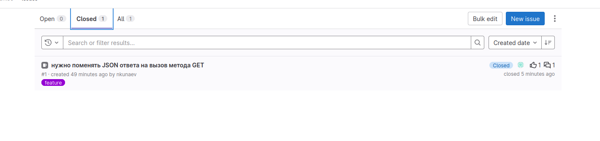