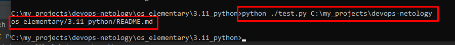
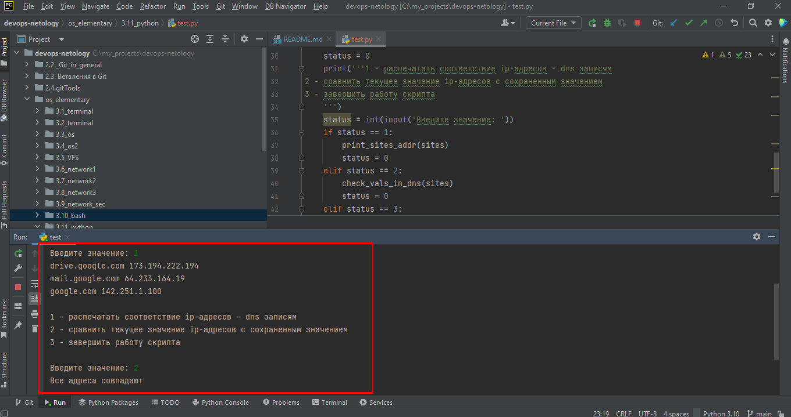

# Домашнее задание к занятию "Использование Python для решения типовых DevOps задач"
_________
## Задание 1

Есть скрипт:
```python
#!/usr/bin/env python3
a = 1
b = '2'
c = a + b
```

### Вопросы:

| Вопрос  | Ответ                                                          |
| ------------- |----------------------------------------------------------------|
| Какое значение будет присвоено переменной `c`?  | Никакое, будет ошибка, тк мы попытается сложить строку и число |
| Как получить для переменной `c` значение 12?  | надо значение переменной "а", взять в кавычки                  |
| Как получить для переменной `c` значение 3?  | нужно у переменной "б" убрать кавычки                          |

------

## Задание 2

Мы устроились на работу в компанию, где раньше уже был DevOps Engineer. Он написал скрипт, позволяющий узнать, какие файлы модифицированы в репозитории, относительно локальных изменений. Этим скриптом недовольно начальство, потому что в его выводе есть не все изменённые файлы, а также непонятен полный путь к директории, где они находятся. 

Как можно доработать скрипт ниже, чтобы он исполнял требования вашего руководителя?

```python
#!/usr/bin/env python3

import os

bash_command = ["cd ~/netology/sysadm-homeworks", "git status"]
result_os = os.popen(' && '.join(bash_command)).read()
is_change = False
for result in result_os.split('\n'):
    if result.find('modified') != -1:
        prepare_result = result.replace('\tmodified:   ', '')
        print(prepare_result)
        break
```

### Ваш скрипт:
```python
import os

sh_command = [f"cd {os.getcwd()}", "git status"]
result_os = os.popen(' && '.join(sh_command)).read()
count = 0
row = 0
print(f"Скрипт запущен в каталоге {os.getcwd()}. Уточняем данные по изменениям...")
for result in result_os.split('\n'):
    if result.find('modified') != -1:
        if row == 0:
            print("Обнаружены изменения в следующих файлах: ")
            row += 1
        prepare_result = os.getcwd() + "\\" + result.replace('\tmodified:   ', '')
        count += 1
        print(prepare_result)
if count == 0:
    print("В текущем каталоге нет изменений, или он не является локальным репозиторием. ")
```

### Вывод скрипта при запуске при тестировании:
```
Скрипт запущен в каталоге C:\my_projects\devops-netology\os_elementary\3.11_python. Уточняем данные по изменениям...
Обнаружены изменения в следующих файлах: 
C:\my_projects\devops-netology\os_elementary\3.11_python\README.md
```

------

## Задание 3

Доработать скрипт выше так, чтобы он не только мог проверять локальный репозиторий в текущей директории, но и умел воспринимать путь к репозиторию, который мы передаём как входной параметр. Мы точно знаем, что начальство коварное и будет проверять работу этого скрипта в директориях, которые не являются локальными репозиториями.

### Ваш скрипт:
```python
import os
print(''' 
Для Unix систем необходимо указывать абсолютный путь в формате /home/user/project/
Для Windows в формате C:\\patch\\to\\dir
''')
route = input("Укажите путь к каталогу: ")

sh_command = [f"cd {route}", "git status"]
result_os = os.popen(' && '.join(sh_command)).read()
count = 0
for result in result_os.split('\n'):
    if result.find('modified') != -1:
        prepare_result = result.replace('\tmodified:   ', '')
        count += 1
        print(prepare_result)
if count == 0:
    print("There's no changes")

-----ИЛИ-------

import os
from sys import argv


sh_command = [f"cd {argv[1]}", "git status"]
result_os = os.popen(' && '.join(sh_command)).read()
count = 0
for result in result_os.split('\n'):
    if result.find('modified') != -1:
        prepare_result = result.replace('\tmodified:   ', '')
        count += 1
        print(prepare_result)
if count == 0:
    print("There's no changes")

```

### Вывод скрипта при запуске при тестировании:
```
Для Unix систем необходимо указывать абсолютный путь в формате /home/user/project/
Для Windows в формате C:\patch\to\dir

Укажите путь к каталогуC:\my_projects\devops-netology
os_elementary/3.11_python/README.md

---------------------------
C:\my_projects\devops-netology\os_elementary\3.11_python>python ./test.py C:\my_projects\devops-netology

os_elementary/3.11_python/README.md



```

------

## Задание 4

Наша команда разрабатывает несколько веб-сервисов, доступных по http. Мы точно знаем, что на их стенде нет никакой балансировки, кластеризации, за DNS прячется конкретный IP сервера, где установлен сервис. 

Проблема в том, что отдел, занимающийся нашей инфраструктурой очень часто меняет нам сервера, поэтому IP меняются примерно раз в неделю, при этом сервисы сохраняют за собой DNS имена. Это бы совсем никого не беспокоило, если бы несколько раз сервера не уезжали в такой сегмент сети нашей компании, который недоступен для разработчиков. 

Мы хотим написать скрипт, который: 
- опрашивает веб-сервисы, 
- получает их IP, 
- выводит информацию в стандартный вывод в виде: <URL сервиса> - <его IP>. 

Также, должна быть реализована возможность проверки текущего IP сервиса c его IP из предыдущей проверки. Если проверка будет провалена - оповестить об этом в стандартный вывод сообщением: [ERROR] <URL сервиса> IP mismatch: <старый IP> <Новый IP>. Будем считать, что наша разработка реализовала сервисы: `drive.google.com`, `mail.google.com`, `google.com`.

### Ваш скрипт:
```python
from socket import gethostbyname
from sys import exit


def get_sites_addr():
    sites = {'drive.google.com': 'none', 'mail.google.com': 'none', 'google.com': 'none'}
    for site in sites.keys():
        sites[site] = gethostbyname(site)
    return sites


def print_sites_addr(sites: dict):
    for key, val in sites.items():
        print(key, val)
    print()


def check_vals_in_dns(sites: dict):
    for url, addr in sites.items():
        new_addr = gethostbyname(url)
        if addr != new_addr:
            print(f"[ERROR] {url} IP mismatch: {addr} {new_addr}. ")
            exit(0)
    print("Все адреса совпадают")
    print()

print("Получаем соответствие ip-адресов - dns записям.")
sites = get_sites_addr()
while True:
    status = 0
    print('''1 - распечатать соответствие ip-адресов - dns записям 
2 - сравнить текущее значение ip-адресов с сохраненным значением
3 - завершить работу скрипта
    ''')
    status = int(input('Введите значение: '))
    if status == 1:
        print_sites_addr(sites)
    elif status == 2:
        check_vals_in_dns(sites)
    elif status == 3:
        print("Завершаю работу. ")
        exit(0)
    else:
        print("Введите корректное значение из списка.")
        print()
```

### Вывод скрипта при запуске при тестировании:
```
Введите значение: 1
drive.google.com 173.194.222.194
mail.google.com 64.233.164.19
google.com 142.251.1.100

1 - распечатать соответствие ip-адресов - dns записям 
2 - сравнить текущее значение ip-адресов с сохраненным значением
3 - завершить работу скрипта
    
Введите значение: 2
Все адреса совпадают
```


```

```

------

## Дополнительное задание (со звездочкой*) - необязательно к выполнению

Так получилось, что мы очень часто вносим правки в конфигурацию своей системы прямо на сервере. Но так как вся наша команда разработки держит файлы конфигурации в github и пользуется gitflow, то нам приходится каждый раз: 
* переносить архив с нашими изменениями с сервера на наш локальный компьютер, 
* формировать новую ветку, 
* коммитить в неё изменения, 
* создавать pull request (PR) 
* и только после выполнения Merge мы наконец можем официально подтвердить, что новая конфигурация применена. 

Мы хотим максимально автоматизировать всю цепочку действий. 
* Для этого нам нужно написать скрипт, который будет в директории с локальным репозиторием обращаться по API к github, создавать PR для вливания текущей выбранной ветки в master с сообщением, которое мы вписываем в первый параметр при обращении к py-файлу (сообщение не может быть пустым).
* При желании, можно добавить к указанному функционалу создание новой ветки, commit и push в неё изменений конфигурации. 
* С директорией локального репозитория можно делать всё, что угодно. 
* Также, принимаем во внимание, что Merge Conflict у нас отсутствуют и их точно не будет при push, как в свою ветку, так и при слиянии в master. 

Важно получить конечный результат с созданным PR, в котором применяются наши изменения. 

### Ваш скрипт:
```python
 ???
```

### Вывод скрипта при запуске при тестировании:
```
???
```

----

### Правила приема домашнего задания

В личном кабинете отправлена ссылка на .md файл в вашем репозитории.

-----

### Критерии оценки

Зачет - выполнены все задания, ответы даны в развернутой форме, приложены соответствующие скриншоты и файлы проекта, в выполненных заданиях нет противоречий и нарушения логики.

На доработку - задание выполнено частично или не выполнено, в логике выполнения заданий есть противоречия, существенные недостатки. 
 
Обязательными к выполнению являются задачи без указания звездочки. Их выполнение необходимо для получения зачета и диплома о профессиональной переподготовке.
Задачи со звездочкой (*) являются дополнительными задачами и/или задачами повышенной сложности. Они не являются обязательными к выполнению, но помогут вам глубже понять тему.
