1. Скачал и установил вагрант, поднял ОС \
ООочень убедительная просьба, подправьте пожалуйста описание ДЗ \
на гите под современные реалии, установка вагранта была самым болезненным процессом из всего дз.
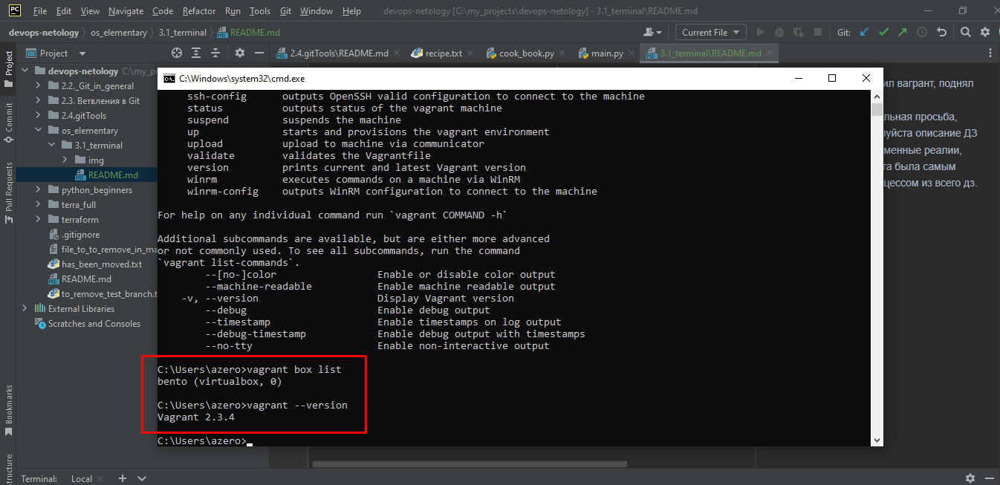
2. Ознакомьтесь с графическим интерфейсом VirtualBox, посмотрите как выглядит виртуальная машина, которую создал для вас Vagrant, какие аппаратные ресурсы ей выделены. Какие ресурсы выделены по-умолчанию?

2 процессора, 1 Гб ОЗУ, 64 Гб дискового пространства, графическая память и виртуальный сетевой интерфейс.
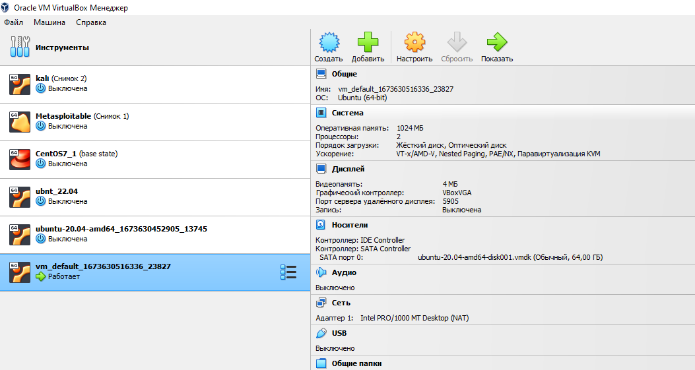

3. Ознакомьтесь с возможностями конфигурации VirtualBox через Vagrantfile: документация. Как добавить оперативной памяти или ресурсов процессора виртуальной машине?
Необходимо в описание VM добавить необходимые параметры конфигурации \
В моем случае я изменил количество ядер на 1 и ОЗУ увеличил до 2 Гб
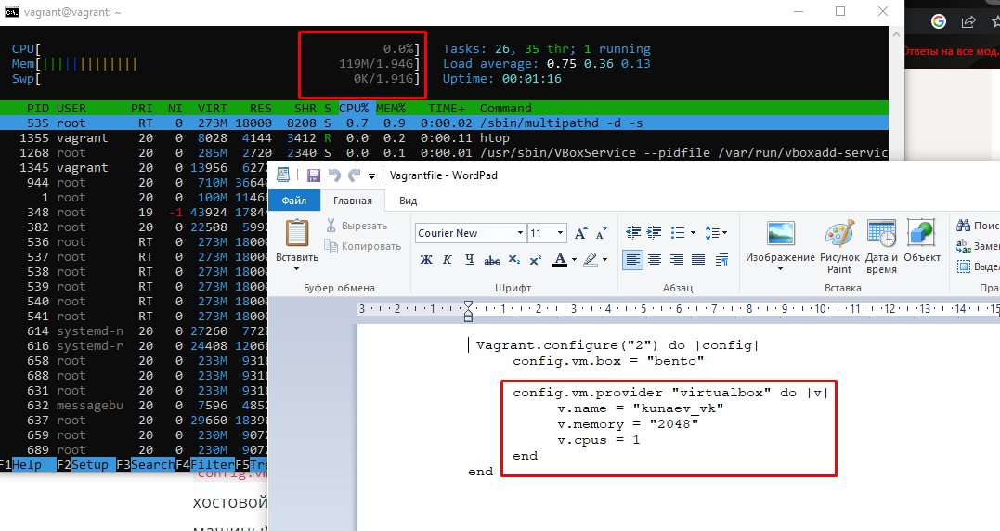

4. Подключился по ssh. root получает под sudo su. Авторизация по приватному ключу, который \
создается при инициализации vm.
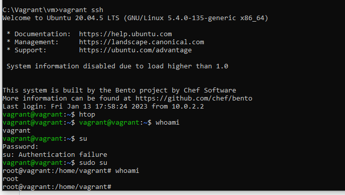
5. Ознакомьтесь с разделами man bash, почитайте о настройках самого bash
какой переменной можно задать длину журнала history, и на какой строчке manual это описывается?
man bash -> /history
параметр - HISTFILESIZE
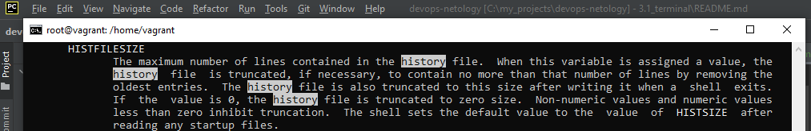
что делает директива ignoreboth в bash?
Клюк к HISTCONROL line 833.
ignoreboth is короткая запись игнорирования дублей и пробелов
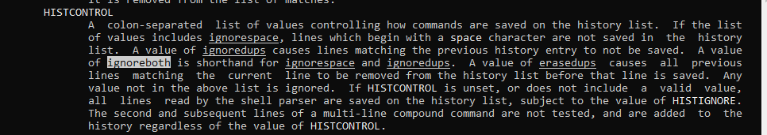
6. В каких сценариях использования применимы скобки {} и на какой строчке man bash это описано? \
строка 257
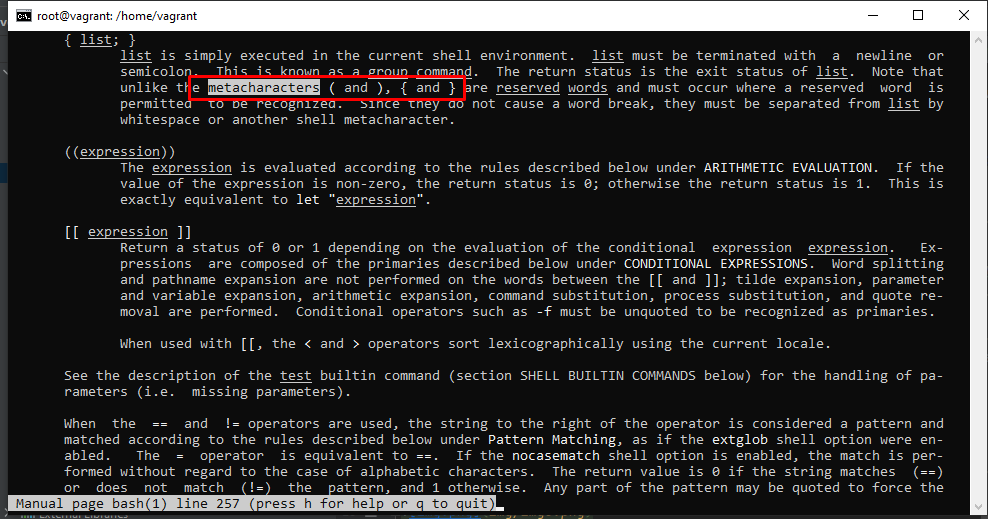
В отличие от () комманды в {} должны быть разделены новой срокой или точной с запятой. Последние также \
выполняются в текущем процессе, а не подпроцессе. Также {} не вызывают разрыв строки и может использоваться для \
подстановки значения.
7. С учётом ответа на предыдущий вопрос, как создать однократным вызовом touch 100000 файлов? Получится ли аналогичным образом создать 300000? Если нет, то почему?
touch file{1..num}.txt
Максимально за раз удалось создать 95723 файла, дальше возникала ошибка на слишном большое количество аргументов
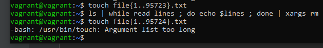
8. В man bash поищите по /\[\[. Что делает конструкция [[ -d /tmp ]]
строка 1818
"\" - символ экранирования
[[]] - используются для выражений состояния
в данном случае "-d" - возвращает True если файл или каталог существуют
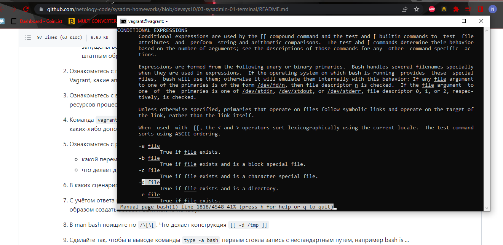

9. Сделайте так, чтобы в выводе команды type -a bash первым стояла запись с нестандартным путем, например bash is ... Используйте знания о просмотре существующих и создании новых переменных окружения, обратите внимание на переменную окружения PATH

bash is /tmp/new_path_directory/bash
bash is /usr/local/bin/bash
bash is /bin/bash \

Для добавления переменной окружения для всех пользователей не обходимо внести изменения в файл /etc/environment, \
для локального - домашней директории ./.profile
Также подойдет комманда PATH=new_dir:$PATH

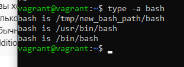

10. Чем отличается планирование команд с помощью batch и at?
Они выполняют идентичную функцию, однако at срабатывает в заданное время, а batch когда LA <1.5

11. Завершить работу VM - #vagrant halt
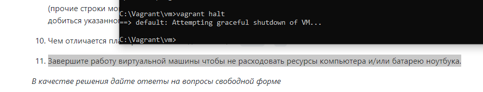