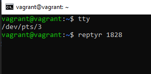

Вопрос 1.

cd (change directory) - это комманда для смены рабочей директории, 
встроенная в операционную систему, и вызывается в текущем инстансе
процесса bash. Трудно представить, как пришлось бы реализовывать 
переход от основного процесса к подпроцессу после смены рабочего 
каталога, если бы команда была реализована иначе.

Вопрос 2.

grep -c 'pattern' 'file'

Вопрос 3

ps 1
/sbin/init

pstree
показывает корневым процессом systemd (но у него и не pid 1)

Вопрос 4.

ls 2>&1 > /dev/pts/{num}

Вопрос 5.

Получится tee < file1 > file2

Вопрос 6.

echo "hello, it's me" > /dev/pts/0

cat ./hash > /dev/tty1

В обоих случаях вывод удалось перенаправить в консоль

Вопрос 7

Bаsh  - коммандная оболочнка. $$ - указывает на процесс шелла. 
Выполнив комманду bash 5>&1 мы дали указание перенаправлять поток вывода с 5 на 1,
что и было продемонстрировано, направив эхо в 5й поток баша.

Вопрос 8

Можно, но нужно создать новый дискриптор.
root@vagrant:/home/vagrant# echo hello! 5>&2 2>&1 1>&5 | grep hello
$ > hello!
Перенаправляем поток 5 в 2(err), 2 в 1 (sdout), и 1 в 5, который уже направляем в пайп

Вопрос 9

Будут выведены переменные окружения. Аналогичный функционал у команды env

Вопрос 10.

man proc
cmdline
- сторка 25, говорится, что это чувствительный файл.
- строка 226 Этот файл содержит полную командную строку запуска процесса, кроме тех процессов, а также тех, что превратились в зомби

exe
- строка 279, этот файл является символьной ссылкой, содержащей актуальное имя исполняемой комманды

Вопрос 11

grep sse /proc/cpuinfo
SSE 4.2

Вопрос 12
Детальной информации по этому поводу не нашел, но сложилось впечатление, что в случае с "ssh localhost 'tty'"
выполяется не полноценное подключение с открытием пользовательской сессии, запуском переменных окружения и 
прочих сопутствующих моментов, а исполнение комманды с последующим ее отправлением инициатору stdout и закрытием соединения.
При этом, если возникает необходимость выполнения комманд от привилегированного пользователя, то уже необходимо ssh отправлять с
ключем "-t", для принудительного открытия терминала.
В случае же с обычным подключением по ssh vagrant@localhost, открывается полноценная сессия и tty выводит информацию

Вопрос 13
Новая сессия. Запустил htop
vagrant@vagrant:~$ vagrant@vagrant:~$ tty
/dev/pts/0
vagrant@vagrant:~$ htop &
[1] 1828

-> screen -S new
reptyr 1828

Вопрос 14.
tee, это процесс вызываемый от имени суперпользователя, по этому он имеет доступ в рутовый каталог. Его поведение можно сравнить с буквой
 "Т" - он принимает поток информации через stdin, после чего выводит ее на stdout и в файл.