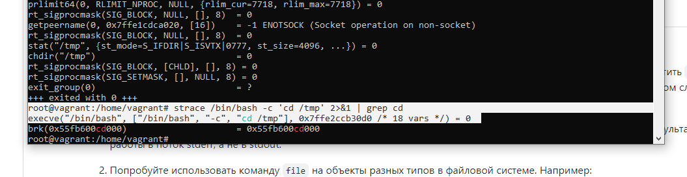
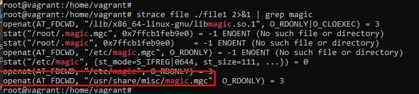
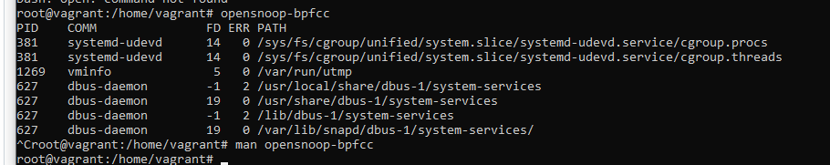
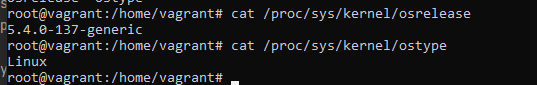
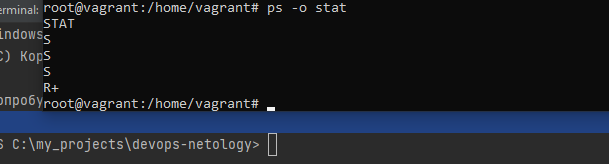

Вопрос 1.

Системные вызов - execve
root@vagrant:/home/vagrant# strace /bin/bash -c 'cd /tmp' 2>&1 | grep cd

execve("/bin/bash", ["/bin/bash", "-c", "cd /tmp"], 0x7ffe2ccb30d0 /* 18 vars */) = 0

Вопрос 2.
Во всех случаях перед выдачей ответа запрашивалось содержимое
"/usr/share/misc/magic.mgc"
в man magic это подтверждается.

Вопрос 3.

echo > file
cat /dev/null > file

Вопрос 4.
Процесс-зомби - подпроцесс завершившив свою работу, освободивший ресурсы и хранящий
запись о завершении работы для его последующего прочтения родительским процессом, ресурсов системы не занимает,
однако он занимает место в записи таблице процессов, размер которой ограничен. Во всяком случае об этом
везде пишут, только не пишут от чего он зависит.

Вопрос 5.

opensnoop отслеживает системные вызовы на открытие файлов. Согласно мануала, может 
использоваться чтобы найти куда интересующий процесс пишет логи, или откуда берет конфиг.

Первыми попались файлы threads и procs, в которые обращался udev (обработчик событий)

Вопрос 6.

Используется системный вызов uname.
В man uname(2), говориться, что /proc/sys/kernel/{ostype, hostname, osrelease, version,
domainname} - является альтернативным источником информации.

Вопрос 7.

; используется для последовательного выполнения комманд, независимо от результата работы предыдущей команды.
&&, амперсанды же используются для выполнения комманды, в случае успешного выполнения предыдущей комманды
например apt update && apt upgrade.

Вопрос 8.

set - устанавливает или отменяет опции shell'a
 -e  выходит немедленно, если комманда возвращает не нулевой статус
 -u  считать неустановленные переменные ошибкой при подстановке
 -x  печатать команды и аргументы по мере их выполнения
 -o pipefail    возвращаемое значение пайпа, это статус последней комманды с ненулевым exit кодом,
                или нулевым exit кодом, если небыл ни одной комманды с ненулевым статусом выхода.

Насколько я понимаю, указанные аргументы и так установлены по умолчанию.

Вопрос 9.

В моем случае наиболее часто встречающийся статус - S (прерываемый сон),
т.е. процесс ожидает какое-то событие.

