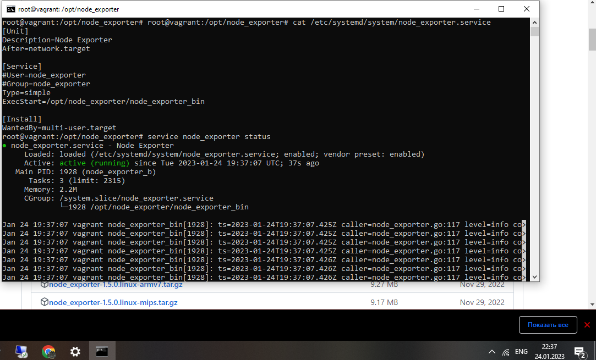
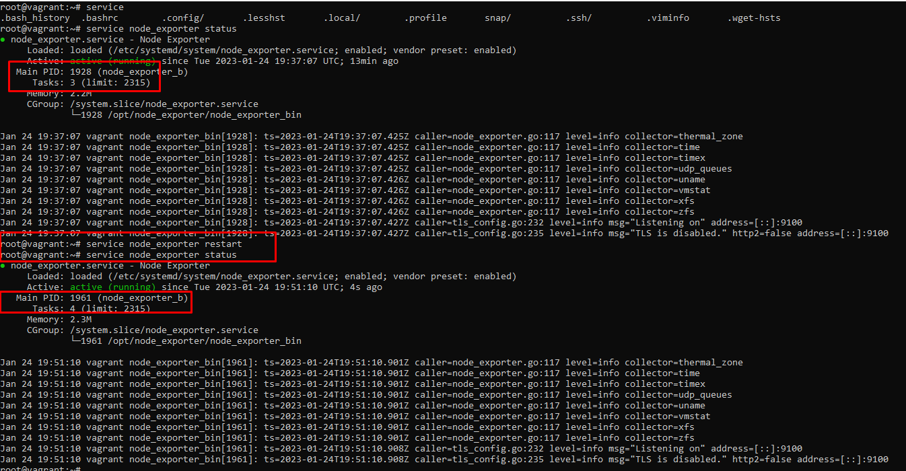
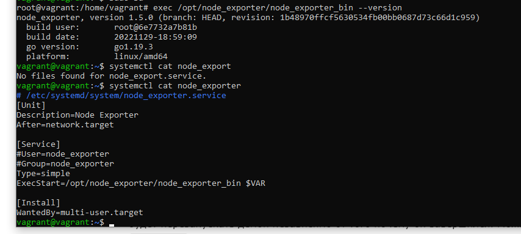
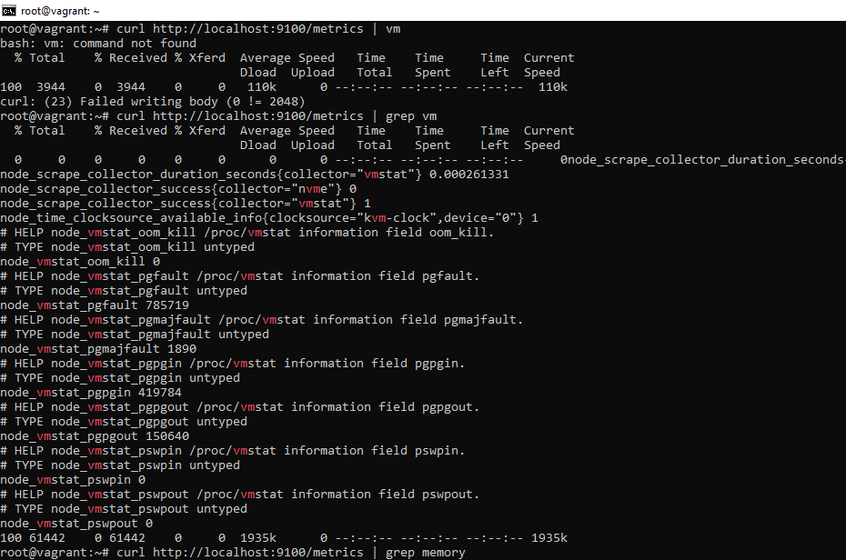
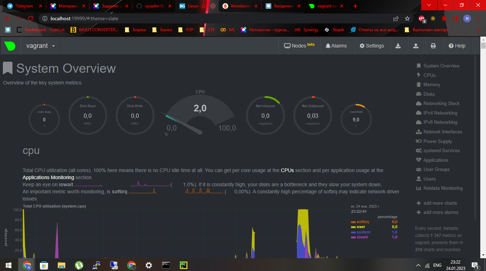
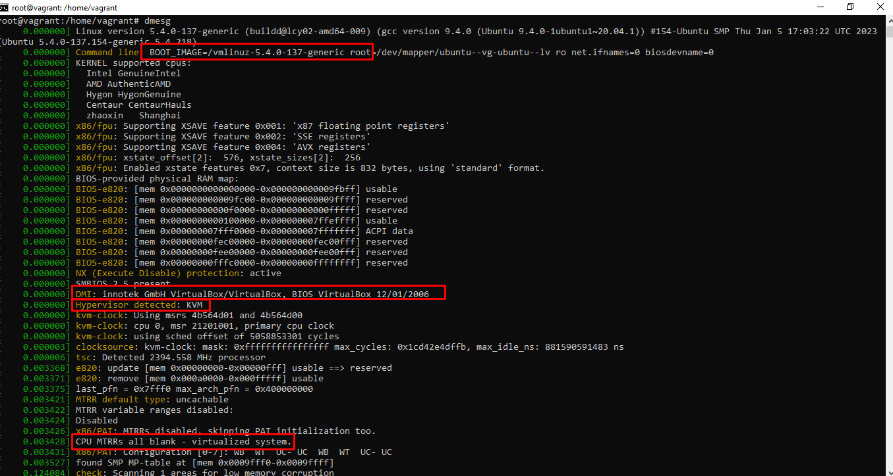
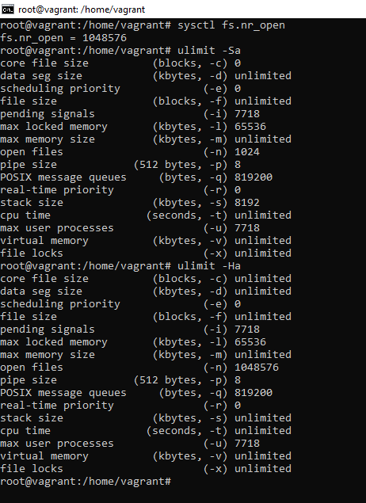
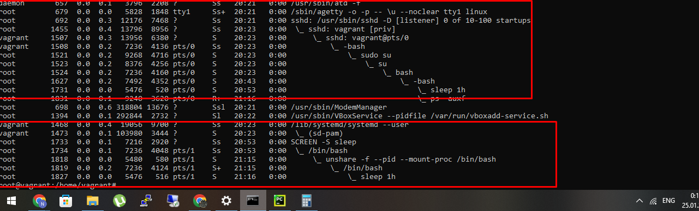
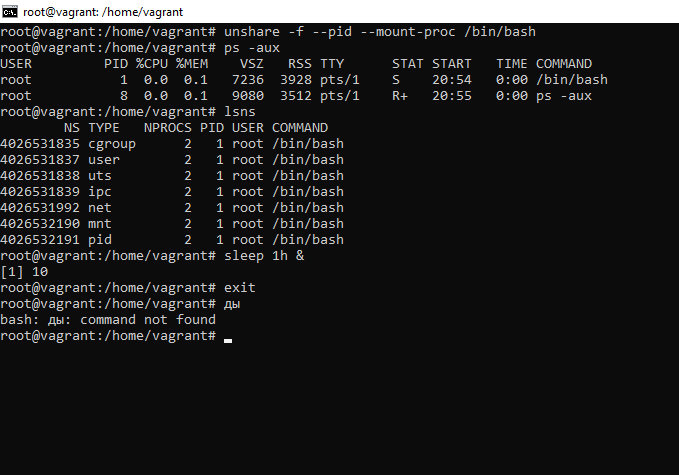
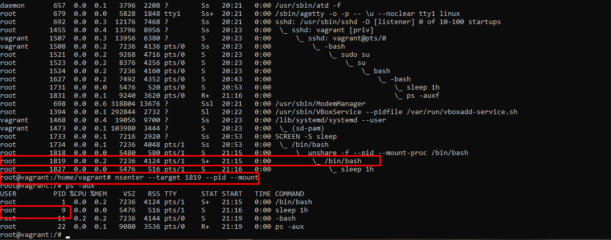

    Вопрос 1.

Скачал с https://github.com/prometheus/node_exporter/releases бинарник для linux 64amd
Создал сервис с описанием, указанием зависимостей, после чего запускать и откуда запускать.
Перечитал systemd - systemctl daemon-reload
добавил в автозапуск systemctl enable node_exporter
и запустил systemctl start node_exporter

Собственнос в скриншоте вывод содержимого node_exporter.service 
и статус процесса.

После перезапуска сервис поднялся с новым PID

Параметры к запуску можно задать через через добавление переменной $VAR с запуском в файле .service

UPD

прикладываю вывод unita c переменной и запуск с ключем --version

    Вопрос 2

Для мониторинга можно выбрать слеюущие параметры:

время простоя цпу
node_cpu_seconds_total{cpu="0",mode="idle"} 4313.66
время ожидания i/o
node_cpu_seconds_total{cpu="0",mode="iowait"} 7.71

Количество занятой и свободной памяти
process_virtual_memory_bytes 7.43497728e+08
node_memory_VmallocUsed_bytes 1.01376e+07

Отработкой out of memory killer
node_vmstat_oom_kill 0

и тд

Скрин вывода метрик через curl

Вопрос 3.

Это феноменально :)

Вопрос 4

VM почти с самого старта определяет, что она запучена через KVM, загрузочный образ
определяет как vmlinux и пр.

Вопрос 5.

fs.nr_open - отвечает за параметр размера максимального количества открытых дескриптеров.
По-умолчанию зто значение 1048576 (1024*1024)
root@vagrant:/home/vagrant# sysctl fs.nr_open
fs.nr_open = 1048576

Лимиты есть жесткие и мягкие
Посмотреть их можно командой ulimit -Ha & Sa соответственно. Этой же
командой можно увеличить мягкие лимиты до жестких для конкретного шелла, где
будет запущена комманда.

Перманентно лимиты можно увеличить в конф. файле /etc/security/limits.conf

Задание 6.

В главном окне создал процесс sleep 1h & pid 1731
прикладываю вывод lsns. Также создал скрин pid 1733

Зашел в скрин. Изолировал шелл и создал процесс sleep с PID 9

Через nsenter примонтировал неймспейс из shellа, который был запущен в скрине 

Задание 7

:(){ :|:& };: - это старый прикол с форк-бомбой

:(){ :|:& }; здесь мы определяем функцию, которая будет вызывать еще 2 своих экземпляра,
а после ";" вызываем ее. При отсутствии лимитов, тех, что смотрели в 5 вопросе, 
займет все возможные pid'ы и не даст создаваться новым процессам, чем повесит систему.

вывод dmesg сообщил, что pid контроллер заблокировал создание форков. 
[ 3958.848974] cgroup: fork rejected by pids controller in /user.slice/user-1000.slice/session-6.scope