Задание 1

Разряженные файлы - файл в котором последовательности нулевых байтов заменены информацией об этих последовательносях,
(списках дыр)

Список дыр - информация о последовательностях нулевых байтов не записанных на диск, а хранящаихся в 
метаданных файловой системы.

Преимущества:

экономия пространства, сокращение IO операций за счет отсуствия временных затрат на запись нулевых байт и
как следствие увеличение срока службы устройства за счет снижения количества циклов перезаписи.

Недостатки:

фрагментация файлов за счет записи данных в дыры, невозможность записи в дыры пр отсутствии свободного места.

Также в википедии упоминается:

невозможность использования других индикаторов дыр, хотя упоминаний о других индикаторах я не нашел

Накладные расходы для работы со списком дыр.

Из имеющейся инфомрации о накладных расходах, если я правильно понял, следует, что это затраты ресурсов операционной
системы на выполнение последовательных комманд для чтения/записи заднных, а также временные затраты при позиционированнии 
головок диска.

Задание 2

Как показала практика при изменении владельца жесткой ссылки, меняется и владелец оригинала.
Полагаю, что это связано тем, что ссылки ссылаются на один и тот же дескриптор (inode), те
физическое расположение файла на диске. 

При этом можно менять владельца символьной ссылки, для этого также можно манипулировать
фланами комманды chown, например --dereference - Изменить владельца файла, на который указывает символьная ссылка, вместо самой символьной ссылки,
и --no-dereference - Работать с самими символьными ссылками, а не с файлами, на которые они указывают.

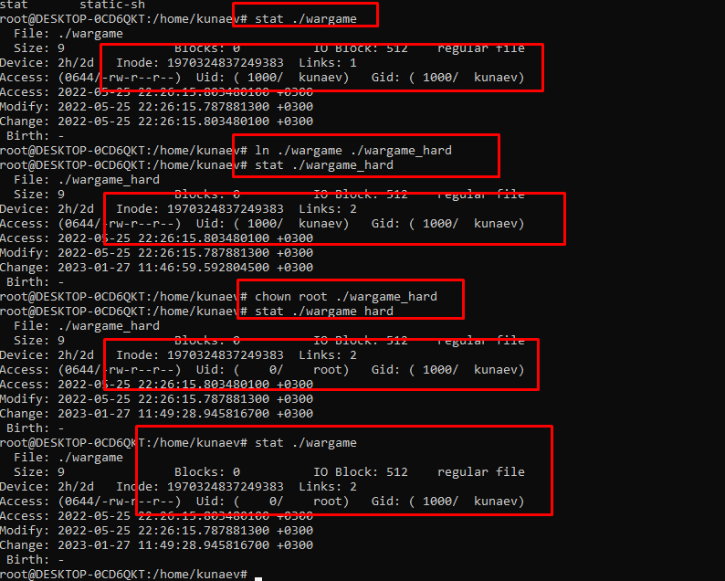

Задание 3.

Поднята vm. Вывод lsblk
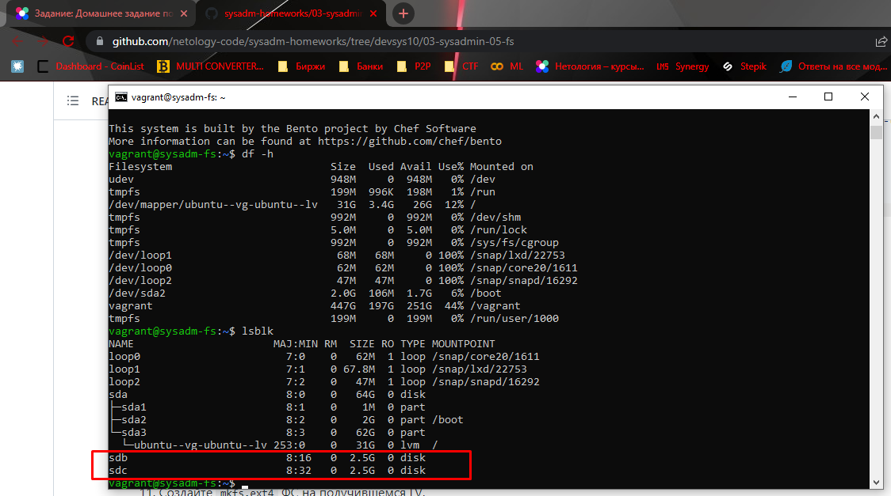

Задание 4.
через fdisk соданы 2 раздела размером 2Гб и 511мб
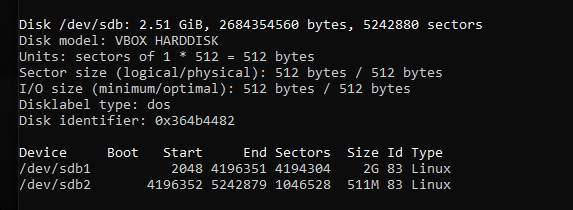

Задание 5.
Сделан дамп информации разделов sdb и перенесен на sdc
sfdisk --dump /dev/sdb > sdb_backup.txt
sfdisk /dev/sdc < sdb_backup.txt

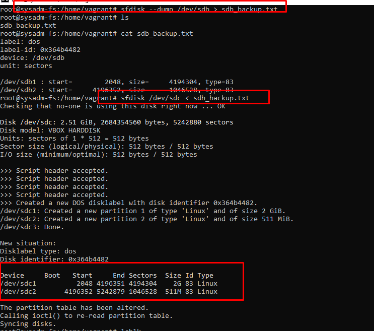

Задание 6, 7.
С помощью mdadm созданы рэйд 1 и 0.

root@sysadm-fs:/home/vagrant# mdadm --create /dev/md0 --level=1 --raid-devices=2 /dev/sdb1 /dev/sdc1

root@sysadm-fs:/home/vagrant# mdadm --create /dev/md1 --level=0 --raid-devices=2 /dev/sdb2 /dev/sdc2

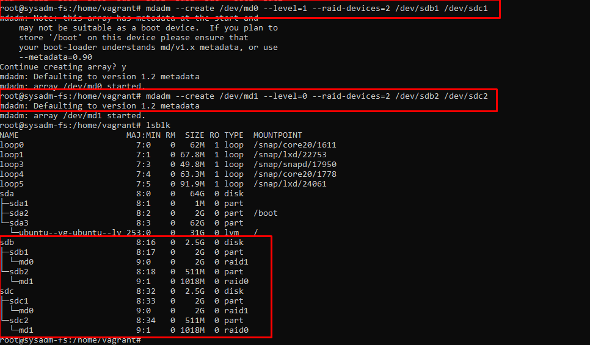

Задание 8,9

Созданы 2 физических раздела
pvcreate /dev/md0 /dev/md1

Создана группа homework из двух физических разделов
vgcreate homework /dev/md0 /dev/md1

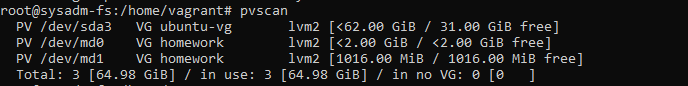

Задание 10

lvcreate -L 100M -n lv1 homework /dev/md1
Параметр block device соответствует raid0.

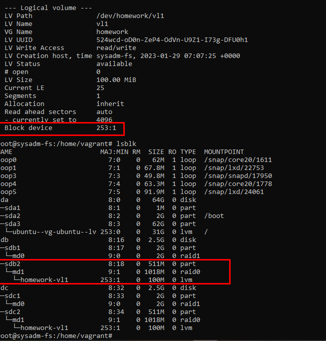

Задание 11-14

mkfs.ext4 /dev/homework/vl1
mkdir /tmp/test-dir
mount /dev/homework/vl1 /tmp/test-dir
curl url -O dir
   65  lsblk
   66  findmnt /dev/homework/vl1
   67  df -h

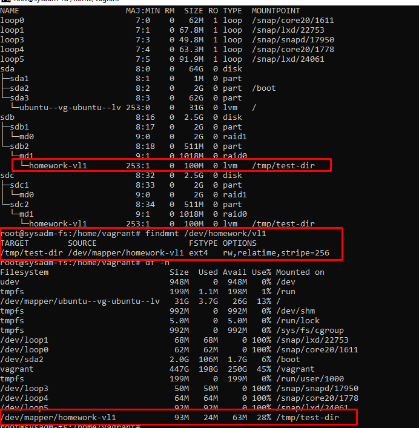

Задание 15.

Целосность файла проверена

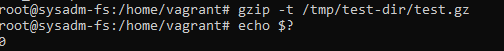

Задание 16

root@sysadm-fs:/home/vagrant# pvmove /dev/md1 /dev/md0
  /dev/md1: Moved: 12.00%

  /dev/md1: Moved: 100.00%
  
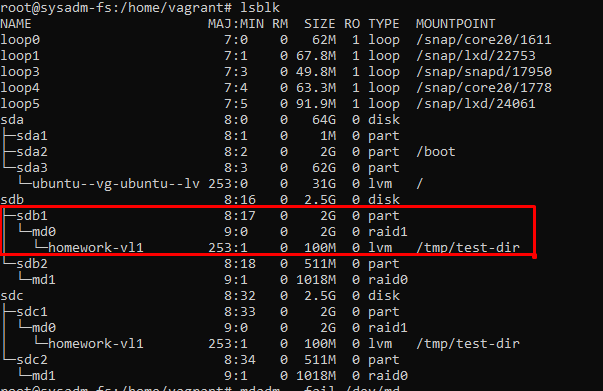

Задание 17, 18.
root@sysadm-fs:/home/vagrant# mdadm --fail /dev/md0 /dev/sdb1
mdadm: set /dev/sdb1 faulty in /dev/md0

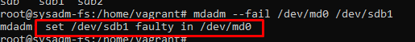

dmesg
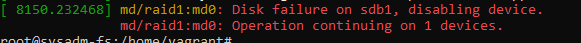
Вывод вообщает, что работа продолжится на 1 диске

Задание 19

root@sysadm-fs:/home/vagrant# gzip -t /tmp/test-dir/test.gz
root@sysadm-fs:/home/vagrant# echo $?
0

Задание 19.1

89  mdadm --detail /dev/md0

90  mdadm --manage /dev/md0 --remove /dev/sdb1

91  sfdisk -d /dev/sdc1 | sfdisk --force /dev/sdb1

92  fdisk -l | grep dev

93  mdadm --manage /dev/md0 --add /dev/sdb1 

94  mdadm --detail /dev/md0

Проверили статус рейда, убедились, что 1 диск не работает

Удалили сбойный диск(раздел)

перенесли разметку с раздела работающего диска на новый

проверили, что разметра встала корретно и информация идентична на обоих партициях

добавили новый диск в рейд

проверили, что все заработало и оба диска активны

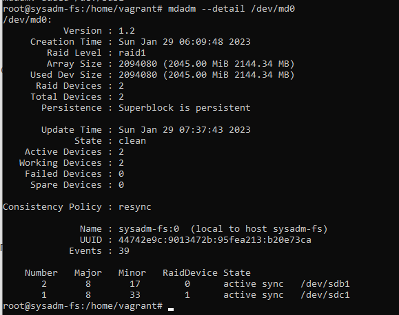

Задание 20.

Уничтожили vm 

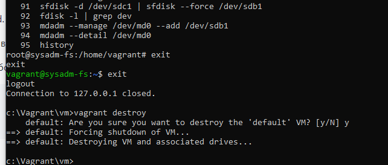

