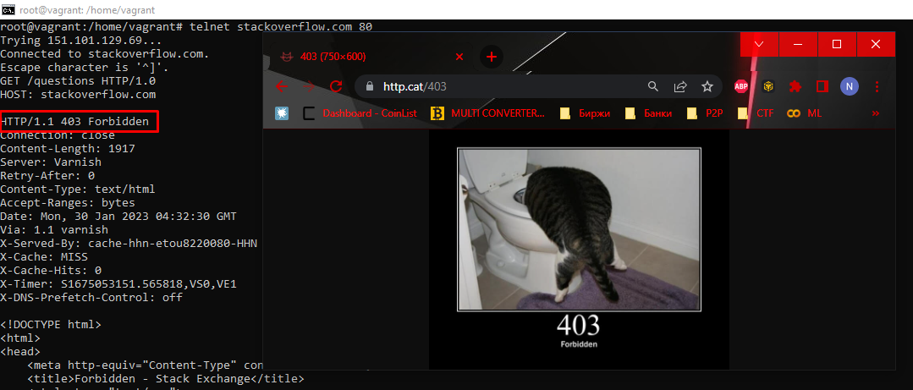
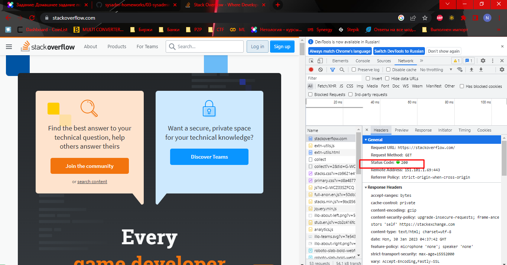
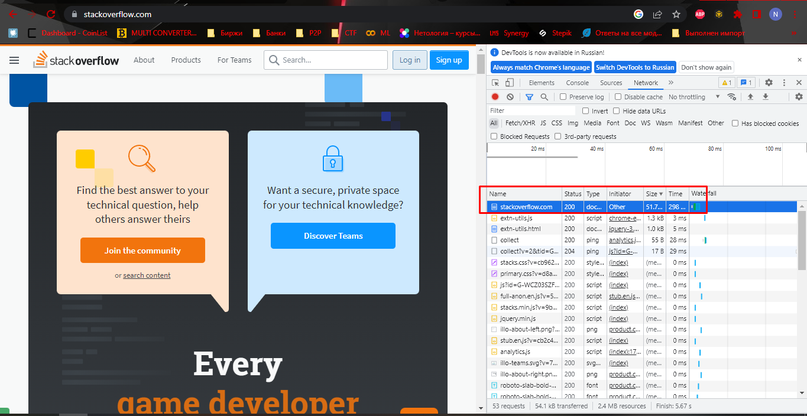
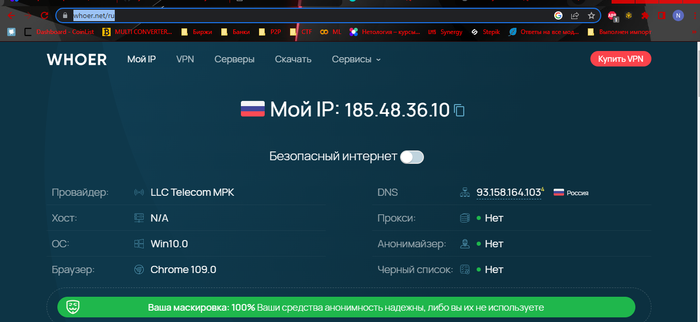
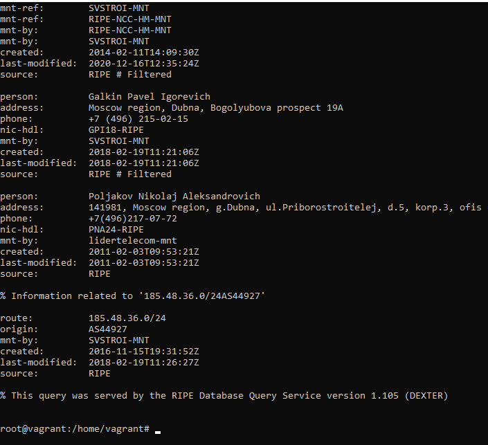
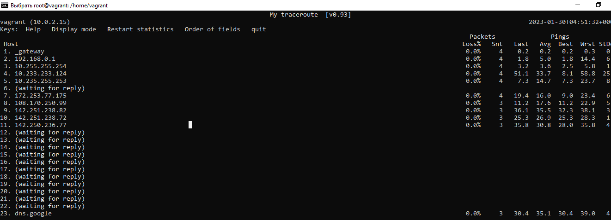
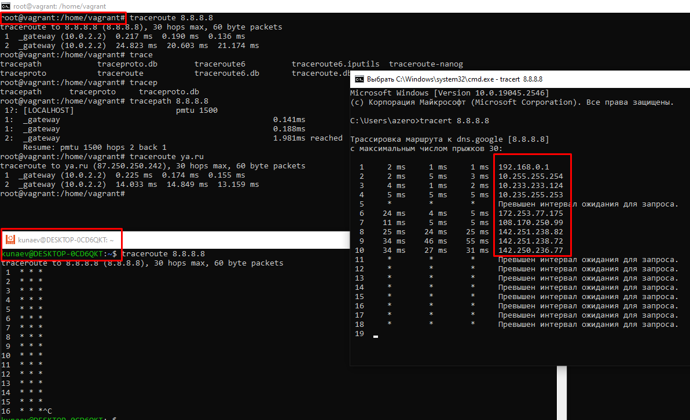
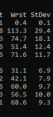
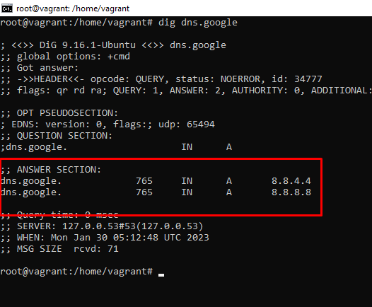
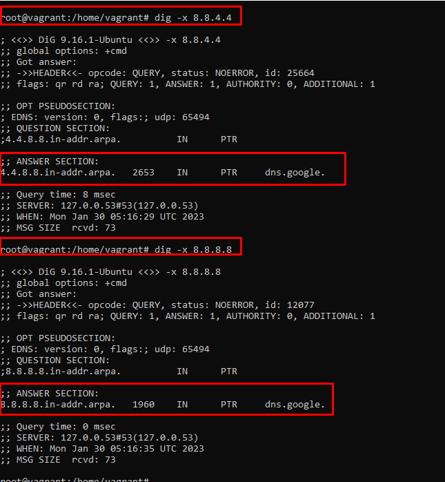

Задание 1

Ответ 403 

Сервер понял запрос, но он был не авторизован. \
Авторизация - предоствление прав на выполнение определенных действий.

Задание 2.

Привеш ответ 200 ОК

Дольше всего подгружалось содержимое сайта, потом скрипты и роботы

Задание 3.

185.48.36.10 

Задание 4.

root@vagrant:/home/vagrant# whois 185.48.36.10

inetnum:        185.48.36.0 - 185.48.39.255
org-name:       Svyazstroi LLC
origin:         AS44927

Задание 5.

 Host                                                                                                                        Loss%   Snt   Last   Avg  Best  Wrst StDev
 1. _gateway                                                                                                                  0.0%    56    0.1   0.3   0.1   2.8   0.4
 2. 192.168.0.1                                                                                                               0.0%    56    2.4   3.2   1.7  16.3   2.9
 3. 10.255.255.254                                                                                                            0.0%    56    2.6   4.3   2.3  33.7   4.6
 4. 10.233.233.124                                                                                                            0.0%    56    6.1  16.9   2.5  72.6  14.5
 5. 10.235.255.253                                                                                                            0.0%    56    5.1  17.8   4.8  61.7  11.5
 7. 172.253.77.175                                                                                                            0.0%    56    5.5  15.5   5.3  40.2   8.3
 8. 108.170.250.99                                                                                                            0.0%    56    9.2  18.3   6.1  57.7   9.8
 9. 142.251.238.82                                                                                                            0.0%    55   44.5  34.1  23.4  77.2   8.8
10. 142.251.238.72                                                                                                            0.0%    55   27.6  36.2  23.9 111.3  14.5
11. 142.250.236.77                                                                                                            0.0%    55   31.4  37.3  24.7 108.7  14.6

Стоит отметить, что по какой-то причине traceroute на вагранте и WSL
не корректно отрабатывает. Более менее адекватный ответ был из под утилиты 
tracert OS Windows и mtr.

Подсети пунктов 1-5 относятся к внутренней сети моего провайдера.

6-11
Organization:   Google LLC (GOGL)
OriginAS:       AS15169

Я так понимаю проход по BGP узлам в трассировке не отображается, иначе вывод был
бы значительно длиннее.

Задание 6.

Наибольший показатель задержки на пути к пограничному маршрутизатору моего провайдера

Задание 7

;; ANSWER SECTION:
dns.google.             765     IN      A       8.8.4.4
dns.google.             765     IN      A       8.8.8.8

Задание 8.

ключ -х отображает PTR (обратную) запись

4.4.8.8.in-addr.arpa.   2653    IN      PTR     dns.google.
8.8.8.8.in-addr.arpa.   1960    IN      PTR     dns.google.

