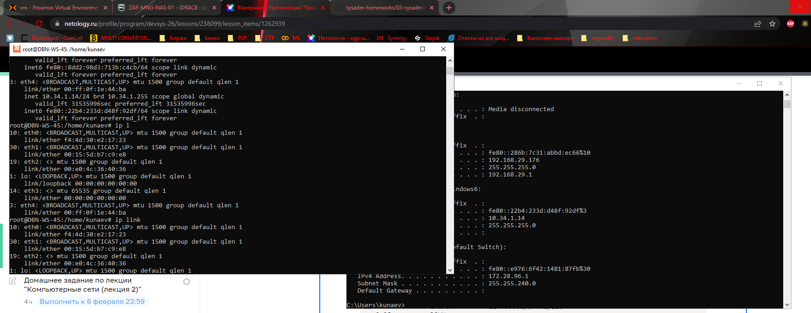
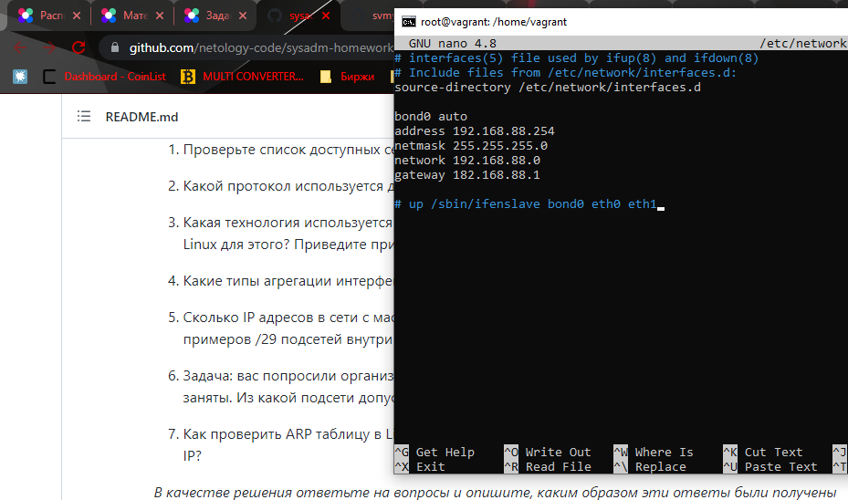

Задание 1.
Linux - ip a(address), ip l(link) /ifconfig
Windows - ipconfig

Задание 2

Для распознавания соседей используется протокол LLDP (Link Layer Discovery Protocol)
Схожий по функционалу есть у Микротика Mikrotik Neighbors Discovery Protocol

В Linux для этого используется пакет lldpd

Задание 3.

Для разделение сети на уровне L2 применяются вланы, посредством тегирования трафика,
которые описаны в стандартах 802.1q и 802.1ad для QinQ (влана во влане)

В Linux для того, чтобы появилась возможность работатьс вланами необходимо чтобы 
был загружен модуль ядра 8021q через mdprobe.

Далее, можно настроить несколькими способами:
времено:
--нужен пакет net-tools, vlan ---

vconfig add eth0 5 (добавляем на интерфейс eth0 влан 5)

ifconfig eth0.5 192.168.1.100 netmask 255.255.255.0 broadcast 192.168.1.255 up 
    выбираем интерфейс, назначаем адрес, указываем маску, широковещательный адрес и стату up 

ip link add link eth0 name eth0.10 type vlan id 10

добавляем на интерфейс еth0 интерфейс eth0.10 тип влан id 10

ip addr add 192.168.1.200/24 brd 192.168.1.255 dev eth0.10

навешиваем адрес и маску на интерфейс

постоянно:

добавить запись в /etc/network/interfaces

auto eth0.100 - автоподъем интерфейса \
iface eth0.100 inet static - говорим, что статика \
address 192.168.1.200 - назначаем адрес \
netmask 255.255.255.0 - маску \
vlan-raw-device eth0 - родительский интерфейс \

Задание 4.

Необходимо добавить модуль ядра bonding \
Установить ifenslave 

Режимов агрегации может быть 5:

0. balance-rr - циклический перебор активного интерфейса \
1. active-backup - 1 интерфейс активен, другие в режиме горячей замены \
2. balance-xor - получатель закрепляется за одним из интерфейсов \
3. broadcast - трафик идет через все интерфейсы одновременно \
4. 802.3ad, стандарт IEEE представляющий собой виртуальный интерфейс, все интерфейсы \
используются одновременно, как одно виртуальное устройство. Необходимо править настройки портов коммутатора \
5. balaned-tlb - балансировка трафика в зависимости от нагрузки

Пример конфига /etc/network/interfaces \
 

Задание 5.

<<<<<<< HEAD
В 29-й маске 6 адресов + шлюз + широковещательный. В сети с маской 24, можно \
выделить 32 подсети 192.168.0.0/29, 192.168.0.8/29, 192.168.0.16/29, 192.168.0.24/29 и тд.
=======
В 29-й маске 8 адресов, фактически к использованию подлежит 6. \
В 24 маске 255 адресов \
255/8 = 31,8 те 31. \

UDP 

Спасибо за подсказку с http://ipmeter.ru/ \
совмем забыл, что адрес подсети тоже учитывается, теперь стало понятней. \
192.168.0.0/29 \
192.168.0.0 - адрес подсети \
1-6 для использования \
7 - широковещательный.

Дальше идет подсеть 192.168.0.8/29 \ 
Дальше идет подсеть 192.168.0.8/29 - адрес подсети \
9-14 для использования \
15 широковещательный и тд.
>>>>>>> 250c7d438e0ccbde2ec30ca1f42c69517f7dd133

Задание 6.

Можно использовать адреса подсети 100.64.0.0/10. \
Поскольку нужно максимум на 50-60 хостов, то подойдет 100.64.0.0\26 (на 63 адреса + бродкаст) \

Задание 7.

Почистить арп-таблицу: \
Linux \
ip neigh flush (ip\dev\all) ip, интерфейс или все \

Windows \
arp -a ip \\

