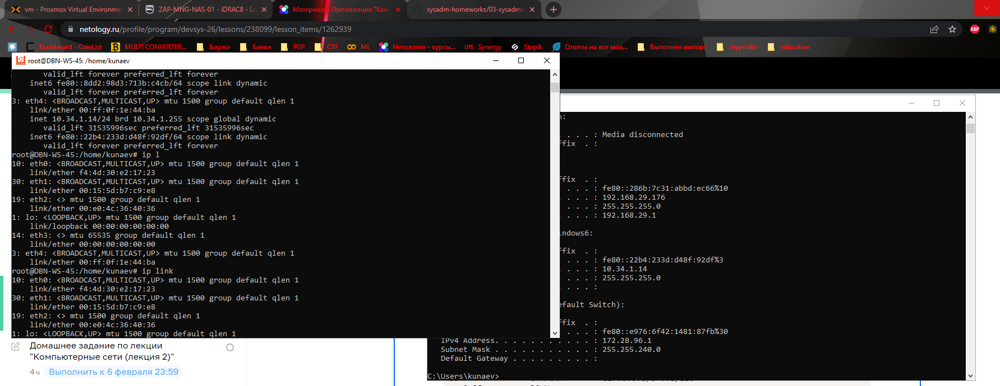

Задание 1.
Linux - ip a(address), ip l(link) /ifconfig
Windows - ipconfig

Задание 2

Для распознавания соседей используется протокол LLDP (Link Layer Discovery Protocol)
Схожий по функционалу есть у Микротика Mikrotik Neighbors Discovery Protocol

В Linux для этого используется пакет lldpd

Задание 3.

Для разделение сети на уровне L2 применяются вланы, посредством тегирования трафика,
которые описаны в стандартах 802.1q и 802.1ad для QinQ (влана во влане)

В Linux для того, чтобы появилась возможность работатьс вланами необходимо чтобы 
был загружен модуль ядра 8021q через mdprobe.

Далее, можно настроить несколькими способами:
времено:
--нужен пакет net-tools ---

vconfig add eth0 5 (добавляем на интерфейс eth0 влан 5)

ifconfig eth0.5 192.168.1.100 netmask 255.255.255.0 broadcast 192.168.1.255 up 
    выбираем интерфейс, назначаем адрес, указываем маску, широковещательный адрес и стату up 

ip link add link eth0 name eth0.10 type vlan id 10

добавляем на интерфейс еth0 интерфейс eth0.10 тип влан id 10

ip addr add 192.168.1.200/24 brd 192.168.1.255 dev eth0.10

навешиваем адрес и маску на интерфейс

постоянно:

добавить запись в /etc/network/interfaces

auto eth0.100 - автоподъем интерфейса \
iface eth0.100 inet static - говорим, что статика \
address 192.168.1.200 - назначаем адрес \
netmask 255.255.255.0 - маску \
vlan-raw-device eth0 - родительский интерфейс

Задание 4.

