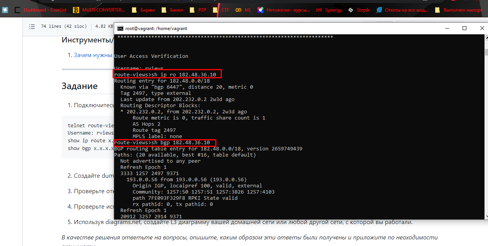
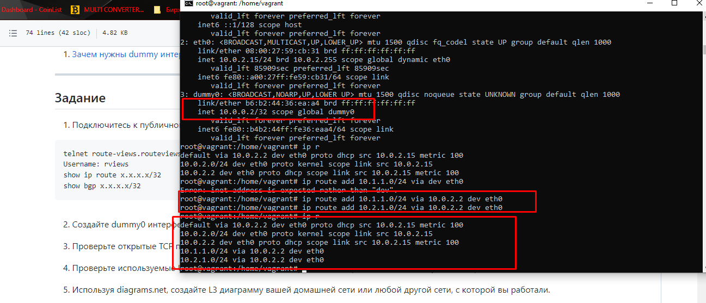
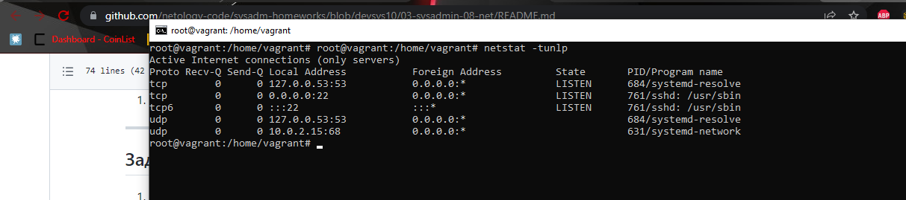
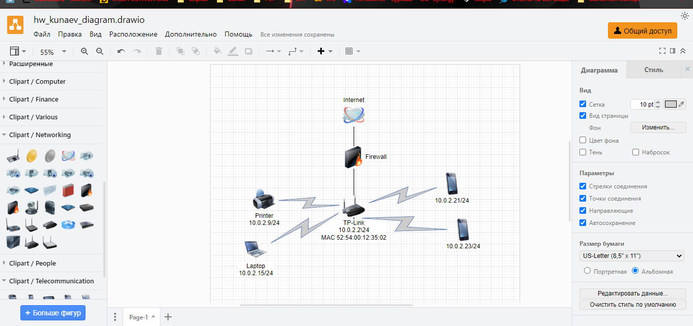
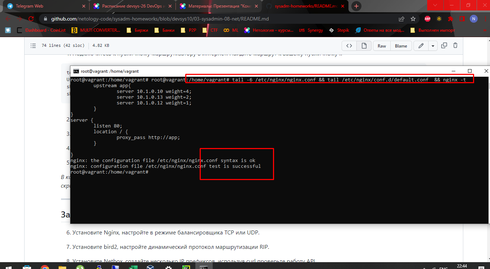
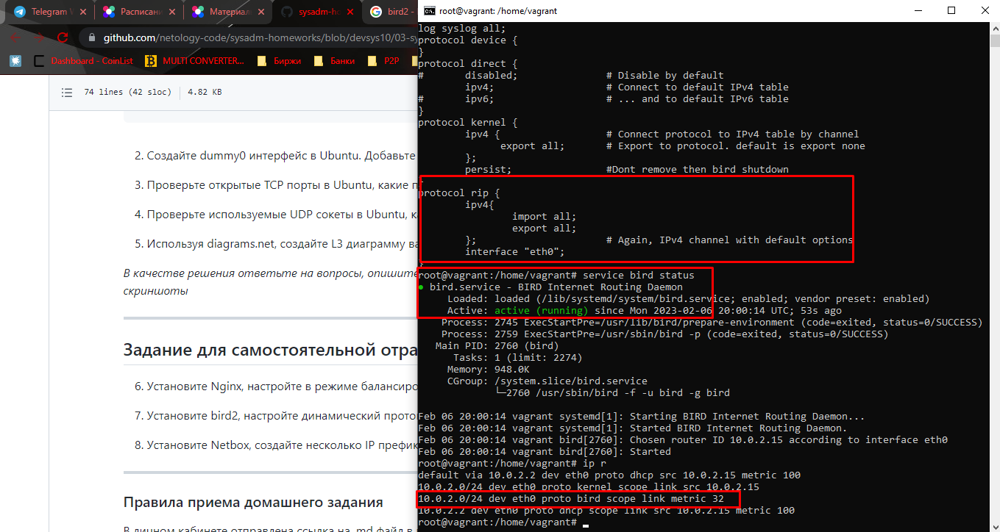

Задание 1 \
вывод команд \
show ip route \
и sh bgp

Задание 2 \
Через modprobe включил модуль dummy \
Навесил на него ip и прописал несколько статических маршрутов \

Задание 3, 4
По личному вкусу вывод через netstat более приятен для восприятия, чем ss \
посмотреть и tcp и udp можно с ключем -tunlp
по отдельности lu (listen udp), lt (listen tcp)
tcp 53 - dns \
tcp 22 - ssh \
udp 68 - dhcp \

Задание 5

схема домашней сети \

Задание 6 \
Существует несколько типов басансировки нагрузки: \
RoundRobin - передает запросы на сервера по-очереди \
RoundRobin с весом - передает запросы преимущественно на сервера с наибольшим весов \
    Вес назначается в зависимости от пропускной способности \
Least Connection - в зависимости от количества соединений \
Least Connection с весом - в зависимости от количества соединений и веса \
IP Hash - хэширует IP для определения того, какой сервер должен будет обработаь запрос \
    Для того, чтобы ответы направлялись одним и тем же сервером. Используется когда за одним \
    адресом несколько серверов. \
URL Hash - работает по аналогии с IP, на хэшируется url. \

Пример конфигурации балансировки RoundRobin с весом \

Задание 7. \

Установил bird2, удалил из конфига закомментированные строки \
grep "^[^#*]" /etc/bird/bird.conf
Изменил маршрутизацию со статики на rip. Вывод статуса сервиса - "ок", вывод списка маршрутов. \

