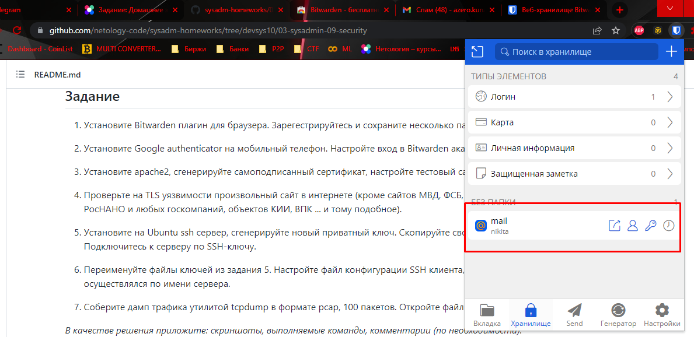
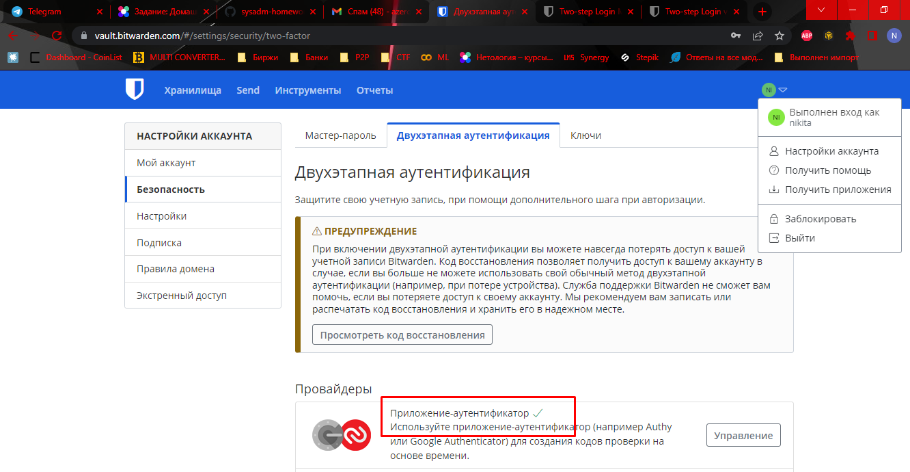
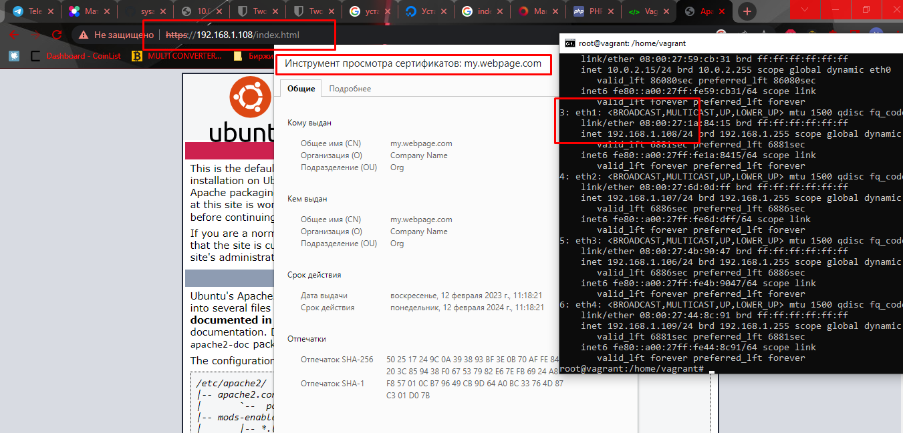
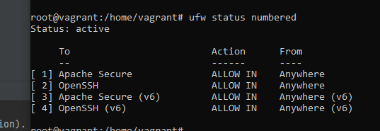
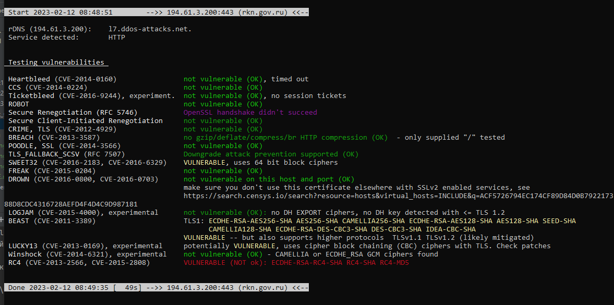
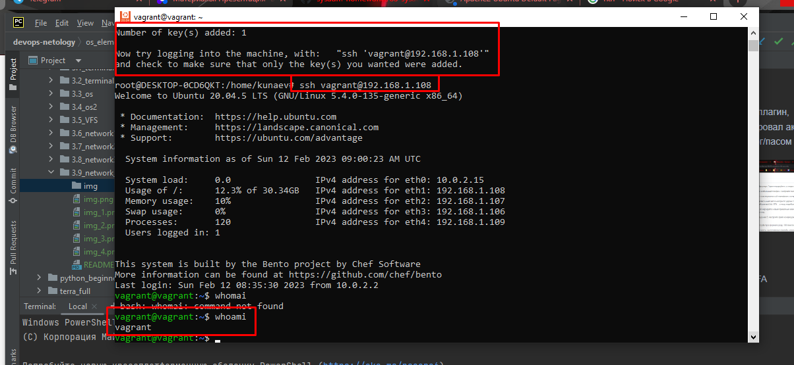
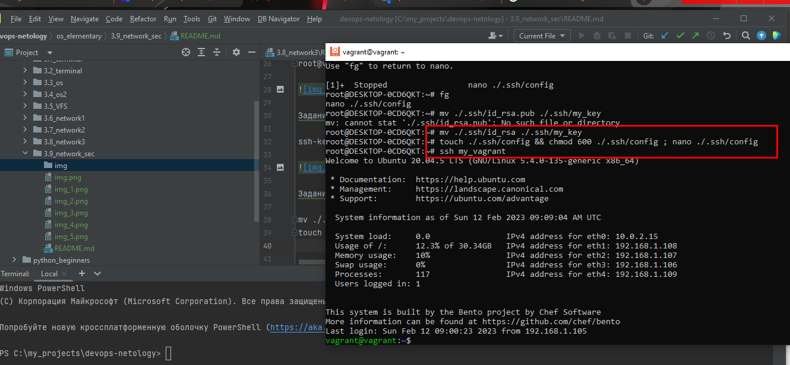
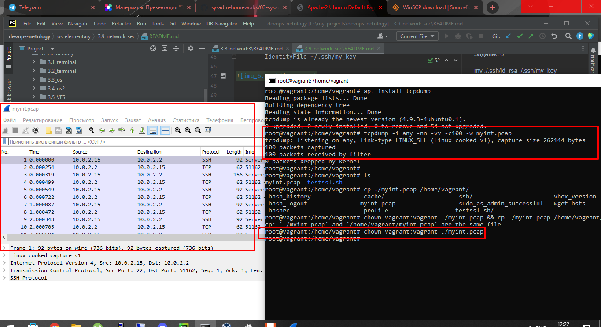
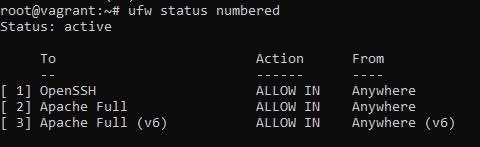
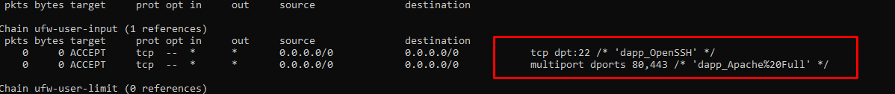

Задание 1

Установил плагин, зарегистрировал аккаунт и создал запись с лог/пасом от почты 

Задание 2

Включил 2FA

Задание 3

Установил апач, сгенерировал сертификат, включил модуль \
a2enmod ssl, добавил в a2enmod конфиг файл сайта, указал в конфиге \
порт прослушиваия 443, что включен ssl и пути к сертификату и ключу. \
Также в ufw добавил надстройку для apache 

Задание 4.

Попал под раздачу наш РКН \
root@vagrant:/home/vagrant/testssl.sh# ./testssl.sh -U --sneaky https://rkn.gov.ru 

Задание 5.

ssh-keygen; ssh-copy-id vagrant@192.168.1.108; ssh vagrant@192.168.1.108 

Задание 6.

mv ./.ssh/id_rsa ./.ssh/my_key \
touch ./.ssh/config && chmod 600 ./.ssh/config ; nano ./.ssh/config \
root@DESKTOP-0CD6QKT:~# cat ./.ssh/config \
Host my_vagrant \
        HostName 192.168.1.108 \
        User vagrant \
        IdentityFile ~/.ssh/my_key 

Задание 7.

root@vagrant:/home/vagrant# tcpdump -i any -nn -vv -c100 -w myint.pcap 

chown vagrant:vagrant ./myint.pcap

Через winscp перенес на винду и открыл в wireshark'e

Задание 8

nmap -v -A scanme.nmap.org 

22/tcp    open  ssh        OpenSSH 6.6.1p1 Ubuntu 2ubuntu2.13 (Ubuntu Linux; protocol 2.0) \
80/tcp    open  http       Apache httpd 2.4.7 ((Ubuntu)) \
9929/tcp  open  nping-echo Nping echo \
31337/tcp open  tcpwrapped \
В 3м столбце название сервисов.

Задание 9.

Я окрывал только 22 и 443, осталось добавить 80.

iptable -nvL

